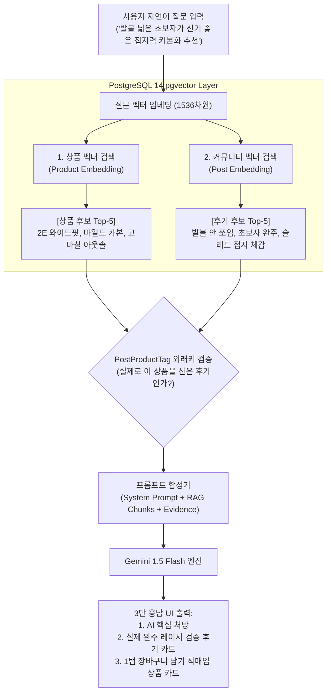

# FittersSweat AI RAG 파이프라인 아키텍처 설계서 (RAG Architecture Specification)

> **문서 버전**: 1.0.0  
> **시스템 목적**: HYROX 올인원 커뮤니티 & 커머스 플랫폼의 AI 맞춤 추천 및 지능형 검색  
> **핵심 페르소나**: **"HYROX 플래그십 스토어의 1:1 전문 매니저 (Expert Floor Advisor)"**  
> **핵심 기술 스택**: PostgreSQL 14 (pgvector) + Fastify 4 + Next.js 14 + Gemini 1.5 Flash + Cloudinary CDN

---

## 1. 시스템 비전 및 핵심 가치 (System Vision)

기존 이커머스의 검색이나 챗봇은 제조사의 천편일률적인 제품 설명서("이 신발은 쿠션이 좋습니다")를 읊어주는 수준에 그쳐, 사용자의 구매 결정을 끌어내지 못합니다.

FittersSweat의 AI RAG는 **"오프라인 전문 매장의 베테랑 매니저"**처럼 동작합니다:
1. 고객의 특수한 상황(예: "발볼이 넓은 초보자", "슬레드 150kg에서 발이 미끄러짐")을 깊이 공감하고 경청합니다.
2. 스펙에 부합하는 장비를 400개 직매입 풀에서 찾아 제시할 뿐만 아니라,
3. **"실제로 고객님과 같은 조건에서 경기장을 완주한 선배 레이서들의 생생한 후기"**를 증거(Social Proof)로 함께 꺼내어 보여줍니다.
4. 설명에 그치지 않고, 화면에서 **1탭으로 즉시 장바구니에 담고 결제할 수 있는 완결된 쇼핑 경험**을 완성합니다.

---

## 2. 듀얼 리트리버 아키텍처 (Dual-Retriever & Cross-Referencing)

사용자의 단일 자연어 질문에 대해, 백엔드는 2개의 독립된 벡터 컬렉션을 동시에 교차 조회(Cross-Referencing)합니다.



### 2.1 검색 단계별 동작
1. **상품 벡터 검색 (Spec Matching)**:
   - 400개 직매입 상품의 이름, 카테고리, 상세 스펙 임베딩과 질의 간 코사인 유사도 연산.
2. **커뮤니티 벡터 검색 (Experience Matching)**:
   - 150개 이상의 실전 후기 요약문 및 훈련팁 임베딩과 질의 간 코사인 유사도 연산.
3. **외래키(`PostProductTag`) 교차 신뢰도 부스팅 (Cross-Validation Reranking)**:
   - 추천된 상품 ID가 추천된 커뮤니티 게시글의 `taggedItems` 외래키에 포함되어 있을 경우, 가중치(+20%)를 부여하여 최상단에 배치합니다.
   - 이를 통해 **"후기가 입증하는 바로 그 상품"**이 항상 최우선 추천됩니다.

---

## 3. 도큐먼트 인리치먼트 & 비동기 자동 정제 (Document Enrichment)

### 3.1 왜 본문 전체를 바로 임베딩하면 안 되는가?
실제 사용자가 작성한 커뮤니티 글은 다음과 같은 잡음(Noise)이 가득합니다:
- *"안녕하세요! 서울 대회 다녀온 30대입니다. 사진이 안 올라가네요..."* (인사/잡담)
- 비정형 줄바꿈, 이모지 남발, 감정적 푸념.
- 이 상태로 임베딩을 생성하면, **질문과 무관한 인사말 벡터가 노이즈로 작용하여 검색 정밀도가 급락**합니다.

### 3.2 비동기 정제 파이프라인 (Async AI Summarization)
사용자가 글을 등록(`POST /api/v1/posts`)하면 사용자 대기 시간은 **0초**이며, 백엔드 백그라운드 워커가 1~2초 내에 아래 과정을 수행합니다:

```text
[사용자 원문 (1,500자 장문)]
"안녕하세요 오늘 송도 첫 출전 후기입니다. 슬레드 푸시 152kg에서 일반 런닝화 신고 갔다가
 바닥 우레탄에서 발이 뒤로 헛돌아서 허벅지가 털렸습니다... (중략)"
            ▼ (비동기 LLM 1문장 핵심 요약 추출)
[정제된 지식 (Key Takeaway)]
"슬레드 푸시 152kg 구간은 쿠션화 착용 시 마찰력 부족으로 발이 헛돌며,
 고접지 플랫 레이스화와 상체 45도 전경 자세가 필수적임."
            ▼ (메타데이터 결합 임베딩 청크 생성)
[임베딩 페이로드 (1536-dim pgvector)]
"[스테이션: SLED_PUSH] [태그장비: PUMA NITRO] [핵심요약: 슬레드 푸시 152kg 구간은...] [제목: ...]"
```

---

## 4. 데이터셋 내용 유사도 방지 설계 (4차원 변량 매트릭스)

Task 3-5에서 구축하는 150건의 커뮤니티 데이터셋은 템플릿 복제글이 되지 않도록 **4대 독립 변량의 직교 조합(Cartesian Product)**으로 생성 공간을 극대화합니다.

| 변량 축 | 구성 요소 (Dimensions) | 다양성 확보 효과 |
| :--- | :--- | :--- |
| **축 1: 종목/스테이션** (10종) | SkiErg, Sled Push, Sled Pull, Burpee Broad Jump, Rowing, Farmers Carry, Sandbag Lunges, Wall Balls, Running(인터벌), Nutrition/Recovery | 전 종목 고른 지식 분포 |
| **축 2: 레이서 페르소나** (5종) | ① 첫 출전 초보 레이서<br>② 포디움/에이지그룹 랭커<br>③ 엘리트 코치/선수<br>④ 더블(2인 1조) 파트너십<br>⑤ 부상 복귀/통증 관리 레이서 | 수준별/상황별 고민 해결 |
| **축 3: 글의 의도/토픽** (5종) | ① 실착 장비 심층 검증<br>② 구간 테크닉 & 훈련 꿀팁<br>③ 대회 당일 실패담/오답노트<br>④ 서플리먼트/영양 섭취 타임라인<br>⑤ Q&A 질문 및 고민 상담 | 풍부한 인과관계 데이터 |
| **축 4: 톤앤매너** (3종) | ① 데이터 분석형 (스플릿 타임, 수치 중심)<br>② 솔직 담백한 실전 후기형 (경험 서사)<br>③ 불릿 포인트 요약형 (3줄 팁) | 텍스트 패턴 복제 방지 |

> **유사도 방어 규칙**:  
> N-gram 자카드 유사도가 35%를 초과하는 쌍이 발생하지 않도록 사전 검증을 거친 후 DB에 시딩합니다.

---

## 5. 사용자 화면 응답 UI/UX 규격 (`/search`)

RAG 검색 결과는 텍스트 덩어리가 아닌, **3단 액션 카드(Dark Athletic UI)**로 렌더링됩니다.

```
┌──────────────────────────────────────────────────────────────────────────────┐
│ 👨‍💼 FittersSweat AI 전문 어드바이저                                          │
├──────────────────────────────────────────────────────────────────────────────┤
│ [섹션 1: 1:1 맞춤형 핵심 처방]                                              │
│ "고객님, 발볼이 넓으시고 첫 출전이시라면 탄성이 과한 풀카본화보다는          │
│  토박스(앞코)가 2E 규격으로 여유로우면서 150kg 슬레드에서도 접지력을         │
│  확보해 주는 [푸마 데비에이트 나이트로 3 와이드]를 추천드립니다."           │
├──────────────────────────────────────────────────────────────────────────────┤
│ [섹션 2: 실제 레이서들의 검증 후기 카드 (Social Proof)]                      │
│                                                                              │
│  📄 "발볼러의 첫 HYROX 송도 완주기" (작성자: 런린이탈출 / 완주 1회)          │
│     💡 핵심 요약: "발볼 실측 10.4cm인데 새끼발가락 압박이 전혀 없었고,     │
│     슬레드 푸시 우레탄 바닥에서 뒤로 1cm도 안 밀리고 완벽히 접지됨."         │
│     [👉 후기 전문 읽기]                                                     │
│                                                                              │
│  📄 "초보자 카본화 고민 끝에 선택" (작성자: 박하이브리드 / 코치)             │
│     💡 핵심 요약: "카본 플레이트가 과하지 않아 8km 런닝 페이스 유지에 매우   │
│     안정적임. 발볼 넓은 초보자 입문용으로 1순위 추천."                      │
│     [👉 후기 전문 읽기]                                                     │
├──────────────────────────────────────────────────────────────────────────────┤
│ [섹션 3: 추천 직매입 장비 (1탭 구매 연계)]                                   │
│                                                                              │
│  👟 푸마 데비에이트 나이트로 3 와이드 (HYROX 에디션)                         │
│     • 가격: 189,000원 (무료배송)  |  잔여 재고: 5개 (품절 임박)              │
│                                                                              │
│  [ 🛒 장바구니에 담기 ]      [ ⚡ 바로 구매하기 (Toss 결제) ]                 │
└──────────────────────────────────────────────────────────────────────────────┘
```

---

## 6. 결론 및 마일스톤 연계

1. **3주차 (Task 3-5)**:  
   - 본 설계서의 4차원 변량 매트릭스를 기반으로 **150건의 고다양성 커뮤니티 데이터셋(`community-seed-data.json`)**을 생성하고 PostgreSQL에 적재합니다.
   - 각 게시글 상단에 규격화된 `> 💡 **핵심 요약**: ...`을 주입하여 4주차 RAG가 즉시 임베딩할 수 있는 토대를 구축합니다.
2. **4주차 (AI RAG 구현)**:  
   - 본 설계서의 Dual-Retriever 엔진 및 `/api/v1/ai/recommend` 엔드포인트를 구현하여 실제 서비스에 배포합니다.
