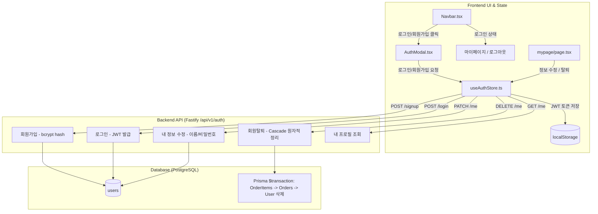

# 회원 인증 및 계정 라이프사이클(Auth & Member Lifecycle) 구현 계획

> **For agentic workers:** REQUIRED SUB-SKILL: Use superpowers:subagent-driven-development to implement this plan task-by-task. Steps use checkbox (`- [ ]`) syntax for tracking.

**Goal:** 하드코딩된 테스트 계정(`runner1@naver.com`) 고정 자동 로그인을 전면 제거하고, 로그인·회원가입 탭 토글 모달 및 내 정보 수정, 로그아웃, 회원탈퇴를 포함한 완전한 사용자 인증/계정 라이프사이클을 구축하여 실제 계정 생성과 인증 흐름을 자유롭게 테스트할 수 있도록 지원합니다.

**Architecture:** 
- **백엔드(Fastify 4 + Prisma Client)**:
  - 기존 `POST /signup`, `POST /login`, `POST /refresh`, `GET /me`에 더해 `PATCH /api/v1/auth/me`(프로필 및 비밀번호 변경), `POST /api/v1/auth/logout`(세션 종료), `DELETE /api/v1/auth/me`(주문/후기 연관 데이터 원자적 정리 및 회원 탈퇴) 엔드포인트를 구현합니다.
- **프론트엔드(Next.js 14 App Router + Zustand + Framer Motion)**:
  - `frontend/stores/useAuthStore.ts`를 신설하여 전역 인증 상태(`user`, `accessToken`, `isAuthenticated`, `login`, `signup`, `updateProfile`, `logout`, `deleteAccount`, `checkAuth`)를 단일 진실 공급원(Single Source of Truth)으로 관리합니다.
  - Dark Athletic 테마의 `AuthModal.tsx` 컴포넌트를 구축하여 어디서든 원클릭으로 `로그인` ↔ `회원가입` 탭을 토글하며 계정을 생성/인증할 수 있도록 지원합니다.
  - 글로벌 네비게이션 바(`Navbar.tsx`)와 마이페이지(`mypage/page.tsx`)에서 실제 로그인 사용자의 정보를 동적으로 렌더링하고, 정보 수정 모달 및 2단계 탈퇴 확인 플로우를 연동합니다.
  - `frontend/lib/api.ts` 및 각 페이지에 남아있던 고정 테스트 계정 자동 발급 로직을 제거하고 실시간 토큰 기반 인증으로 일원화합니다.

**Architecture Diagram:**



**Tech Stack:** Fastify 4, Prisma 5, PostgreSQL, JWT, bcryptjs, Zod, Next.js 14, Zustand 4, Framer Motion, Tailwind CSS, Lucide React.

**Spec:** 사용자 요구사항 2 - "현재 페이지는 테스트 계정으로 고정 로그인 되어있는 상태임 이를 로그인 회원가입 토글을 구성하여 직접 실제 회원가입과 로그인을 테스트할 수 있도록 구성하기 위한 수정계획 파일도 superpowers skill을 사용하여 작성할것. 2.1 로그인, 회원가입, 내 정보 수정, 로그아웃, 회원탈퇴 기능 삽입"

## Global Constraints

- 비밀번호는 반드시 `bcryptjs` (salt round 10)로 암호화하여 저장하며, 평문 비밀번호는 어떠한 로그에도 기록하지 않음.
- 회원 탈퇴(`DELETE /api/v1/auth/me`) 시 외래키 제약조건(`orders` 등)으로 인한 데이터베이스 무결성 오류를 방지하기 위해 `prisma.$transaction`을 통해 연관 주문 및 사용자를 원자적으로 정리.
- Dark Athletic 디자인 시스템(`#0A0A0A`, `#141414`, `#1F1F1F`, `#262626`, `#FFD700`) 및 44x44px 최소 터치 영역 엄격 준수.
- `docs/erdcloud_schema.sql`은 절대 수정하거나 커밋하지 않음.

---

### Task 1: 백엔드 회원 정보 수정(`PATCH /me`) 및 회원 탈퇴(`DELETE /me`) API 구현

**Files:**
- Modify: `backend/src/routes/auth.ts`
- Test: `backend/tests/auth.test.ts`

**Interfaces:**
- Consumes: `Authorization: Bearer <token>`
- Produces:
  - `PATCH /api/v1/auth/me`: `{ name?: string, currentPassword?: string, newPassword?: string }` -> `{ success: true, user: { id, email, name, role } }`
  - `POST /api/v1/auth/logout`: `{ success: true, message: 'Logged out successfully' }`
  - `DELETE /api/v1/auth/me`: `{ password: string }` -> `{ success: true, message: 'Account deleted successfully' }`

- [ ] **Step 1: 실패하는 통합 테스트 작성 (`backend/tests/auth.test.ts`)**

```typescript
describe('PATCH /api/v1/auth/me (Profile update)', () => {
  it('should update user name successfully', async () => {
    // 1. Create a test user and login
    const email = `updatetest_${Date.now()}@naver.com`;
    await app.inject({
      method: 'POST',
      url: '/api/v1/auth/signup',
      payload: { email, password: 'password123', name: '이전이름' },
    });
    const loginRes = await app.inject({
      method: 'POST',
      url: '/api/v1/auth/login',
      payload: { email, password: 'password123' },
    });
    const token = JSON.parse(loginRes.payload).accessToken;

    // 2. Update name
    const updateRes = await app.inject({
      method: 'PATCH',
      url: '/api/v1/auth/me',
      headers: { authorization: `Bearer ${token}` },
      payload: { name: '새로운이름' },
    });

    expect(updateRes.statusCode).toBe(200);
    const body = JSON.parse(updateRes.payload);
    expect(body.success).toBe(true);
    expect(body.user.name).toBe('새로운이름');
  });
});

describe('DELETE /api/v1/auth/me (Account withdrawal)', () => {
  it('should delete user and cascade related orders cleanly', async () => {
    const email = `deletetest_${Date.now()}@naver.com`;
    await app.inject({
      method: 'POST',
      url: '/api/v1/auth/signup',
      payload: { email, password: 'password123', name: '탈퇴테스트' },
    });
    const loginRes = await app.inject({
      method: 'POST',
      url: '/api/v1/auth/login',
      payload: { email, password: 'password123' },
    });
    const token = JSON.parse(loginRes.payload).accessToken;

    const deleteRes = await app.inject({
      method: 'DELETE',
      url: '/api/v1/auth/me',
      headers: { authorization: `Bearer ${token}` },
      payload: { password: 'password123' },
    });

    expect(deleteRes.statusCode).toBe(200);
    expect(JSON.parse(deleteRes.payload).success).toBe(true);

    // Verify user no longer exists
    const meRes = await app.inject({
      method: 'GET',
      url: '/api/v1/auth/me',
      headers: { authorization: `Bearer ${token}` },
    });
    expect(meRes.statusCode).toBe(404);
  });
});
```

- [ ] **Step 2: 테스트 실패 확인**

Run: `cd backend && npm test -- tests/auth.test.ts`  
Expected: FAIL (PATCH /me and DELETE /me not implemented)

- [ ] **Step 3: `backend/src/routes/auth.ts`에 PATCH, POST /logout, DELETE 엔드포인트 구현**

```typescript
const updateProfileSchema = z.object({
  name: z.string().min(1).optional(),
  currentPassword: z.string().optional(),
  newPassword: z.string().min(6).optional(),
});

const deleteAccountSchema = z.object({
  password: z.string().min(1),
});

// 5. 내 정보 수정 (PATCH /api/v1/auth/me)
app.patch(
  '/me',
  {
    schema: {
      tags: ['Auth'],
      summary: '내 정보 수정',
      description: '사용자 이름 또는 비밀번호를 변경합니다.',
    },
  },
  async (request, reply) => {
    let userId: bigint;
    try {
      const token = request.headers.authorization?.replace('Bearer ', '');
      if (!token) throw new Error('Missing token');
      const decoded = app.jwt.verify<{ id: string }>(token);
      userId = BigInt(decoded.id);
    } catch {
      return reply.status(401).send({ message: 'Unauthorized' });
    }

    const parseResult = updateProfileSchema.safeParse(request.body);
    if (!parseResult.success) {
      return reply.status(400).send({ message: 'Invalid input', errors: parseResult.error.errors });
    }

    const { name, currentPassword, newPassword } = parseResult.data;
    const user = await prisma.user.findUnique({ where: { id: userId } });
    if (!user) {
      return reply.status(404).send({ message: 'User not found' });
    }

    const updateData: { name?: string; passwordHash?: string } = {};

    if (name) {
      updateData.name = name;
    }

    if (newPassword) {
      if (!currentPassword) {
        return reply.status(400).send({ message: '현재 비밀번호를 입력해 주세요.' });
      }
      const valid = await bcrypt.compare(currentPassword, user.passwordHash);
      if (!valid) {
        return reply.status(400).send({ message: '현재 비밀번호가 일치하지 않습니다.' });
      }
      updateData.passwordHash = await bcrypt.hash(newPassword, 10);
    }

    const updated = await prisma.user.update({
      where: { id: userId },
      data: updateData,
      select: { id: true, email: true, name: true, role: true, createdAt: true },
    });

    return reply.send({
      success: true,
      user: { ...updated, id: updated.id.toString() },
    });
  }
);

// 6. 로그아웃 (POST /api/v1/auth/logout)
app.post('/logout', async (request, reply) => {
  return reply.send({ success: true, message: 'Logged out successfully' });
});

// 7. 회원 탈퇴 (DELETE /api/v1/auth/me)
app.delete(
  '/me',
  {
    schema: {
      tags: ['Auth'],
      summary: '회원 탈퇴',
      description: '비밀번호 확인 후 사용자와 연관된 데이터를 정리하고 계정을 삭제합니다.',
    },
  },
  async (request, reply) => {
    let userId: bigint;
    try {
      const token = request.headers.authorization?.replace('Bearer ', '');
      if (!token) throw new Error('Missing token');
      const decoded = app.jwt.verify<{ id: string }>(token);
      userId = BigInt(decoded.id);
    } catch {
      return reply.status(401).send({ message: 'Unauthorized' });
    }

    const parseResult = deleteAccountSchema.safeParse(request.body);
    if (!parseResult.success) {
      return reply.status(400).send({ message: '비밀번호를 입력해 주세요.' });
    }

    const user = await prisma.user.findUnique({ where: { id: userId } });
    if (!user) {
      return reply.status(404).send({ message: 'User not found' });
    }

    const valid = await bcrypt.compare(parseResult.data.password, user.passwordHash);
    if (!valid) {
      return reply.status(400).send({ message: '비밀번호가 일치하지 않습니다.' });
    }

    // Atomic cascading cleanup for orders and user
    await prisma.$transaction(async (tx) => {
      await tx.orderItem.deleteMany({ where: { order: { userId } } });
      await tx.order.deleteMany({ where: { userId } });
      await tx.user.delete({ where: { id: userId } });
    });

    return reply.send({
      success: true,
      message: '회원 탈퇴가 안전하게 완료되었습니다.',
    });
  }
);
```

- [ ] **Step 4: 테스트 재실행 및 검증**

Run: `cd backend && npm test`  
Expected: 6 test suites, all passed

- [ ] **Step 5: Commit**

```bash
git add backend/src/routes/auth.ts backend/tests/auth.test.ts
git commit -m "feat(auth): implement PATCH /me, POST /logout, and DELETE /me with atomic order cascade"
```

---

### Task 2: 프론트엔드 Zustand 인증 상태 스토어 (`useAuthStore.ts`) 구현

**Files:**
- Create: `frontend/stores/useAuthStore.ts`

**Interfaces:**
- Produces: `useAuthStore` hook with `user`, `accessToken`, `isAuthenticated`, `login()`, `signup()`, `updateProfile()`, `logout()`, `deleteAccount()`, `checkAuth()`

- [ ] **Step 1: `frontend/stores/useAuthStore.ts` 작성**

```typescript
import { create } from 'zustand';
import { fetchApi } from '@/lib/api';

export interface AuthUser {
  id: string;
  email: string;
  name: string;
  role: string;
  createdAt?: string;
}

interface AuthState {
  user: AuthUser | null;
  accessToken: string | null;
  isAuthenticated: boolean;
  isLoading: boolean;
  authModalOpen: boolean;
  authModalTab: 'login' | 'signup';
  setAuthModalOpen: (open: boolean, tab?: 'login' | 'signup') => void;
  login: (email: string, password: string) => Promise<void>;
  signup: (email: string, password: string, name: string) => Promise<void>;
  updateProfile: (data: { name?: string; currentPassword?: string; newPassword?: string }) => Promise<void>;
  logout: () => void;
  deleteAccount: (password: string) => Promise<void>;
  checkAuth: () => Promise<void>;
}

export const useAuthStore = create<AuthState>((set, get) => ({
  user: null,
  accessToken: null,
  isAuthenticated: false,
  isLoading: true,
  authModalOpen: false,
  authModalTab: 'login',

  setAuthModalOpen: (open, tab = 'login') => set({ authModalOpen: open, authModalTab: tab }),

  login: async (email, password) => {
    const res = await fetchApi<{
      success: boolean;
      accessToken: string;
      refreshToken: string;
      user: AuthUser;
    }>('/api/v1/auth/login', {
      method: 'POST',
      body: JSON.stringify({ email, password }),
    });

    if (res.accessToken && res.user) {
      localStorage.setItem('accessToken', res.accessToken);
      localStorage.setItem('refreshToken', res.refreshToken);
      set({
        user: res.user,
        accessToken: res.accessToken,
        isAuthenticated: true,
        authModalOpen: false,
      });
    }
  },

  signup: async (email, password, name) => {
    await fetchApi('/api/v1/auth/signup', {
      method: 'POST',
      body: JSON.stringify({ email, password, name }),
    });
    // Auto login after signup
    await get().login(email, password);
  },

  updateProfile: async (data) => {
    const token = get().accessToken || localStorage.getItem('accessToken');
    const res = await fetchApi<{ success: boolean; user: AuthUser }>('/api/v1/auth/me', {
      method: 'PATCH',
      headers: { Authorization: `Bearer ${token}` },
      body: JSON.stringify(data),
    });
    if (res.user) {
      set({ user: res.user });
    }
  },

  logout: () => {
    localStorage.removeItem('accessToken');
    localStorage.removeItem('refreshToken');
    set({
      user: null,
      accessToken: null,
      isAuthenticated: false,
    });
    fetchApi('/api/v1/auth/logout', { method: 'POST' }).catch(() => {});
  },

  deleteAccount: async (password) => {
    const token = get().accessToken || localStorage.getItem('accessToken');
    await fetchApi('/api/v1/auth/me', {
      method: 'DELETE',
      headers: { Authorization: `Bearer ${token}` },
      body: JSON.stringify({ password }),
    });
    get().logout();
  },

  checkAuth: async () => {
    set({ isLoading: true });
    try {
      const token = localStorage.getItem('accessToken');
      if (!token) {
        set({ user: null, accessToken: null, isAuthenticated: false, isLoading: false });
        return;
      }

      // Check expiry defensively
      const parts = token.split('.');
      if (parts.length === 3) {
        const payload = JSON.parse(atob(parts[1]));
        if (payload.exp && payload.exp * 1000 < Date.now()) {
          // Token expired, attempt refresh
          const refreshToken = localStorage.getItem('refreshToken');
          if (refreshToken) {
            const refreshRes = await fetchApi<{ accessToken: string }>('/api/v1/auth/refresh', {
              method: 'POST',
              body: JSON.stringify({ refreshToken }),
            });
            if (refreshRes.accessToken) {
              localStorage.setItem('accessToken', refreshRes.accessToken);
              set({ accessToken: refreshRes.accessToken });
            }
          } else {
            get().logout();
            set({ isLoading: false });
            return;
          }
        }
      }

      const activeToken = localStorage.getItem('accessToken');
      const meRes = await fetchApi<{ success: boolean; user: AuthUser }>('/api/v1/auth/me', {
        headers: { Authorization: `Bearer ${activeToken}` },
      });

      if (meRes.user) {
        set({
          user: meRes.user,
          accessToken: activeToken,
          isAuthenticated: true,
          isLoading: false,
        });
      }
    } catch {
      get().logout();
      set({ isLoading: false });
    }
  },
}));
```

- [ ] **Step 2: TypeScript 컴파일 검증**

Run: `cd frontend && npx tsc --noEmit`  
Expected: 0 errors

- [ ] **Step 3: Commit**

```bash
git add frontend/stores/useAuthStore.ts
git commit -m "feat(auth): create zustand useAuthStore with persistence and token refresh"
```

---

### Task 3: 반응형 로그인/회원가입 토글 모달 (`AuthModal.tsx`) 구현

**Files:**
- Create: `frontend/components/AuthModal.tsx`
- Modify: `frontend/app/layout.tsx`

**Interfaces:**
- Consumes: `useAuthStore`
- Produces: `<AuthModal />` global modal

- [ ] **Step 1: `frontend/components/AuthModal.tsx` 구현**
  - Framer Motion `<AnimatePresence>` 백드롭 및 스케일 페이드인/아웃.
  - 상단 탭: `[로그인]` / `[회원가입]` 토글 (클릭 시 폼 즉시 전환).
  - 로그인 폼: 이메일, 비밀번호, [로그인] CTA, "아직 회원이 아니신가요? 회원가입" 링크.
  - 회원가입 폼: 이름, 이메일, 비밀번호(6자 이상), 비밀번호 확인, [회원가입 완료] CTA.
  - 폼 유효성 검사 및 인라인 에러 피드백.
  - 키보드 `Escape` 키 닫기 및 백드롭 클릭 닫기, 스크롤 잠금 지원.

- [ ] **Step 2: `frontend/app/layout.tsx`에 `<AuthModal />` 전역 마운트 및 `checkAuth()` 초기화**

- [ ] **Step 3: 프론트엔드 빌드 검증**

Run: `cd frontend && npm run build`  
Expected: 성공

- [ ] **Step 4: Commit**

```bash
git add frontend/components/AuthModal.tsx frontend/app/layout.tsx
git commit -m "feat(auth): add responsive dark athletic AuthModal with login/signup toggle"
```

---

### Task 4: 네비게이션 바(`Navbar.tsx`) 인증 상태 연동 및 로그인/로그아웃 토글

**Files:**
- Modify: `frontend/components/Navbar.tsx`

- [ ] **Step 1: `useAuthStore` 구독**
  - `const { user, isAuthenticated, logout, setAuthModalOpen } = useAuthStore();`
  - 마운트 후 상태 렌더링 (SSR hydration 불일치 방지).

- [ ] **Step 2: 헤더 우측 UI 조건부 렌더링**
  - 비로그인 상태: `[로그인 / 회원가입]` 버튼 (클릭 시 `setAuthModalOpen(true)`).
  - 로그인 상태:
    - 데스크톱: `사용자명` 칩, `[마이페이지]` 링크, `[로그아웃]` 버튼 (클릭 시 `logout()`).
    - 모바일 드로어: 로그인된 사용자 이메일/이름 안내 및 로그아웃 버튼 노출.

- [ ] **Step 3: 터치 타겟(44px) 및 키보드 접근성 확인**

- [ ] **Step 4: Commit**

```bash
git add frontend/components/Navbar.tsx
git commit -m "feat(navbar): integrate dynamic auth state with login/signup trigger and logout"
```

---

### Task 5: 마이페이지(`mypage/page.tsx`) 내 정보 수정 모달 및 회원탈퇴 2단계 플로우

**Files:**
- Create: `frontend/components/EditProfileModal.tsx`
- Create: `frontend/components/DeleteAccountModal.tsx`
- Modify: `frontend/app/mypage/page.tsx`

- [ ] **Step 1: `EditProfileModal.tsx` 구현**
  - 이름 변경 인풋.
  - 비밀번호 변경 섹션 (현재 비밀번호, 새 비밀번호, 새 비밀번호 확인).
  - [저장하기] 클릭 시 `updateProfile()` 호출 및 피드백.

- [ ] **Step 2: `DeleteAccountModal.tsx` 구현**
  - 위험 경고 콜아웃: "탈퇴 시 모든 주문 내역과 후기가 삭제되며 복구할 수 없습니다."
  - 탈퇴 확인 비밀번호 입력 필드.
  - [회원 탈퇴 확정] 위험 버튼 (클릭 시 `deleteAccount(password)` 호출 후 홈으로 라우팅).

- [ ] **Step 3: `mypage/page.tsx` 연동**
  - 프로필 헤더에 `[내 정보 수정]`, `[로그아웃]`, `[회원탈퇴]` 버튼 배치.
  - 비로그인 시 안내 배너에서 "로그인하기" 클릭 시 `AuthModal` 오픈.

- [ ] **Step 4: Commit**

```bash
git add frontend/components/EditProfileModal.tsx frontend/components/DeleteAccountModal.tsx frontend/app/mypage/page.tsx
git commit -m "feat(mypage): add profile edit modal and safe 2-step account deletion modal"
```

---

### Task 6: 고정 테스트 계정 자동 로그인 제거 및 게스트 가드 리팩토링

**Files:**
- Modify: `frontend/lib/api.ts`
- Modify: `frontend/app/checkout/page.tsx`
- Modify: `frontend/app/community/[id]/page.tsx`
- Modify: `frontend/app/community/new/page.tsx`

- [ ] **Step 1: `frontend/lib/api.ts`에서 하드코딩된 `runner1@naver.com` 자동 로그인 제거**
  - `ensureAuthToken()`이 고정 로그인이 아닌 `useAuthStore`의 토큰 갱신 로직을 따르도록 정제.

- [ ] **Step 2: 결제 페이지 및 글작성 페이지 게스트 가드**
  - 비로그인 상태에서 결제 진행 또는 글 작성 시, 조용히 `runner1`로 로그인하는 대신 `setAuthModalOpen(true)`를 띄워 사용자가 직접 로그인/회원가입하거나 기존 세션을 활용하도록 직관적으로 유도.

- [ ] **Step 3: 전체 빌드 및 테스트 스위트 검증**
  - `cd backend && npm test` (40개 테스트 전체 통과)
  - `cd frontend && npm run build` (Next.js 14 라우트 전체 빌드 통과)

- [ ] **Step 4: Commit & Push**

```bash
git add frontend/lib/api.ts frontend/app/checkout/page.tsx frontend/app/community/
git commit -m "refactor(auth): remove hardcoded runner1 logins and enforce user-driven auth flows"
```
