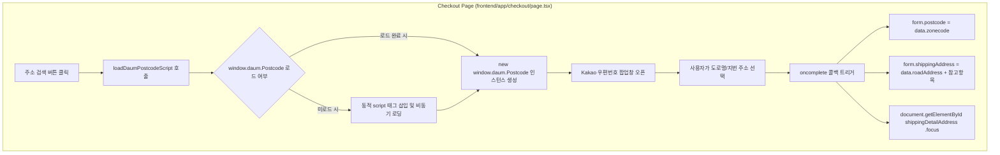

# Kakao 우편번호 서비스 배송지 주소 검색 연동 구현 계획

> **For agentic workers:** REQUIRED SUB-SKILL: Use superpowers:subagent-driven-development to implement this plan task-by-task. Steps use checkbox (`- [ ]`) syntax for tracking.

**Goal:** 결제 페이지(`frontend/app/checkout/page.tsx`)의 배송지 입력 섹션에 Kakao(Daum) 우편번호 검색 서비스를 연동하여, 사용자가 주소 검색 버튼을 클릭하면 공식 우편번호 팝업을 통해 5자리 우편번호와 도로명/지번 기본주소를 자동으로 입력받고 상세주소 입력창으로 포커스가 이동하도록 구현합니다.

**Architecture:** 외부 라이브러리 설치 없이 경량 동적 스크립트 로더 유틸리티(`frontend/lib/daumPostcode.ts`)를 작성하여 `//t1.daumcdn.net/mapjsapi/bundle/postcode/prod/postcode.v2.js`를 필요 시 온디맨드로 안전하게 로딩합니다. 주소 검색 버튼 클릭 시 `window.daum.Postcode` 인스턴스를 실행하고, 사용자가 선택한 주소 데이터(`zonecode`, `roadAddress` 또는 `jibunAddress`, `buildingName`)를 조합하여 주문서 상태(`form.postcode`, `form.shippingAddress`)에 반영한 뒤 상세주소(`shippingDetailAddress`) 엘리먼트에 포커스를 부여합니다.

**Architecture Diagram:**



**Tech Stack:** Next.js 14 App Router, TypeScript, Tailwind CSS, Daum Postcode JavaScript API v2 (`//t1.daumcdn.net/mapjsapi/bundle/postcode/prod/postcode.v2.js`), Lucide React.

**Spec:** 사용자 요구사항 1 - "결제 페이지의 배송지 기본주소 검색 시 kakao 우편번호 서비스를 사용하여 기본주소 입력받게 하고싶어 해당 기능 추가를 위한 과정 md파일을 superpowers skill을 사용하여 작성"

## Global Constraints

- 외부 무거운 npm 패키지(`react-daum-postcode` 등)를 추가 설치하지 않고, Next.js 14 SSR/Hydration 친화적인 네이티브 비동기 스크립트 로더(`frontend/lib/daumPostcode.ts`)를 구현하여 번들 크기 0KB 오버헤드 유지.
- Kakao 우편번호 서비스는 API 키 발급이 불필요한 공개 서비스(Open API)이므로 별도 환경변수 설정 불필요.
- Dark Athletic 디자인 토큰(`#0A0A0A`, `#141414`, `#1F1F1F`, `#262626`, `#FFD700`) 준수 및 최소 터치 타겟 44x44px 보장.
- `docs/erdcloud_schema.sql`은 절대 수정하거나 커밋하지 않음.

---

### Task 1: Daum Postcode 타입 선언 및 동적 스크립트 로더 모듈 구현

**Files:**
- Create: `frontend/lib/daumPostcode.ts`
- Create: `frontend/types/daum.d.ts`

**Interfaces:**
- Consumes: `window` 객체
- Produces: `loadDaumPostcodeScript(): Promise<void>`, `openDaumPostcodePopup(onComplete: (data: DaumPostcodeResult) => void): Promise<void>`

- [ ] **Step 1: Daum Postcode TypeScript 전역 인터페이스 선언 (`frontend/types/daum.d.ts`)**

```typescript
export interface DaumPostcodeData {
  zonecode: string;
  address: string;
  addressType: 'R' | 'J';
  userSelectedType: 'R' | 'J';
  roadAddress: string;
  jibunAddress: string;
  bname: string;
  buildingName: string;
  apartment: 'Y' | 'N';
}

export interface DaumPostcodeResult {
  zonecode: string;
  baseAddress: string;
  extraAddress: string;
  fullAddress: string;
}

declare global {
  interface Window {
    daum?: {
      Postcode: new (options: {
        oncomplete: (data: DaumPostcodeData) => void;
        onclose?: (state: string) => void;
        width?: string | number;
        height?: string | number;
      }) => {
        open: (options?: { popupName?: string }) => void;
        embed: (element: HTMLElement, options?: { autoClose?: boolean }) => void;
      };
    };
  }
}
```

- [ ] **Step 2: 비동기 스크립트 로더 및 팝업 헬퍼 유틸리티 구현 (`frontend/lib/daumPostcode.ts`)**

```typescript
import { DaumPostcodeData, DaumPostcodeResult } from '@/types/daum';

const DAUM_POSTCODE_SCRIPT_URL = '//t1.daumcdn.net/mapjsapi/bundle/postcode/prod/postcode.v2.js';

let scriptLoadingPromise: Promise<void> | null = null;

export function loadDaumPostcodeScript(): Promise<void> {
  if (typeof window === 'undefined') {
    return Promise.reject(new Error('Window is not defined'));
  }

  if (window.daum && window.daum.Postcode) {
    return Promise.resolve();
  }

  if (!scriptLoadingPromise) {
    scriptLoadingPromise = new Promise((resolve, reject) => {
      const existingScript = document.querySelector(`script[src="${DAUM_POSTCODE_SCRIPT_URL}"]`);
      if (existingScript) {
        existingScript.addEventListener('load', () => resolve());
        existingScript.addEventListener('error', (err) => reject(err));
        return;
      }

      const script = document.createElement('script');
      script.src = DAUM_POSTCODE_SCRIPT_URL;
      script.async = true;
      script.onload = () => resolve();
      script.onerror = () => {
        scriptLoadingPromise = null;
        reject(new Error('Kakao 우편번호 서비스 스크립트 로딩에 실패했습니다.'));
      };
      document.head.appendChild(script);
    });
  }

  return scriptLoadingPromise;
}

export async function openDaumPostcodePopup(
  onComplete: (result: DaumPostcodeResult) => void
): Promise<void> {
  await loadDaumPostcodeScript();

  if (!window.daum?.Postcode) {
    throw new Error('Kakao 우편번호 모듈이 준비되지 않았습니다.');
  }

  new window.daum.Postcode({
    oncomplete: (data: DaumPostcodeData) => {
      const baseAddress = data.userSelectedType === 'R' ? data.roadAddress : data.jibunAddress;
      let extraAddress = '';

      if (data.userSelectedType === 'R') {
        if (data.bname !== '' && /[동|로|가]$/g.test(data.bname)) {
          extraAddress += data.bname;
        }
        if (data.buildingName !== '' && data.apartment === 'Y') {
          extraAddress += extraAddress !== '' ? `, ${data.buildingName}` : data.buildingName;
        }
        if (extraAddress !== '') {
          extraAddress = ` (${extraAddress})`;
        }
      }

      const fullAddress = `${baseAddress}${extraAddress}`;

      onComplete({
        zonecode: data.zonecode,
        baseAddress,
        extraAddress,
        fullAddress,
      });
    },
  }).open();
}
```

- [ ] **Step 3: TypeScript 컴파일 검사**

Run: `cd frontend && npx tsc --noEmit`  
Expected: 0 errors

- [ ] **Step 4: Commit**

```bash
git add frontend/types/daum.d.ts frontend/lib/daumPostcode.ts
git commit -m "feat(checkout): add daum postcode typescript definitions and dynamic script loader"
```

---

### Task 2: 결제 페이지 주소 입력 폼 확장 및 우편번호 검색 연동

**Files:**
- Modify: `frontend/app/checkout/page.tsx`

**Interfaces:**
- Consumes: `openDaumPostcodePopup` from `@/lib/daumPostcode`
- Produces: `postcode` 상태 필드, `handleOpenPostcodeSearch` 이벤트 핸들러, 상세주소 자동 포커스

- [ ] **Step 1: OrderFormState에 `postcode` 필드 추가 및 상태 초기화**

```diff
 interface OrderFormState {
   ordererName: string;
   ordererPhone: string;
   ordererEmail: string;
   recipientName: string;
   recipientPhone: string;
+  postcode: string;
   shippingAddress: string;
   shippingDetailAddress: string;
   deliveryRequest: string;
 }
```

- [ ] **Step 2: 우편번호 검색 팝업 트리거 함수 구현**

```typescript
const handleOpenPostcodeSearch = async () => {
  try {
    await openDaumPostcodePopup((result) => {
      setForm((prev) => ({
        ...prev,
        postcode: result.zonecode,
        shippingAddress: result.fullAddress,
      }));

      // 주소 입력 완료 시 유효성 에러 즉시 해제
      setFieldErrors((prev) => {
        const next = { ...prev };
        delete next.postcode;
        delete next.shippingAddress;
        return next;
      });

      // 상세주소 입력창으로 자동 포커스 이동
      setTimeout(() => {
        document.getElementById('shippingDetailAddress')?.focus();
      }, 100);
    });
  } catch (err: any) {
    setErrorMessage(err.message || '우편번호 서비스를 불러오는 중 오류가 발생했습니다.');
  }
};
```

- [ ] **Step 3: 배송지 폼 UI에 우편번호 인풋 및 [우편번호 검색] 버튼 렌더링**

```tsx
<div className="space-y-3">
  <label htmlFor="postcode" className="text-xs font-semibold text-neutral-400 block">
    우편번호 및 기본 주소 <span className="text-rose-400">*</span>
  </label>
  <div className="flex gap-2.5">
    <input
      type="text"
      id="postcode"
      name="postcode"
      aria-label="우편번호"
      readOnly
      value={form.postcode}
      placeholder="우편번호 (5자리)"
      className="w-36 bg-neutral-900 border border-neutral-700 rounded-xl px-4 py-2.5 text-sm text-white font-mono placeholder:text-neutral-500 focus:outline-none focus:border-[#FFD700] transition-colors"
    />
    <button
      type="button"
      onClick={handleOpenPostcodeSearch}
      className="min-h-[44px] px-4 py-2 rounded-xl bg-neutral-800 hover:bg-neutral-700 border border-neutral-700 hover:border-[#FFD700] text-xs font-bold text-white transition-all flex items-center gap-1.5 shrink-0 active:scale-[0.98]"
    >
      <Search className="w-3.5 h-3.5 text-[#FFD700]" />
      <span>우편번호 검색</span>
    </button>
  </div>
  <div className="relative">
    <input
      type="text"
      id="shippingAddress"
      name="shippingAddress"
      aria-label="배송지 기본 주소"
      readOnly
      onClick={handleOpenPostcodeSearch}
      value={form.shippingAddress}
      placeholder="우편번호 검색 버튼을 눌러 주소를 검색하세요"
      className={`w-full bg-neutral-900 border rounded-xl px-4 py-2.5 text-sm text-white cursor-pointer placeholder:text-neutral-500 focus:outline-none transition-colors ${
        fieldErrors.shippingAddress
          ? 'border-rose-500 focus:border-rose-500 ring-1 ring-rose-500'
          : 'border-neutral-700 focus:border-[#FFD700]'
      }`}
    />
    <MapPin className="w-4 h-4 text-neutral-500 absolute right-3 top-3 pointer-events-none" />
  </div>
  {fieldErrors.shippingAddress && (
    <p className="text-xs text-rose-400 mt-1 flex items-center gap-1">
      <AlertCircle className="w-3 h-3 shrink-0" />
      <span>{fieldErrors.shippingAddress}</span>
    </p>
  )}
</div>
```

- [ ] **Step 4: 유효성 검사 업데이트 (`validateAndCreateOrder`)**

```typescript
if (!form.postcode.trim() || !form.shippingAddress.trim()) {
  errors.shippingAddress = '우편번호 검색을 통해 배송지 기본 주소를 입력해 주세요.';
}
```

- [ ] **Step 5: 프론트엔드 빌드 검증**

Run: `cd frontend && npm run build`  
Expected: Next.js 14 라우트 빌드 성공

- [ ] **Step 6: Commit**

```bash
git add frontend/app/checkout/page.tsx
git commit -m "feat(checkout): integrate daum postcode address search in checkout delivery form"
```

---

### Task 3: 주소 검색 E2E 시나리오 및 예외 상황 검증

**Files:**
- Test: 브라우저 통합 테스트 및 방어 로직 검증

- [ ] **Step 1: 팝업 차단 및 모바일 브라우저 환경 방어 로직 확인**
- [ ] **Step 2: 주소 선택 시 우편번호, 기본주소 반영 및 상세주소 자동 포커스 검증**
- [ ] **Step 3: 주문 생성 페이로드에 조합된 주소(`[12345] 서울 강남구...`) 정상 반영 확인**
