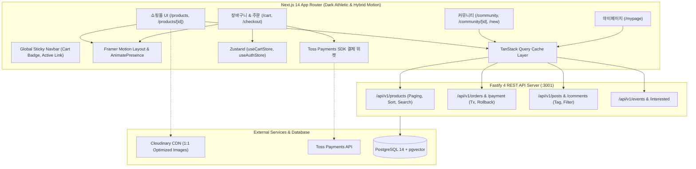

# 3주차(Week 3) 프론트엔드 UI & 커뮤니티 도메인 종합 구현 최종 계획서 (v2.0)

> **For agentic workers:** REQUIRED SUB-SKILL: Use superpowers:subagent-driven-development to implement this plan task-by-task. Steps use checkbox (`- [ ]`) syntax for tracking.  
> **기준 레퍼런스 문서**:  
> - [디자인 가이드라인](../../디자인_가이드라인.md) (`docs/디자인_가이드라인.md`)  
> - [E2E 테스트 명세서](../../e2e_테스트.md) (`docs/e2e_테스트.md`)  
> - [Supahero.io](https://supahero.io/) Dark Athletic Showcase 패턴

---

## 1. 개요 및 설계 철학 (ui-ux-pro-max & ponytail 하이브리드)

**Goal:** Next.js 14 App Router 기반으로 HYROX 특화 쇼핑몰(400개 직매입 장비), 장바구니/Toss Payments 결제 플로우, 커뮤니티 게시판 및 마이페이지를 구축하고, 4주차 RAG 검색의 토대가 될 스테이션별 커뮤니티 데이터셋을 완성한다.

**Design & Motion Philosophy:**
- **ui-ux-pro-max (Design Intelligence)**:
  - **테마**: Dark Athletic High-Contrast (심야 차콜 `#0A0A0A`, 서피스 `#141414`, 테두리 `#262626`) + HYROX Gold (`#FFD700`) & Lime (`#CCFF00`)
  - **레이아웃**: 1:1 정사각 썸네일 그리드, CLS 0 스켈레톤 사전 예약, 44x44px 터치 타겟, 명도 대비 4.5:1 이상 준수
- **하이브리드 모션 시스템 (Hybrid Motion)**:
  - **Tailwind CSS (90%)**: 호버 스케일업(`group-hover:scale-[1.02]`), 보더 점등, 스티키 블러 헤더, 카트 펄스 등 정적 마이크로 인터랙션을 0kb 번들 오버헤드로 브라우저 GPU 가속 처리
  - **Framer Motion (10%)**: 장바구니 삭제 시 퇴장 모션(`<AnimatePresence>`), 필터 변경 시 유기적 리스트 재배치(`layout` prop)에만 선별 적용하여 사용자의 시각적 연속성(Spatial Continuity)과 심리적 안심감 확보
- **ponytail (Senior Lazy Engineering)**:
  - 무분별한 서드파티 라이브러리 차단 (복잡한 캐러셀/폼 패키지 지양, 네이티브 폼 및 Zustand 상태 재사용)
  - 최소 코드, 최단 diff, 기존 자산(`useCartStore`, `fetchApi`, `lucide-react`) 100% 재활용

---

## 2. 전체 아키텍처 및 데이터 흐름

---

## 3. 3주차 세부 태스크 및 체크리스트

### Task 3-1: 프론트엔드 인프라 & 글로벌 네비게이션 최적화
* **참조 기준**: [디자인 가이드라인 4.1](../../디자인_가이드라인.md#41-글로벌-네비게이션-바-global-sticky-navbar)
* **Files**:
  - `frontend/package.json`
  - `frontend/next.config.mjs`
  - `frontend/components/Navbar.tsx`
  - `frontend/components/Footer.tsx`
  - `frontend/app/globals.css`

- [x] **Step 1: Framer Motion 및 CDN 인프라 설정**
  - `frontend/package.json`에 `framer-motion` 설치
  - `next.config.mjs`에 `res.cloudinary.com` remotePatterns 등록
- [x] **Step 2: 글로벌 스티키 블러 네비게이션 구현 (`Navbar.tsx`)**
  - 높이 64px, `sticky top-0 z-50 bg-[#0A0A0A]/85 backdrop-blur-md`
  - 4대 메뉴(`대회 일정`, `장비몰`, `커뮤니티`, `마이페이지`) 및 활성 라우트 골드 언더라인
  - Lucide SVG 아이콘 통일 (이모지 배제)
- [x] **Step 3: 장바구니 실시간 카운트 뱃지 & 펄스 인터랙션**
  - `useCartStore` 아이템 수량 연동 및 담기 이벤트 시 150ms 팝/펄스 애니메이션 적용
- [x] **Step 4: 빌드 검증**
  - `cd frontend && npm run build` 통과 확인

---

### Task 3-2: 커머스 쇼핑몰 UI 완성 (목록 / 상세 / 장바구니)
* **참조 기준**: [디자인 가이드라인 4.2~4.5](../../디자인_가이드라인.md#43-상품-카드-product-card), [E2E 테스트 시나리오 2 & 3](../../e2e_테스트.md#시나리오-2-400개-카탈로그-탐색-필터링-및-상세-조회-catalog-browsing--motion-ux)
* **Files**:
  - `frontend/app/products/page.tsx`
  - `frontend/app/products/[id]/page.tsx`
  - `frontend/app/cart/page.tsx`
  - `frontend/components/ProductCard.tsx`
  - `frontend/components/motion/MotionProductGrid.tsx`

- [ ] **Step 1: 상품 목록 페이지 고도화 (`/products`)**
  - 4대 카테고리 알약 칩(`ALL`, `SHOES`, `NUTRITION`, `GEAR`, `EQUIPMENT`)
  - Framer Motion `layout` 적용 그리드: 필터링 시 카드가 튀지 않고 유기적으로 슬라이드 재배치
  - 검색어 실시간 디바운스(300ms) 및 정렬 드롭다운
  - 20개 단위 페이징 버튼 바 및 검색 결과 0건 시 Empty State UI
- [ ] **Step 2: 상품 카드 인터랙션 (`ProductCard.tsx`)**
  - 1:1 정사각 고정 비율로 CLS 0 보장
  - 마우스 호버 시 `scale-[1.02]` 확대, 테두리 골드 점등, 250ms 그라디언트 딤 + 퀵 담기 버튼 슬라이드업
- [ ] **Step 3: 상품 상세 페이지 고도화 (`/products/[id]`)**
  - 1:1 Cloudinary 고해상도 뷰어 및 본사 직매입 정품 배지
  - 가격, 잔여 재고, 수량 증감(`+`, `-`), [장바구니 담기] & [바로 구매하기]
  - 이 상품이 태그된 커뮤니티 완주 후기 바로가기 배너 연동
- [ ] **Step 4: 장바구니 드로어/페이지 (`/cart`)**
  - 품목 삭제 시 `<AnimatePresence>` 부드러운 슬라이드 페이드아웃 적용
  - 주문 금액 요약(무료배송 프로모션 게이지) 및 [주문서 작성하기] CTA

---

### Task 3-3: Toss Payments SDK 결제 위젯 & E2E 결제 플로우
* **참조 기준**: [E2E 테스트 시나리오 3](../../e2e_테스트.md#시나리오-3-장바구니-담기-및-toss-payments-결제-플로우-cart--checkout-flow)
* **Files**:
  - `frontend/app/checkout/page.tsx`
  - `frontend/app/checkout/success/page.tsx`
  - `frontend/app/checkout/fail/page.tsx`

- [ ] **Step 1: Toss Payments 공식 SDK v2 클라이언트 초기화**
- [ ] **Step 2: 주문서 작성 및 재고 선차감 연동 (`/checkout`)**
  - 배송지 입력 ➔ 백엔드 `POST /api/v1/orders` 호출 (트랜잭션 재고 선차감)
- [ ] **Step 3: 토스 결제 위젯 렌더링 및 결제 요청**
  - 수신된 `orderId`와 `totalAmount`로 결제창 호출
- [ ] **Step 4: 승인 및 롤백 처리**
  - 성공 (`/checkout/success`): 백엔드 최종 승인 호출 ➔ 장바구니 비우기 ➔ 완료 영수증 출력
  - 실패 (`/checkout/fail`): 백엔드 재고 롤백 ➔ 에러 사유 안내 및 장바구니 유지

---

### Task 3-4: 커뮤니티 도메인 UI 구축 (피드 / 상세 / 글작성)
* **참조 기준**: [디자인 가이드라인 4.6](../../디자인_가이드라인.md#46-커뮤니티-포스트-카드-post-card), [E2E 테스트 시나리오 4](../../e2e_테스트.md#시나리오-4-커뮤니티-레이서-완주-후기-및-장비-태깅-community--gear-tagging)
* **Files**:
  - `frontend/app/community/page.tsx`
  - `frontend/app/community/[id]/page.tsx`
  - `frontend/app/community/new/page.tsx`
  - `frontend/components/PostCard.tsx`
  - `frontend/components/ProductSearchModal.tsx`

- [ ] **Step 1: 재사용 가능한 `PostCard` 컴포넌트 구현**
  - 대회 태그 배지, 작성자 완주 배지, 제목, 요약 본문, 댓글 수, 태그된 직매입 장비 칩
- [ ] **Step 2: 커뮤니티 메인 피드 (`/community`)**
  - 대회별 필터 탭 및 [완주 후기 & 훈련팁 작성하기] 액션 헤더
- [ ] **Step 3: 게시글 상세 페이지 (`/community/[id]`)**
  - 본문 훈련담 및 태그된 실제 장비 카드 노출 (클릭 시 `/products/[id]` 1탭 이동)
  - 댓글 목록 및 실시간 댓글 작성
- [ ] **Step 4: 게시글 작성 & 장비 태그 모달 (`/community/new`)**
  - 대회 선택, 제목, 본문 에디터
  - 장비 검색 모달(`AnimatePresence` 팝업): 400개 상품 중 검색하여 후기에 장비 외래키 매핑

---

### Task 3-5: 4주차 RAG 검색 토대용 커뮤니티/리뷰 대량 데이터셋 시딩
* **목적**: 4주차 AI RAG 검색을 위한 8대 스테이션 도메인 특화 데이터베이스 완성
* **Files**:
  - `backend/prisma/data/community-seed-data.json`
  - `backend/prisma/seed-community.ts`

- [ ] **Step 1: HYROX 8대 스테이션 특화 커뮤니티 데이터셋 구성**
  - 8개 스테이션별 완주 후기 60~80건, 댓글 120~150건, 실구매 리뷰 150건 생성
  - 각 게시글마다 관련 직매입 상품 1~3개씩 정교하게 외래키 매핑
- [ ] **Step 2: PostgreSQL DB 일괄 시딩 실행 및 검증**
  - `npx tsx prisma/seed-community.ts` 실행 후 카운트 확인

---

### Task 3-6: 마이페이지 및 전체 E2E 통합 검증
* **참조 기준**: [E2E 테스트 명세서 전체 시나리오 1~4](../../e2e_테스트.md)
* **Files**:
  - `frontend/app/mypage/page.tsx`

- [ ] **Step 1: 마이페이지 UI 구현 (`/mypage`)**
  - 프로필 대시보드 및 3대 탭(내 주문 내역, 관심 대회, 내 활동 게시글)
- [ ] **Step 2: E2E 4대 사용자 여정 시나리오 검증**
  - 시나리오 1: 대회 탐색 & 관심 대회 등록
  - 시나리오 2: 400개 카탈로그 필터링 및 1:1 상세 뷰어 (CLS 0)
  - 시나리오 3: 장바구니 수량 조절/삭제(퇴장 모션) & Toss Payments 결제 완결
  - 시나리오 4: 커뮤니티 후기 작성 & 직매입 장비 태깅 연계
- [ ] **Step 3: 시각적 결함 8대 체크리스트 최종 통과 확인**
  - 대비율 4.5:1, 터치타겟 44px, 모바일 safe-area, Lucide SVG 100%
- [ ] **Step 4: 백엔드/프론트엔드 빌드 및 Git 동기화**
  - `cd backend && npm test` (33개 테스트 ALL PASS)
  - `cd frontend && npm run build` (Type & Bundle 통과)
  - Git 브랜치 `week-3` 커밋 및 푸시
