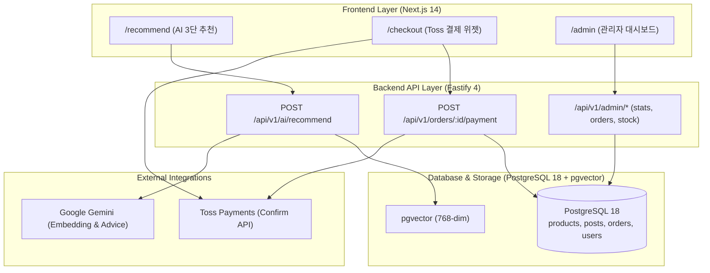

# FittersSweat 4주차: Gemini AI RAG 추천, Toss 실결제 & 관리자 대시보드 구현 계획서 (Implementation Plan)

> **For agentic workers:** REQUIRED SUB-SKILL: Use `superpowers:subagent-driven-development` to implement this plan task-by-task. Steps use checkbox (`- [ ]`) syntax for tracking.

**Goal:** Google Gemini Free Tier (`text-embedding-004` + `gemini-1.5-flash`) 기반의 AI 맞춤 추천 시스템을 구축하고, Toss Payments 실결제 팝업창 및 승인/롤백 API를 실연동하며, 매출/주문/재고를 총괄하는 관리자 대시보드(`/admin`)를 완성하여 클라우드에 배포합니다.

**Architecture:** 
1. **AI RAG**: 사용자 질문을 768차원 벡터로 변환하여 PostgreSQL 18 `pgvector`에서 상품과 후기를 코사인 유사도로 동시 검색하고, 외래키(`PostProductTag`) 교차 일치 시 +20% 가중치 랭킹 후 `gemini-1.5-flash`가 전문 처방을 합성하여 3단 UI(`/recommend`)로 서빙.
2. **Toss Payments**: 실제 유효한 테스트 키를 장착하여 토스 결제 위젯 iframe 정상 렌더링, 팝업창 결제 승인 통신 및 실패 시 원자적 재고 롤백 보장.
3. **Admin Dashboard**: `Role.ADMIN` 전용 미들웨어를 통해 총매출/주문 통계, 주문별 배송 상태 전환(`paid` ➔ `shipped` ➔ `delivered`), 400개 장비 실시간 재고 수정을 지원하는 통합 관리자 화면(`/admin`) 구축.

**Architecture Diagram:**

**Tech Stack:**
- Google Gemini API (`@google/generative-ai`: `text-embedding-004`, `gemini-1.5-flash`)
- Toss Payments SDK v2 (`@tosspayments/tosspayments-sdk`, Confirm API)
- PostgreSQL 18 + `pgvector` (`vector(768)`)
- Fastify 4, Prisma ORM 5.x, TypeScript 5, Jest
- Next.js 14 App Router, Tailwind CSS, Framer Motion, Lucide Icons

**Spec:** [docs/superpowers/specs/2026-09-14-gemini-rag-recommendation-design.md](file:///Users/kmj/Desktop/26-2/캡스톤/fittersweat/docs/superpowers/specs/2026-09-14-gemini-rag-recommendation-design.md)

## Global Constraints

- `docs/erdcloud_schema.sql` 절대 수정 및 Git 커밋 금지
- Dark Athletic 디자인 토큰 (`#0A0A0A`, `#141414`, `#1F1F1F`, `#262626`, `#FFD700`) 준수
- 터치 타겟 최소 44x44px 준수
- 백엔드 기존 45개 테스트 전체 PASS 유지
- `Role.ADMIN` 권한 검증 철저 (일반 유저는 403 Forbidden 및 프론트엔드 리다이렉트)

---

### Task 4-1: DB 스키마 pgvector(768) 마이그레이션 & Gemini SDK 모듈 구현

**Files:**
- Modify: `backend/prisma/schema.prisma:86,129`
- Modify: `backend/package.json`
- Modify: `backend/.env`
- Create: `backend/src/services/gemini.service.ts`
- Create: `backend/tests/gemini.service.test.ts`

- [ ] **Step 1: Write failing test for Gemini Service**
- [ ] **Step 2: Update Prisma schema to vector(768) and install `@google/generative-ai`**
- [ ] **Step 3: Run prisma generate & prisma db push**
- [ ] **Step 4: Implement `gemini.service.ts` with Mock Fallback**
- [ ] **Step 5: Run tests and verify PASS**
- [ ] **Step 6: Commit**

---

### Task 4-2: 400개 카탈로그 & 150개 후기 일괄 임베딩 적재 파이프라인

**Files:**
- Create: `backend/scripts/embed-catalog.ts`
- Modify: `backend/src/routes/posts.ts` (신규 글 작성 시 비동기 임베딩 갱신)
- Modify: `backend/package.json` (add `"db:embed"` script)

- [ ] **Step 1: Create `backend/scripts/embed-catalog.ts`**
- [ ] **Step 2: Update `backend/src/routes/posts.ts` for real-time post embedding**
- [ ] **Step 3: Run catalog embedding script**
- [ ] **Step 4: Commit**

---

### Task 4-3: Dual-Retriever & 교차 검증 추천 API (`POST /api/v1/ai/recommend`)

**Files:**
- Create: `backend/src/routes/ai.ts`
- Modify: `backend/src/app.ts`
- Create: `backend/tests/ai.test.ts`

- [ ] **Step 1: Write integration tests for `POST /api/v1/ai/recommend`**
- [ ] **Step 2: Implement `backend/src/routes/ai.ts` (Dual 코사인 검색, 외래키 +20% Reranking, 처방 합성)**
- [ ] **Step 3: Register `aiRoutes` in `backend/src/app.ts`**
- [ ] **Step 4: Run tests and verify PASS**
- [ ] **Step 5: Commit**

---

### Task 4-4: 프론트엔드 AI 맞춤추천 3단 액션 UI (`/recommend`)

**Files:**
- Create: `frontend/app/recommend/page.tsx`
- Modify: `frontend/components/Navbar.tsx`

- [ ] **Step 1: Create `frontend/app/recommend/page.tsx` with Dark Athletic theme**
  - 4대 퀵 프롬프트 칩
  - Section 1: AI 수석 어드바이저 1:1 처방 골드 콜아웃 박스
  - Section 2: 실제 완주 레이서 검증 후기 카드 (클릭 시 `/community/[id]` 1탭 이동)
  - Section 3: 추천 직매입 장비 카드 (`[장바구니 담기]` Zustand 연동 + `[바로 구매하기]` Toss 결제 연동)
- [ ] **Step 2: Update `frontend/components/Navbar.tsx` navigation link**
- [ ] **Step 3: Test production build `cd frontend && npm run build`**
- [ ] **Step 4: Commit**

---

### Task 4-5: Toss Payments 실결제 위젯 & 승인/롤백 API 실연동

**Files:**
- Modify: `backend/src/services/payment.service.ts`
- Modify: `backend/.env` (Toss Test Secret Key 설정)
- Modify: `frontend/app/checkout/page.tsx` (위젯 마운트 및 팝업 콜백 점검)
- Modify: `backend/tests/orders.test.ts`

- [ ] **Step 1: 유효한 Toss Test Secret Key 적용 및 `payment.service.ts` 실통신 로직 보강**
  - 클라이언트 키: `test_ck_D5GePWvyJnrK0W0k6q8gLzN97Eoq`
  - 시크릿 키: `test_sk_zXLkKEypNArWmo50nX3VQlmeAQyY`
  - Base64 Basic Auth로 `https://api.tosspayments.com/v1/payments/confirm` 통신 보장
- [ ] **Step 2: `frontend/app/checkout/page.tsx` 결제 위젯 정상 렌더링 확인**
  - DOM 컨테이너 `#payment-method`, `#agreement`에 토스 위젯 안정적 마운트
  - 결제 진행 시 `requestPayment` 팝업 호출 및 성공/실패 URL 리다이렉트 흐름 정합성 확보
- [ ] **Step 3: 결제 승인 실패/취소 시 원자적 재고 롤백 테스트 검증**
- [ ] **Step 4: 백엔드 주문/결제 테스트 실행 및 PASS 확인**
- [ ] **Step 5: Commit**

---

### Task 4-6: 관리자 대시보드 시스템 (`/admin`)

**Files:**
- Create: `backend/src/routes/admin.ts`
- Modify: `backend/src/app.ts`
- Create: `backend/tests/admin.test.ts`
- Create: `frontend/app/admin/page.tsx`
- Modify: `frontend/components/Navbar.tsx` (관리자 로그인 시 대시보드 이동 링크 표시)

- [ ] **Step 1: 백엔드 관리자 라우트 `backend/src/routes/admin.ts` 구현**
  - `verifyAdmin` 미들웨어 (JWT 인증 + `role === Role.ADMIN` 체크)
  - `GET /api/v1/admin/stats`: 총 누적 매출액, 총 주문 건수, 재고 부족(<=5) 장비 수, 회원 수
  - `GET /api/v1/admin/orders`: 전체 주문 목록 (주문자명, 연락처, 품목, 금액, 결제상태)
  - `PATCH /api/v1/admin/orders/:id/status`: 배송 상태 변경 (`paid` ➔ `shipped` ➔ `delivered`)
  - `PATCH /api/v1/admin/products/:id/stock`: 상품 재고 실시간 수정 (`stockQuantity`)
- [ ] **Step 2: 백엔드 관리자 API 테스트 `backend/tests/admin.test.ts` 작성 및 검증**
  - 일반 유저 접근 시 403 Forbidden 검증
  - 관리자 계정 통계 조회, 배송 상태 변경, 재고 수정 정상 동작 검증
- [ ] **Step 3: 프론트엔드 관리자 대시보드 `frontend/app/admin/page.tsx` 구현**
  - 비관리자 접근 방어 (게스트 또는 일반 유저 진입 시 경고 후 메인 리다이렉트)
  - 4대 핵심 KPI 카드 (총 매출액, 주문 건수, 재고 부족 장비, 회원 수)
  - 주문 & 배송 관리 탭: 주문 테이블, 원클릭 `[배송 시작]` / `[배송 완료]` 버튼
  - 400개 직매입 장비 실시간 재고 관리 탭: 검색/카테고리 필터, 재고 즉시 증감 및 품절 배지
- [ ] **Step 4: `Navbar.tsx`에 관리자 전용 배지/링크 연동 (`admin@fittersweat.com` 로그인 시 `[관리자 콘솔]` 노출)**
- [ ] **Step 5: Next.js 빌드 검증 (`npm run build`) 및 Git 커밋**

---

### Task 4-7: E2E 통합 검증 및 클라우드 배포 (Railway & Vercel) 동기화

**Files:**
- Modify: Railway Environment (`GEMINI_API_KEY`, `TOSS_SECRET_KEY`)
- Verify: Live production URLs

- [ ] **Step 1: 백엔드 전체 테스트 스위트 (50+ 테스트) ALL PASS 확인**
- [ ] **Step 2: Railway PostgreSQL 클라우드 DB `vector(768)` 스키마 푸시 및 일괄 임베딩 실행**
- [ ] **Step 3: Railway 백엔드 환경변수 세팅 및 배포 (`railway up ./backend`)**
- [ ] **Step 4: Vercel 프론트엔드 최신 배포 (`vercel --prod`)**
- [ ] **Step 5: 라이브 실서비스 브라우저 동작 검증**
  - `/recommend` AI 추천 ➔ 장바구니 ➔ `/checkout` 토스 실결제 ➔ `/admin` 주문 확인 및 배송 상태 변경
- [ ] **Step 6: 최종 워크스루 보고서 작성 및 브랜치 정리**
