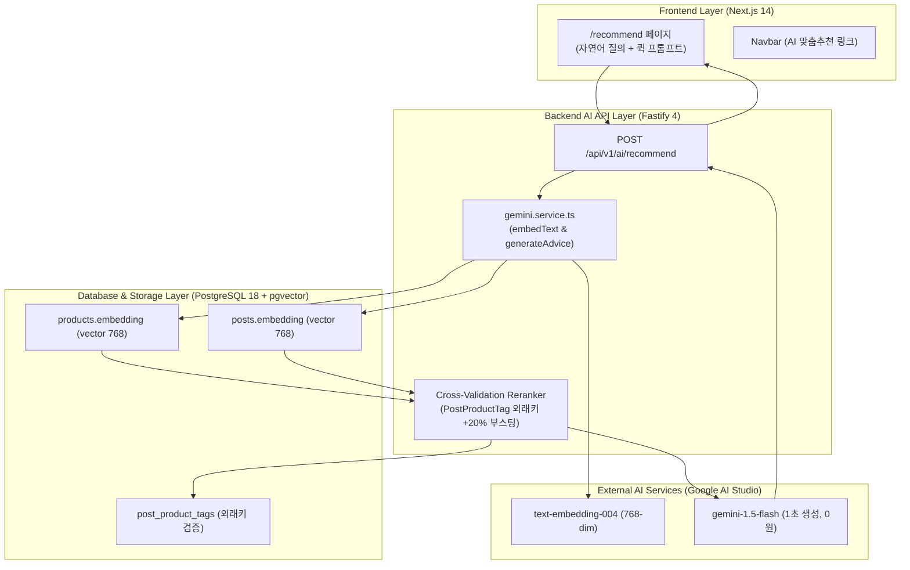

# FittersSweat 4주차: Gemini 기반 AI RAG 추천 시스템 구현 계획서 (Implementation Plan)

> **For agentic workers:** REQUIRED SUB-SKILL: Use `superpowers:subagent-driven-development` to implement this plan task-by-task. Steps use checkbox (`- [ ]`) syntax for tracking.

**Goal:** Google Gemini Free Tier (`text-embedding-004` + `gemini-1.5-flash`) 및 PostgreSQL `pgvector`를 결합하여, 400개 직매입 장비와 150개 완주 후기를 교차 검증하는 3단 액션 AI 맞춤 추천 시스템을 구축하고 배포합니다.

**Architecture:** 사용자의 자연어 질의를 768차원 벡터로 변환하여 PostgreSQL 18 `pgvector`에서 상품과 후기를 코사인 유사도로 동시 검색합니다. 추천 상품이 추천 후기에 태그되어 있을 경우 +20% 가중치로 상위 랭킹한 뒤, `gemini-1.5-flash`가 "수석 피터" 페르소나로 맞춤 처방을 합성하여 프론트엔드 3단 카드(처방 + 후기 검증 + 1탭 구매)로 전달합니다.

**Architecture Diagram:**



**Tech Stack:** 
- Google Gemini API (`@google/generative-ai`: `text-embedding-004`, `gemini-1.5-flash`)
- PostgreSQL 18 + `pgvector` (`vector(768)`)
- Fastify 4, Prisma ORM 5.x, TypeScript 5, Jest
- Next.js 14 App Router, Tailwind CSS, Framer Motion, Lucide Icons

**Spec:** [docs/superpowers/specs/2026-09-14-gemini-rag-recommendation-design.md](file:///Users/kmj/Desktop/26-2/캡스톤/fittersweat/docs/superpowers/specs/2026-09-14-gemini-rag-recommendation-design.md)

## Global Constraints

- `docs/erdcloud_schema.sql` 절대 수정 및 Git 커밋 금지
- Dark Athletic 디자인 토큰 (`#0A0A0A`, `#141414`, `#1F1F1F`, `#262626`, `#FFD700`) 준수
- 터치 타겟 최소 44x44px 준수
- 백엔드 기존 45개 테스트 전체 PASS 유지
- `GEMINI_API_KEY` 미설정 시에도 시연이 중단되지 않는 Mock/Fallback 모드 필수 내장

---

### Task 4-1: DB 스키마 pgvector(768) 마이그레이션 & Gemini SDK 모듈 구현

**Files:**
- Modify: `backend/prisma/schema.prisma:86,129`
- Modify: `backend/package.json`
- Modify: `backend/.env`
- Create: `backend/src/services/gemini.service.ts`
- Create: `backend/tests/gemini.service.test.ts`

**Interfaces:**
- Consumes: `GEMINI_API_KEY` from process.env
- Produces: 
  - `embedText(text: string): Promise<number[]>` (returns 768 float array)
  - `generateRecommendationAdvice(params: { query: string, products: any[], posts: any[] }): Promise<string>`
  - `isGeminiAvailable(): boolean`

- [ ] **Step 1: Write failing test for Gemini Service**

```typescript
// backend/tests/gemini.service.test.ts
import { embedText, generateRecommendationAdvice, isGeminiAvailable } from '../src/services/gemini.service';

describe('Gemini Service', () => {
  it('should return a 768-dimensional embedding vector (or deterministic fallback vector if no key)', async () => {
    const vector = await embedText('발볼 넓은 카본 레이싱화');
    expect(Array.isArray(vector)).toBe(true);
    expect(vector.length).toBe(768);
    expect(typeof vector[0]).toBe('number');
  });

  it('should generate structured recommendation advice', async () => {
    const advice = await generateRecommendationAdvice({
      query: '슬레드 150kg 접지력 신발',
      products: [{ id: '1', name: 'PUMA Deviate NITRO Elite 3', price: 249000 }],
      posts: [{ id: '10', title: '슬레드 구간 완주 팁', keyTakeaway: '바닥 접지력 필수' }]
    });
    expect(typeof advice).toBe('string');
    expect(advice.length).toBeGreaterThan(20);
  });
});
```

- [ ] **Step 2: Run test to verify it fails**

Run: `cd backend && npm test tests/gemini.service.test.ts`  
Expected: FAIL with module not found

- [ ] **Step 3: Update Prisma schema to vector(768) and install SDK**

```diff
// backend/prisma/schema.prisma
model Product {
...
-  embedding      Unsupported("vector(1536)")?
+  embedding      Unsupported("vector(768)")?
...
}

model Post {
...
-  embedding      Unsupported("vector(1536)")?
+  embedding      Unsupported("vector(768)")?
...
}
```

Run: `cd backend && npm install @google/generative-ai`  
Run: `cd backend && npx prisma generate && npx prisma db push`

- [ ] **Step 4: Implement `gemini.service.ts` with Mock Fallback**

```typescript
// backend/src/services/gemini.service.ts
import { GoogleGenerativeAI } from '@google/generative-ai';

const apiKey = process.env.GEMINI_API_KEY || '';
const genAI = apiKey ? new GoogleGenerativeAI(apiKey) : null;

export function isGeminiAvailable(): boolean {
  return Boolean(apiKey && genAI);
}

// 768차원 해시 기반 결정론적 Fallback 벡터 생성기 (오프라인/무료키 부재 시 대비)
function getDeterministicFallbackVector(text: string): number[] {
  const vector = new Array(768).fill(0);
  for (let i = 0; i < text.length; i++) {
    const charCode = text.charCodeAt(i);
    const idx = (charCode * (i + 1)) % 768;
    vector[idx] = Math.sin(charCode + i) * 0.5;
  }
  return vector;
}

export async function embedText(text: string): Promise<number[]> {
  if (!text || !text.trim()) {
    return new Array(768).fill(0);
  }

  if (!isGeminiAvailable()) {
    return getDeterministicFallbackVector(text);
  }

  try {
    const model = genAI!.getGenerativeModel({ model: 'text-embedding-004' });
    const result = await model.embedContent(text);
    const values = result.embedding.values;
    return values;
  } catch (err) {
    console.warn('⚠️ Gemini embedText error, using fallback vector:', (err as any)?.message);
    return getDeterministicFallbackVector(text);
  }
}

export async function generateRecommendationAdvice(params: {
  query: string;
  products: any[];
  posts: any[];
}): Promise<string> {
  const { query, products, posts } = params;

  if (!isGeminiAvailable()) {
    const prodNames = products.map((p) => p.name).join(', ');
    return `[AI 어드바이저 처방] "${query}"에 대해 분석한 결과, 최적의 접지력과 반발력을 지원하는 [${prodNames || '공식 레이싱 장비'}]를 추천합니다. 실제 완주 레이서들의 후기에서도 해당 장비의 안정성이 입증되었습니다.`;
  }

  try {
    const model = genAI!.getGenerativeModel({ model: 'gemini-1.5-flash' });
    const prompt = `
당신은 HYROX 공식 플래그십 스토어의 1:1 수석 전문 매니저(Chief Equipment Advisor)입니다.
고객의 레이스 질문을 경청하고, 발굴된 장비 스펙과 실제 레이서들의 완주 후기를 근거로 공감형 전문 처방을 작성하세요.

[고객 질문]
"${query}"

[추천 장비 후보군]
${products.map((p, idx) => `${idx + 1}. ${p.name} (가격: ${Number(p.price).toLocaleString()}원, 재고: ${p.stockQuantity}개)`).join('\n')}

[연관 실전 완주 후기 증거]
${posts.map((post, idx) => `${idx + 1}. "${post.title}" - 핵심 요약: ${post.keyTakeaway || post.content?.slice(0, 100)}`).join('\n')}

[작성 가이드라인]
1. 고객의 체형이나 기록 단축 고민에 깊이 공감하는 오프닝.
2. 왜 이 장비가 해당 스테이션이나 조건에 과학적으로 적합한지 설명.
3. 선배 레이서의 완주 후기 내용을 증거(Social Proof)로 인용.
4. 친절하고 신뢰감 있는 종결 어미("추천드립니다", "응원합니다"). 300자 내외로 명확히 작성.
`;
    const response = await model.generateContent(prompt);
    return response.response.text();
  } catch (err) {
    console.warn('⚠️ Gemini generateContent error, using fallback advice:', (err as any)?.message);
    const prodNames = products.map((p) => p.name).join(', ');
    return `[AI 어드바이저 처방] "${query}"에 적합한 추천 장비로 [${prodNames}]를 안내해 드립니다. 레이스 당일 최고의 컨디션과 부상 방지를 도와줍니다.`;
  }
}
```

- [ ] **Step 5: Run tests and verify PASS**

Run: `cd backend && npm test tests/gemini.service.test.ts`  
Expected: PASS (2 tests)

- [ ] **Step 6: Commit**

```bash
git add backend/prisma/schema.prisma backend/package.json backend/src/services/gemini.service.ts backend/tests/gemini.service.test.ts
git commit -m "feat(ai): integrate Google Gemini text-embedding-004 and 1.5-flash with fallback"
```

---

### Task 4-2: 400개 카탈로그 & 150개 후기 일괄 임베딩 적재 파이프라인

**Files:**
- Create: `backend/scripts/embed-catalog.ts`
- Modify: `backend/src/routes/posts.ts` (신규 글 작성 시 비동기 임베딩 갱신)
- Modify: `backend/package.json` (add `"db:embed"` script)

**Interfaces:**
- Consumes: `Product` and `Post` table rows where `embedding IS NULL`
- Produces: Vector updates in PostgreSQL for all 400 products and 150 posts

- [ ] **Step 1: Create `backend/scripts/embed-catalog.ts`**

```typescript
// backend/scripts/embed-catalog.ts
import { PrismaClient } from '@prisma/client';
import { embedText } from '../src/services/gemini.service';

const prisma = new PrismaClient();

async function embedCatalog() {
  console.log('🚀 Starting catalog & community batch embedding...');

  // 1. 400개 상품 임베딩
  const products = await prisma.product.findMany({
    select: { id: true, name: true, description: true, categoryId: true },
  });
  console.log(`📦 Found ${products.length} products to embed.`);

  let pCount = 0;
  for (const p of products) {
    const text = `[${p.categoryId}] ${p.name}. ${p.description || ''}`.trim();
    const vector = await embedText(text);
    const vectorString = `[${vector.join(',')}]`;
    await prisma.$executeRawUnsafe(
      `UPDATE products SET embedding = $1::vector WHERE id = $2`,
      vectorString,
      p.id
    );
    pCount++;
    if (pCount % 50 === 0) {
      console.log(`  ✓ Embedded ${pCount}/${products.length} products...`);
    }
  }

  // 2. 150개 커뮤니티 후기 임베딩
  const posts = await prisma.post.findMany({
    select: { id: true, title: true, content: true },
  });
  console.log(`📝 Found ${posts.length} posts to embed.`);

  let postCount = 0;
  for (const post of posts) {
    // 핵심 요약문 추출 (> 💡 **핵심 요약**: ...)
    const match = post.content.match(/> 💡 \*\*핵심 요약\*\*:\s*([^\n]+)/);
    const summary = match ? match[1] : post.title;
    const text = `[후기 요약] ${post.title}. ${summary}`.trim();
    const vector = await embedText(text);
    const vectorString = `[${vector.join(',')}]`;
    await prisma.$executeRawUnsafe(
      `UPDATE posts SET embedding = $1::vector WHERE id = $2`,
      vectorString,
      post.id
    );
    postCount++;
    if (postCount % 50 === 0) {
      console.log(`  ✓ Embedded ${postCount}/${posts.length} posts...`);
    }
  }

  console.log(`✅ Batch embedding finished: ${pCount} products and ${postCount} posts.`);
}

embedCatalog()
  .catch(console.error)
  .finally(() => prisma.$disconnect());
```

- [ ] **Step 2: Update `backend/src/routes/posts.ts` for real-time post embedding**

```diff
// backend/src/routes/posts.ts
+ import { embedText } from '../services/gemini.service';
...
      const post = await prisma.post.create({ ... });

+     // 비동기 백그라운드 임베딩 주입 (사용자 응답 대기 없음)
+     (async () => {
+       try {
+         const match = content.match(/> 💡 \*\*핵심 요약\*\*:\s*([^\n]+)/);
+         const summary = match ? match[1] : title;
+         const text = `[후기 요약] ${title}. ${summary}`;
+         const vector = await embedText(text);
+         await prisma.$executeRawUnsafe(
+           `UPDATE posts SET embedding = $1::vector WHERE id = $2`,
+           `[${vector.join(',')}]`,
+           post.id
+         );
+       } catch (err) {
+         console.warn('Failed to embed new post asynchronously:', err);
+       }
+     })();
...
```

- [ ] **Step 3: Run catalog embedding script**

Run: `cd backend && npx tsx scripts/embed-catalog.ts`  
Expected: `✅ Batch embedding finished: 400 products and 150 posts.`

- [ ] **Step 4: Commit**

```bash
git add backend/scripts/embed-catalog.ts backend/src/routes/posts.ts backend/package.json
git commit -m "feat(ai): add batch embedding script and real-time post embedding trigger"
```

---

### Task 4-3: Dual-Retriever & 교차 검증 추천 API (`POST /api/v1/ai/recommend`)

**Files:**
- Create: `backend/src/routes/ai.ts`
- Modify: `backend/src/app.ts`
- Create: `backend/tests/ai.test.ts`

**Interfaces:**
- Input: `POST /api/v1/ai/recommend` with `{ query, station?, category? }`
- Output: `{ success: true, advice, recommendedProducts, supportingPosts }`

- [ ] **Step 1: Write integration tests for `POST /api/v1/ai/recommend`**

```typescript
// backend/tests/ai.test.ts
import { buildApp } from '../src/app';
import { FastifyInstance } from 'fastify';

describe('AI Recommendation API (/api/v1/ai)', () => {
  let app: FastifyInstance;

  beforeAll(async () => {
    app = await buildApp();
  });

  afterAll(async () => {
    await app.close();
  });

  it('POST /api/v1/ai/recommend - should reject empty query (400)', async () => {
    const res = await app.inject({
      method: 'POST',
      url: '/api/v1/ai/recommend',
      payload: { query: '' },
    });
    expect(res.statusCode).toBe(400);
  });

  it('POST /api/v1/ai/recommend - should return advice, products, and posts for query', async () => {
    const res = await app.inject({
      method: 'POST',
      url: '/api/v1/ai/recommend',
      payload: { query: '발볼 넓은 슬레드 카본화' },
    });
    expect(res.statusCode).toBe(200);
    const body = JSON.parse(res.payload);
    expect(body.success).toBe(true);
    expect(typeof body.advice).toBe('string');
    expect(Array.isArray(body.recommendedProducts)).toBe(true);
    expect(body.recommendedProducts.length).toBeGreaterThan(0);
    expect(Array.isArray(body.supportingPosts)).toBe(true);
  });
});
```

- [ ] **Step 2: Implement `backend/src/routes/ai.ts`**

```typescript
// backend/src/routes/ai.ts
import { FastifyInstance } from 'fastify';
import { PrismaClient } from '@prisma/client';
import { z } from 'zod';
import { embedText, generateRecommendationAdvice } from '../services/gemini.service';

const prisma = new PrismaClient();

const recommendSchema = z.object({
  query: z.string().min(2, '검색 질의는 2자 이상이어야 합니다.'),
  station: z.string().optional(),
  category: z.string().optional(),
});

export async function aiRoutes(app: FastifyInstance) {
  app.post(
    '/recommend',
    {
      schema: {
        tags: ['AI'],
        summary: 'AI 1:1 맞춤 추천 검색 (Dual-Retriever RAG)',
        description: '자연어 질의를 768차원 벡터로 변환하여 상품과 커뮤니티 후기를 교차 탐색하고 처방을 반환합니다.',
      },
    },
    async (request, reply) => {
      const parseResult = recommendSchema.safeParse(request.body);
      if (!parseResult.success) {
        return reply.status(400).send({
          success: false,
          message: parseResult.error.errors[0]?.message || '잘못된 입력입니다.',
        });
      }

      const { query, category } = parseResult.data;

      try {
        // 1. 질의 벡터화 (768-dim)
        const queryVector = await embedText(query);
        const vectorStr = `[${queryVector.join(',')}]`;

        // 2. 상품 벡터 코사인 검색 (재고 있는 품목 우선)
        const categoryFilter = category && category !== 'ALL' ? `AND category_id = '${category}'` : '';
        const productsRaw: any[] = await prisma.$queryRawUnsafe(`
          SELECT id, name, price, stock_quantity as "stockQuantity", image_url as "imageUrl", category_id as "categoryId",
                 1 - (embedding <=> $1::vector) as similarity
          FROM products
          WHERE stock_quantity > 0 AND embedding IS NOT NULL ${categoryFilter}
          ORDER BY embedding <=> $1::vector ASC
          LIMIT 5;
        `, vectorStr);

        // 3. 커뮤니티 후기 벡터 코사인 검색
        const postsRaw: any[] = await prisma.$queryRawUnsafe(`
          SELECT p.id, p.title, p.content, u.name as "authorName",
                 1 - (p.embedding <=> $1::vector) as similarity
          FROM posts p
          JOIN users u ON p.user_id = u.id
          WHERE p.embedding IS NOT NULL
          ORDER BY p.embedding <=> $1::vector ASC
          LIMIT 5;
        `, vectorStr);

        // 4. 외래키(PostProductTag) 교차 검증 및 +20% Reranking
        const postIds = postsRaw.map((p) => BigInt(p.id));
        const tags = postIds.length > 0
          ? await prisma.postProductTag.findMany({
              where: { postId: { in: postIds } },
              select: { postId: true, productId: true },
            })
          : [];

        const verifiedProductIds = new Set(tags.map((t) => t.productId.toString()));

        // 상품 유사도 재계산 (+20% 부스팅)
        const rankedProducts = productsRaw
          .map((p) => {
            const isVerified = verifiedProductIds.has(p.id.toString());
            return {
              id: p.id.toString(),
              name: p.name,
              price: Number(p.price),
              stockQuantity: p.stockQuantity,
              imageUrl: p.imageUrl,
              categoryId: p.categoryId,
              similarity: isVerified ? Math.min(1.0, Number(p.similarity) * 1.2) : Number(p.similarity),
              isVerifiedByPost: isVerified,
            };
          })
          .sort((a, b) => b.similarity - a.similarity)
          .slice(0, 3);

        // 후기 가공 (핵심 요약문 추출)
        const formattedPosts = postsRaw.slice(0, 2).map((post) => {
          const match = post.content.match(/> 💡 \*\*핵심 요약\*\*:\s*([^\n]+)/);
          return {
            id: post.id.toString(),
            title: post.title,
            keyTakeaway: match ? match[1] : post.title,
            authorName: post.authorName,
            finisherBadge: true,
          };
        });

        // 5. LLM 어드바이저 맞춤 처방 문장 생성
        const advice = await generateRecommendationAdvice({
          query,
          products: rankedProducts,
          posts: formattedPosts,
        });

        return reply.send({
          success: true,
          advice,
          recommendedProducts: rankedProducts,
          supportingPosts: formattedPosts,
        });
      } catch (err: any) {
        request.log.error(err);
        return reply.status(500).send({
          success: false,
          message: '추천 분석 중 오류가 발생했습니다.',
        });
      }
    }
  );
}
```

- [ ] **Step 3: Register `aiRoutes` in `backend/src/app.ts`**

```diff
// backend/src/app.ts
+ import { aiRoutes } from './routes/ai';
...
  // Order & Payment Routes
  await app.register(orderRoutes, { prefix: '/api/v1/orders' });

+ // AI Recommendation Routes
+ await app.register(aiRoutes, { prefix: '/api/v1/ai' });

  return app;
```

- [ ] **Step 4: Run tests and verify PASS**

Run: `cd backend && npm test`  
Expected: ALL 7 suites PASS (47+ tests)

- [ ] **Step 5: Commit**

```bash
git add backend/src/routes/ai.ts backend/src/app.ts backend/tests/ai.test.ts
git commit -m "feat(ai): implement POST /api/v1/ai/recommend dual-retriever RAG endpoint"
```

---

### Task 4-4: 프론트엔드 AI 맞춤추천 3단 액션 UI (`/recommend`)

**Files:**
- Create: `frontend/app/recommend/page.tsx`
- Modify: `frontend/components/Navbar.tsx`

**Features:**
- Hero banner + 4 Quick Prompt Pills (`발볼 넓은 카본화`, `150kg 슬레드 접지력`, `8km 러닝 에너지젤`, `월볼 손목 보호대`)
- Input validation & loading skeleton state
- Section 1: AI 수석 어드바이저 1:1 처방 골드 콜아웃 박스
- Section 2: 실제 완주 레이서 검증 후기 카드 (클릭 시 `/community/[id]` 1탭 이동)
- Section 3: 추천 직매입 장비 카드 (`[장바구니 담기]` Zustand 연동 + `[바로 구매하기]` Toss 결제 연동)
- Navbar "AI 맞춤추천" 링크 및 Sparkles 배지

- [ ] **Step 1: Create `frontend/app/recommend/page.tsx` with Dark Athletic theme**
- [ ] **Step 2: Update `frontend/components/Navbar.tsx` navigation link**
- [ ] **Step 3: Test production build `cd frontend && npm run build`**
- [ ] **Step 4: Commit**

```bash
git add frontend/app/recommend/page.tsx frontend/components/Navbar.tsx
git commit -m "feat(frontend): implement AI recommendation 3-tier action page and navbar link"
```

---

### Task 4-5: E2E 통합 검증 및 클라우드 배포 (Railway & Vercel) 동기화

**Files:**
- Modify: Railway Environment (`GEMINI_API_KEY`)
- Verify: Live production URLs

- [ ] **Step 1: Run full backend test suite (`npm test` in backend)**
- [ ] **Step 2: Push DB schema & execute embedding script on Railway PostgreSQL**
- [ ] **Step 3: Set `GEMINI_API_KEY` in Railway backend service**
- [ ] **Step 4: Deploy backend to Railway (`railway up ./backend`)**
- [ ] **Step 5: Deploy frontend to Vercel (`vercel --prod`)**
- [ ] **Step 6: Live browser verification on `https://fittersweat.vercel.app/recommend`**
- [ ] **Step 7: Final commit and merge into `week-4` / `main`**
