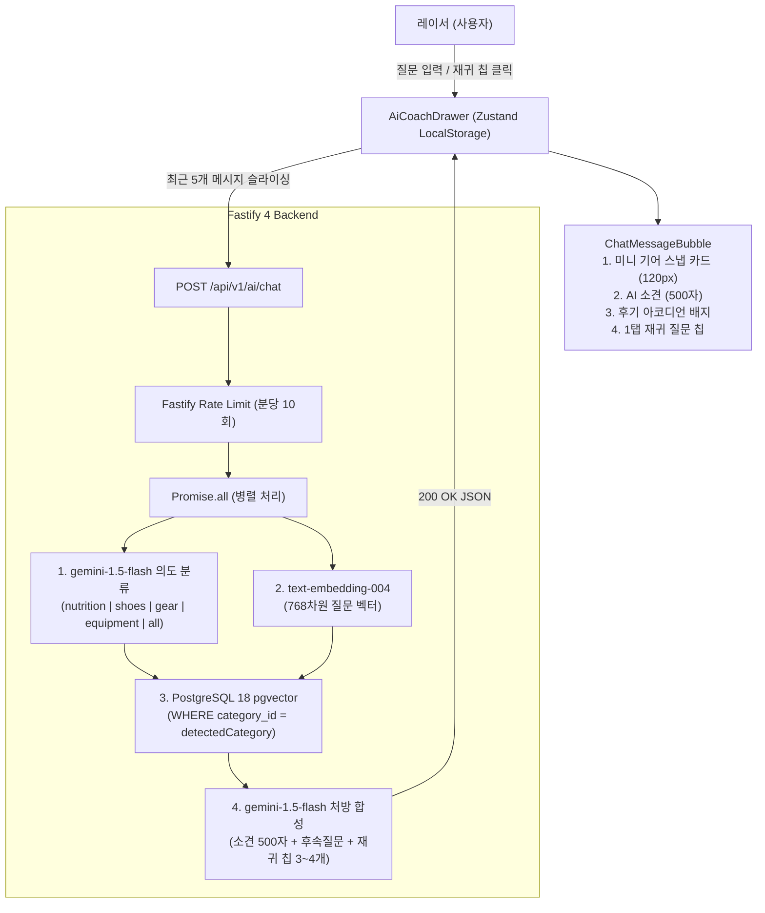

# AI 대화형 챗 드로어, Gemini 인텐트 분류 & 세션 지속성 구현 계획서 (Implementation Plan)

> **For agentic workers:** REQUIRED SUB-SKILL: Use superpowers:subagent-driven-development to implement this plan task-by-task. Steps use checkbox (`- [ ]`) syntax for tracking.

**Goal:** 사용자의 쇼핑 의도를 LLM으로 자동 분류하여 카테고리 내 코사인 검색을 수행하고, 새로고침/페이지 이동에도 세션이 보존되는 좌측 슬라이드형 대화형 챗 드로어와 1탭 재귀 질문 칩 시스템을 구축한다.

**Architecture:**
백엔드는 `@fastify/rate-limit`(분당 10회)을 통과한 요청에 대해 `gemini-1.5-flash` JSON 모드로 카테고리 의도를 판별하고, `pgvector` 코사인 검색을 해당 카테고리로 좁혀 수행한 뒤 500자 이내 소견과 재귀 질문 칩(3~4개)을 합성하여 반환한다. 프론트엔드는 Zustand + LocalStorage persist 기반으로 메시지 이력을 보존하며, Framer Motion 좌측 슬라이드 드로어와 컴팩트 3단 카드(120px 미니 기어 스냅 캐러셀, 후기 아코디언, 재귀 칩)를 통해 모바일/데스크톱 모두에서 쾌적한 인터랙션을 제공한다.

**Architecture Diagram:**



**Tech Stack:**
- Backend: Fastify 4, `@fastify/rate-limit` 9, `@google/generative-ai`, Prisma Client 5, PostgreSQL 18 `pgvector`
- Frontend: Next.js 14.2 (App Router), Zustand 4 (persist), Framer Motion 11, Lucide React, Tailwind CSS
- Testing: Jest 29, Supertest

**Spec:** [`docs/superpowers/specs/2026-09-15-ai-chat-drawer-recommendation-design.md`](file:///Users/kmj/Desktop/26-2/캡스톤/fittersweat/docs/superpowers/specs/2026-09-15-ai-chat-drawer-recommendation-design.md)

## Global Constraints
- `docs/erdcloud_schema.sql`은 절대 수정하거나 커밋하지 않는다.
- `ponytail` 철학 준수: 네이티브 플랫폼/표준 라이브러리 우선, 불필요한 추상화 금지, 가장 단순한 최소 코드.
- `ui-ux-pro-max` 디자인 시스템: Dark Athletic 토큰 (`#0A0A0A`, `#141414`, `#262626`, `#FFD700`, `#CCFF00`), 최소 터치 타겟 44x44px, `focus-visible:ring-2`.
- AI 소견 출력은 최대 500자 이내로 엄격히 제한 (`maxOutputTokens: 500`).
- API 요청 시 대화 이력은 최근 5개 메시지만 슬라이싱하여 전송 (`history.slice(-5)`).

---

## 🚀 Task-by-Task Implementation Plan

### Task 1: 백엔드 Gemini 의도 분류 & 재귀 질문 생성 모듈 구현 (TDD)

**Files:**
- Modify: `backend/src/services/gemini.service.ts`
- Test: `backend/tests/gemini.service.test.ts`

**Interfaces:**
- Produces:
  ```typescript
  export interface CategoryClassification {
    category: 'nutrition' | 'shoes' | 'gear' | 'equipment' | 'all';
    reason: string;
  }

  export interface ChatAdvisorResponse {
    advice: string;
    followUpQuestion: string;
    suggestedQueries: string[];
  }
  ```
  - `geminiService.classifyQueryIntent(query: string, history?: Array<{ role: string; content: string }>, currentCategory?: string): Promise<CategoryClassification>`
  - `geminiService.generateChatResponse(query: string, products: any[], posts: any[], history?: Array<{ role: string; content: string }>): Promise<ChatAdvisorResponse>`

- [ ] **Step 1: Write failing unit tests in `backend/tests/gemini.service.test.ts`**

Add tests for:
1. `classifyQueryIntent`: correctly identifies `nutrition` for "에너지젤 추천해줘", `shoes` for "접지력 좋은 신발", inherits `currentCategory` on short follow-up "카페인 없는 건?", and falls back to regex keywords in mock mode.
2. `generateChatResponse`: returns `advice` within 500 characters, `followUpQuestion` string, and 3~4 `suggestedQueries` items.

- [ ] **Step 2: Run tests to verify they fail**

Run: `npm --prefix backend test tests/gemini.service.test.ts`
Expected: FAIL (methods not defined).

- [ ] **Step 3: Implement minimal code in `backend/src/services/gemini.service.ts`**

- Implement `classifyQueryIntent`:
  - If `genAI` is initialized and not in mock mode: prompt `gemini-1.5-flash` with JSON output schema (`{ category, reason }`), passing `query`, `history`, and `currentCategory`.
  - In mock/fallback mode: use rule-based regex to classify (`nutrition` for 젤/보충제/단백질/카페인/전해질, `shoes` for 신발/러닝화/접지화, `gear` for 보호대/슬리브/양말/테이핑, `equipment` for 슬레드/케틀벨/월볼, else `currentCategory` or `all`).
- Implement `generateChatResponse`:
  - Pass `maxOutputTokens: 500` to `getGenerativeModel`.
  - Return `{ advice, followUpQuestion, suggestedQueries }`.
  - In mock mode: generate realistic 2-3 sentence advice, a relevant follow-up question, and 3-4 clickable recursive query strings.

- [ ] **Step 4: Run tests to verify they pass**

Run: `npm --prefix backend test tests/gemini.service.test.ts`
Expected: PASS (all tests green).

- [ ] **Step 5: Commit**

```bash
git add backend/src/services/gemini.service.ts backend/tests/gemini.service.test.ts
git commit -m "feat(ai): implement gemini intent classifier and recursive question generator"
```

---

### Task 2: 백엔드 Fastify Rate Limit & 멀티턴 챗 API (`POST /api/v1/ai/chat`) (TDD)

**Files:**
- Modify: `backend/src/app.ts` (register `@fastify/rate-limit`)
- Modify: `backend/src/routes/ai.ts` (add `POST /chat` endpoint)
- Test: `backend/tests/ai.test.ts`

**Interfaces:**
- Consumes: `geminiService.classifyQueryIntent`, `geminiService.embedText`, `geminiService.generateChatResponse`, PostgreSQL `products` and `posts`
- Produces: `POST /api/v1/ai/chat` endpoint returning `{ success, detectedCategory, categoryReason, advice, followUpQuestion, suggestedQueries, recommendedProducts, verifiedReviews }`

- [ ] **Step 1: Write failing tests in `backend/tests/ai.test.ts`**

Add tests for:
1. `POST /api/v1/ai/chat` with energy gel query returns only `nutrition` products (0 shoes/equipment).
2. `POST /api/v1/ai/chat` preserves `currentCategory` on follow-up question.
3. Fastify rate limiting returns HTTP 429 when exceeding 10 requests per minute with Korean warning message.

- [ ] **Step 2: Run tests to verify they fail**

Run: `npm --prefix backend test tests/ai.test.ts`
Expected: FAIL (route or behavior not implemented).

- [ ] **Step 3: Register rate limit and implement `POST /api/v1/ai/chat`**

- In `backend/src/app.ts`:
  - Register `@fastify/rate-limit` with `max: 10`, `timeWindow: '1 minute'`, custom keyGenerator supporting IP and JWT `user.id`, and custom errorResponse returning:
    `{ success: false, message: "매크로 방지를 위해 분당 메세지 제한이 설정되었습니다. 5회 경고 시 아이디가 영구 차단됩니다." }`
- In `backend/src/routes/ai.ts`:
  - Implement `app.post('/chat', ...)`:
    1. Parse `{ query, history, currentCategory }`.
    2. Parallel execution: `Promise.all([ geminiService.classifyQueryIntent(query, history?.slice(-5), currentCategory), geminiService.embedText(query) ])`.
    3. Category filtering in SQL: `WHERE ($2::text = 'all' OR category_id = $2)`.
    4. Top products & posts retrieval and foreign key reranking (+20%).
    5. Generate chat response with `generateChatResponse`.
    6. Return unified response.

- [ ] **Step 4: Run tests to verify they pass**

Run: `npm --prefix backend test tests/ai.test.ts`
Expected: PASS.

- [ ] **Step 5: Commit**

```bash
git add backend/src/app.ts backend/src/routes/ai.ts backend/tests/ai.test.ts
git commit -m "feat(ai): implement rate-limited multi-turn chat endpoint with category filtering"
```

---

### Task 3: 프론트엔드 Zustand AI Chat Store 구현 (`useAiChatStore.ts`)

**Files:**
- Create: `frontend/stores/useAiChatStore.ts`

**Interfaces:**
- Produces:
  ```typescript
  export interface ChatMessage {
    id: string;
    role: 'user' | 'assistant';
    content: string;
    detectedCategory?: string;
    products?: RecommendedProduct[];
    reviews?: VerifiedReview[];
    followUpQuestion?: string;
    suggestedQueries?: string[];
    createdAt: number;
  }

  export interface AiChatStore {
    isOpen: boolean;
    messages: ChatMessage[];
    currentCategory: string;
    isLoading: boolean;
    warningCount: number;
    guestQueryCount: number;
    error: string | null;

    toggleOpen: () => void;
    setOpen: (open: boolean) => void;
    sendMessage: (query: string) => Promise<void>;
    resetConversation: () => void;
  }
  ```

- [ ] **Step 1: Create `frontend/stores/useAiChatStore.ts`**

- Use `zustand` and `persist` middleware with `localStorage` key `'fittersweat-ai-coach-session'`.
- Initial state with welcome message from AI Fit Coach and default suggested query pills.
- `sendMessage(query)` implementation:
  - Check `guestQueryCount >= 10` if not authenticated -> trigger login modal flag.
  - Slice history to last 5 messages (`messages.slice(-5)`).
  - Optimistically append user message.
  - Call `POST ${apiUrl}/api/v1/ai/chat`.
  - Handle 429 rate limit error: increment `warningCount` and set warning error banner.
  - On success: update `currentCategory`, append assistant message with `products`, `reviews`, `followUpQuestion`, `suggestedQueries`.
- `resetConversation()`: clear messages back to welcome message.

- [ ] **Step 2: TypeScript verification**

Run: `npm --prefix frontend run build` (or `npx tsc --noEmit`)
Expected: 0 errors.

- [ ] **Step 3: Commit**

```bash
git add frontend/stores/useAiChatStore.ts
git commit -m "feat(store): create persistent Zustand ai chat store with sliding window and guest quota"
```

---

### Task 4: 프론트엔드 AI 챗 컴포넌트 구현 (점진적 공개 3단 카드 & 재귀 칩)

**Files:**
- Create: `frontend/components/ai/MiniProductCard.tsx`
- Create: `frontend/components/ai/ReviewAccordion.tsx`
- Create: `frontend/components/ai/RecursiveQueryPills.tsx`
- Create: `frontend/components/ai/ChatMessageBubble.tsx`

**Interfaces:**
- `MiniProductCard`: props `{ product: RecommendedProduct }` (120px height, 1:1 square thumbnail, 1-tap cart button, price, name)
- `ReviewAccordion`: props `{ review: VerifiedReview }` (inline accordion with Framer Motion `AnimatePresence`, expands 2-line racer tip)
- `RecursiveQueryPills`: props `{ queries: string[], onSelect: (q: string) => void }` (horizontal scrollable chips, 44px touch targets)
- `ChatMessageBubble`: props `{ message: ChatMessage, onSelectQuery: (q: string) => void }` (assembles mini cards + 500-char advice + review accordion + recursive pills)

- [ ] **Step 1: Create `MiniProductCard.tsx`**

- 120px height snap card with Cloudinary thumbnail, product title (truncated), formatted price, and 1-tap [장바구니 담기] button (adds to `useCartStore` with toast notification).

- [ ] **Step 2: Create `ReviewAccordion.tsx`**

- `#1F1F1F` subtle background with `#FFD700` finisher badge icon.
- Clicking toggles inline expansion with Framer Motion without navigating away or causing layout shifts.

- [ ] **Step 3: Create `RecursiveQueryPills.tsx`**

- Renders 3~4 pills with `bg-[#262626] text-white hover:bg-[#FFD700] hover:text-black transition-all`.
- Click triggers `onSelect(query)`.

- [ ] **Step 4: Create `ChatMessageBubble.tsx`**

- Visual hierarchy:
  1. Top: Horizontal scroll snap row of `MiniProductCard`s.
  2. Middle: Assistant markdown advice text (500-character cap, clean line-height).
  3. Lower: `ReviewAccordion` for social proof tips.
  4. Bottom: `followUpQuestion` text and `RecursiveQueryPills`.

- [ ] **Step 5: Verify build & commit**

Run: `npm --prefix frontend run build`
Expected: 0 errors.

```bash
git add frontend/components/ai/
git commit -m "feat(ui): implement progressive disclosure chat bubble components with mini cards and recursive pills"
```

---

### Task 5: 프론트엔드 좌측 슬라이드 드로어 & 전역 연동 (`AiCoachDrawer.tsx`, `AiCoachFab.tsx`)

**Files:**
- Create: `frontend/components/ai/AiCoachDrawer.tsx`
- Create: `frontend/components/ai/AiCoachFab.tsx`
- Modify: `frontend/app/layout.tsx` (mount `AiCoachDrawer` & `AiCoachFab` globally)
- Modify: `frontend/components/Navbar.tsx` (link `AI 맞춤추천` to `toggleOpen()`)
- Modify: `frontend/app/recommend/page.tsx` (auto-open drawer on mount)

**Interfaces:**
- `AiCoachDrawer`: mounts globally, animated slide-over from left (`x: '-100%'` to `0`), backdrop overlay on mobile, escape key listener, scroll lock when open on mobile, guest 10-query limit modal, 429 warning alert banner.
- `AiCoachFab`: bottom-right floating toggle button (`fixed bottom-6 right-6 z-40`), glowing gold pulse badge, 48x48px touch target.

- [ ] **Step 1: Create `AiCoachDrawer.tsx`**

- Framer Motion `<AnimatePresence>` left-drawer (`w-full max-w-[420px] bg-[#141414] border-r border-[#262626] h-full fixed top-0 left-0 z-50 flex flex-col shadow-2xl`).
- Header: `⚡ Fit Coach` logo, reset conversation button (`RotateCcw`), close button (`X`).
- Scrollable body: auto-scrolling message list with `ChatMessageBubble`.
- Rate limit warning banner (5-warning ban countdown).
- Guest 10-query limit overlay with [1초 간편 로그인] button.
- Bottom sticky input bar: input textarea/text, send button (`Send` icon, 44px), disabled when `isLoading`.

- [ ] **Step 2: Create `AiCoachFab.tsx`**

- Fixed bottom-right button: `bg-[#FFD700] text-black font-black p-3.5 rounded-full shadow-lg hover:scale-105 transition-transform flex items-center space-x-2`.
- Accessible `aria-label="AI 기어 코치 열기"`.

- [ ] **Step 3: Mount in `layout.tsx`, `Navbar.tsx`, and `recommend/page.tsx`**

- In `frontend/app/layout.tsx`: include `<AiCoachDrawer />` and `<AiCoachFab />` inside body so it is universally available on all pages.
- In `frontend/components/Navbar.tsx`: when user clicks `AI 맞춤추천`, call `useAiChatStore.getState().toggleOpen()` instead of navigating away.
- In `frontend/app/recommend/page.tsx`: on mount, call `useAiChatStore.getState().setOpen(true)` and render a sleek background hero encouraging exploration.

- [ ] **Step 4: Verify build & commit**

Run: `npm --prefix frontend run build`
Expected: 0 errors, all 15 routes compiled cleanly.

```bash
git add frontend/components/ai/AiCoachDrawer.tsx frontend/components/ai/AiCoachFab.tsx frontend/app/layout.tsx frontend/components/Navbar.tsx frontend/app/recommend/page.tsx
git commit -m "feat(ui): implement left slide-over ai coach drawer with global fab and navbar integration"
```

---

### Task 6: E2E 통합 검증 & 클라우드(Railway & Vercel) 최신 동기화

**Files:**
- Test: All backend tests (`npm --prefix backend test`)
- Build: Frontend production build (`npm --prefix frontend run build`)
- Deploy: Railway backend (`railway up ./backend`)
- Deploy: Vercel frontend (`vercel --prod`)

- [ ] **Step 1: Run full backend test suite**

Run: `npm --prefix backend test`
Expected: ALL test suites pass (60+ tests, 0 failures).

- [ ] **Step 2: Run frontend production build**

Run: `npm --prefix frontend run build`
Expected: 15 routes compile with 0 type errors.

- [ ] **Step 3: Deploy backend to Railway**

Run: `npx @railway/cli up ./backend --path-as-root --service backend -y`
Verify: `curl -s https://backend-production-819f.up.railway.app/health`

- [ ] **Step 4: Deploy frontend to Vercel**

Deploy with production token and verify `fittersweat.vercel.app`.

- [ ] **Step 5: Live E2E Verification**

1. Energy gel intent test: `POST https://backend-production-819f.up.railway.app/api/v1/ai/chat` with query `"후반 버피와 런에서 쥐 안 나고 즉각 흡수되는 에너지젤 추천해줘"`.
   Verify: `detectedCategory === 'nutrition'` and all recommended products are nutrition (no shoes or turf tape).
2. Live UI verification on `https://fittersweat.vercel.app`:
   - Left drawer opens on FAB or Navbar click.
   - 120px mini product cards render with 1-tap cart.
   - Review accordion expands inline.
   - Clicking recursive query pill sends next question.
   - Navigating to `/products` and reloading preserves chat history in drawer.

- [ ] **Step 6: Update task.md & walkthrough.md, commit and push**

```bash
git add task.md walkthrough.md
git commit -m "docs: complete AI chat drawer, intent classification and session persistence implementation"
git push origin week-3
```
