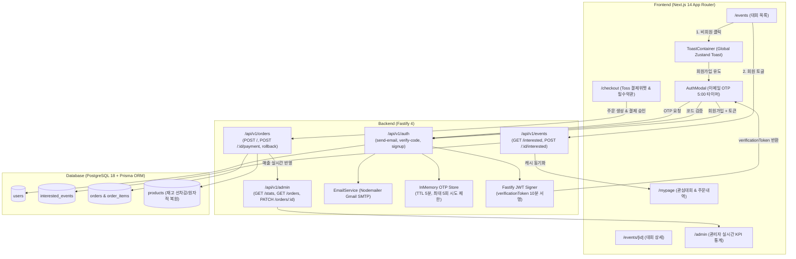

# FittersSweat 4.2주차 핵심 기능 최종 구현 계획서 (Implementation Plan)

> **For agentic workers:** REQUIRED SUB-SKILL: Use superpowers:subagent-driven-development to implement this plan task-by-task. Steps use checkbox (`- [ ]`) syntax for tracking.

**Goal:** FittersSweat의 3대 핵심 유저 여정인 (1) 관심 대회 비회원 가드/회원 실시간 동기화, (2) Toss Payments SDK v2 위젯 결제 및 관리자 대시보드 실시간 연동, (3) Gmail SMTP + Nodemailer 기반 6자리 이메일 OTP 인증 시스템을 구축한다.

**Architecture:**
백엔드는 Fastify 4 기반으로 Google Gmail SMTP(`smtp.gmail.com:587`, TLS)와 Nodemailer를 연동하여 Dark Athletic HTML 이메일 OTP를 발송한다. 무차별 대입 공격(Brute-force) 방어를 위해 인메모리 Map에 5분 TTL과 최대 5회 시도 제한을 두고, 검증 통과 시 10분 유효기간의 서명된 JWT `verificationToken`을 발급하여 `POST /api/v1/auth/signup`에서 무결성을 검증한다. 프론트엔드는 전역 ToastStore를 통해 비회원 관심대회 등록 시도 시 로그인/회원가입 모달을 유도하고, Toss Payments 결제위젯과 필수 약관 동의 위젯을 연동하여 결제 성공 시 관리자 대시보드(`/admin`)에 실시간 매출 및 주문 상태를 반영한다.

**Architecture Diagram:**



**Tech Stack:**
- **Frontend**: Next.js 14.2 (App Router), TypeScript, Tailwind CSS, Zustand, TanStack React Query v5, Framer Motion, Lucide React
- **Backend**: Fastify 4, Prisma ORM 5, PostgreSQL 18, Nodemailer 6.9, `@fastify/jwt`, `@fastify/rate-limit`
- **PG & APIs**: Toss Payments SDK v2 (결제수단 위젯 + 이용약관 위젯), Daum Postcode 카카오 우편번호 검색 API, Google Gmail SMTP

**Spec:** [`docs/superpowers/specs/2026-09-16-week-4.2-features-spec.md`](file:///Users/kmj/Desktop/26-2/캡스톤/fittersweat/docs/superpowers/specs/2026-09-16-week-4.2-features-spec.md)

## Global Constraints
- `docs/erdcloud_schema.sql`은 절대 수정하거나 커밋하지 않는다.
- `ponytail` 무결함 원칙: 추가 DB 테이블 생성 금지 (인메모리 Map + JWT 서명 활용), 불필요한 서드파티 라이브러리 추가 금지.
- Dark Athletic 디자인 시스템 준수 (`#0A0A0A`, `#141414`, `#1F1F1F`, `#262626`, `#FFD700`, `#CCFF00`, 최소 터치 타겟 44x44px).
- 이메일 OTP 보안: 난수 6자리, TTL 5분, 최대 시도 5회 초과 시 강제 폐기, 회원가입 시 JWT 토큰 서명 유효성 검증.
- 모든 UI 상태 변경은 낙관적 업데이트(Optimistic Update)와 실패 시 안전한 롤백을 보장한다.

---

## 🚀 Task-by-Task Implementation Plan

### Task 1: 전역 경량 Toast 알림 시스템 및 대회 관심 등록 비회원 가드 구축

**Files:**
- Create: `frontend/stores/useToastStore.ts`
- Create: `frontend/components/ToastContainer.tsx`
- Modify: `frontend/components/Providers.tsx`
- Modify: `frontend/components/EventCard.tsx`

**Interfaces:**
- Produces:
  ```typescript
  export type ToastType = 'success' | 'error' | 'info' | 'warning';
  export interface ToastItem {
    id: string;
    message: string;
    type: ToastType;
    duration?: number;
  }
  export const showToast: (message: string, type?: ToastType, duration?: number) => void;
  ```
- Consumes: `useAuthStore.getState().isAuthenticated`, `useAuthStore.getState().setAuthModalOpen`

- [ ] **Step 1: Zustand 기반 경량 `useToastStore.ts` 구현**
  - 불필요한 무거운 의존성 없이 순수 Zustand로 `toasts: ToastItem[]`, `addToast`, `removeToast`, 전역 헬퍼 `showToast` 함수 export.
  - 기본 토스트 노출 시간 3000ms 설정.

- [ ] **Step 2: Framer Motion 애니메이션 `ToastContainer.tsx` 구현**
  - Dark Athletic 테마: `bg-[#141414] border border-[#262626] text-white rounded-xl shadow-2xl p-4`.
  - 타입별 아이콘: `success` (`CheckCircle2 text-emerald-400`), `error` (`AlertCircle text-rose-400`), `warning` (`AlertTriangle text-[#FFD700]`).
  - 우측 상단 고정 (`fixed top-5 right-5 z-[9999]`), 슬라이드 인/아웃 트랜지션.

- [ ] **Step 3: `Providers.tsx`에 `<ToastContainer />` 전역 마운트**
  - React Query Provider 하단에 등록하여 전역 어디서나 `showToast()` 트리거 시 렌더링되도록 연결.

- [ ] **Step 4: `EventCard.tsx`에 비회원 가드 인터랙션 적용**
  - 하트 버튼 클릭 시 `e.stopPropagation()` 처리.
  - 비회원일 경우:
    ```typescript
    showToast('회원가입 후 관심 대회를 등록해주세요!', 'warning');
    setAuthModalOpen(true, 'signup');
    ```
  - 회원일 경우: 부모 컴포넌트의 `onToggleInterest(event.id)` 호출.

- [ ] **Step 5: 프론트엔드 빌드 및 동작 검증**
  - Run: `npm --prefix frontend run build`

---

### Task 2: 관심 대회 실시간 낙관적 토글 & 마이페이지 양방향 캐시 동기화

**Files:**
- Modify: `frontend/app/events/page.tsx`
- Modify: `frontend/app/events/[id]/page.tsx`
- Modify: `frontend/app/mypage/page.tsx`
- Backend Reference: `backend/src/routes/events.ts`

**Interfaces:**
- Consumes: `GET /api/v1/events/interested`, `POST /api/v1/events/:id/interested`
- Synchronizes: React Query keys `['events']`, `['interestedEvents']`, `['events', 'interested']`

- [ ] **Step 1: `frontend/app/events/page.tsx` 관심 목록 병렬 쿼리 및 O(1) 매핑**
  - `const { data: interestedData } = useQuery(['interestedEvents'])` (회원 로그인 시에만 fetch).
  - `interestedIdSet = useMemo(() => new Set(interestedData?.events.map(e => e.id)), [interestedData])`로 O(1) 즉시 조회.
  - `EventCard`에 `isInterested={interestedIdSet.has(event.id)}` 전달.

- [ ] **Step 2: 낙관적 업데이트(Optimistic Update) 뮤테이션 작성**
  - `onMutate`: 기존 캐시 스냅샷 저장 및 즉시 토글 반영.
  - `onError`: 스냅샷으로 롤백 및 `showToast('관심 대회 등록에 실패했습니다.', 'error')` 피드백.
  - `onSettled`: `['interestedEvents']`, `['events']`, `['events', 'interested']` 전역 무효화.

- [ ] **Step 3: `frontend/app/events/[id]/page.tsx` 상세 페이지 하트 토글 연동**
  - 대회 상세 헤더에 관심 등록 하트 버튼 배치.
  - 비회원 가드 및 회원 토글 시 토스트 알림(`관심 대회에 등록되었습니다! 🏅` / `관심 대회가 해제되었습니다.`).

- [ ] **Step 4: `frontend/app/mypage/page.tsx` 동기화 및 alert 제거**
  - 기존 브라우저 `alert()`를 `showToast()`로 완전 교체.
  - 마이페이지에서 관심 대회 취소 시 `queryClient.invalidateQueries({ queryKey: ['interestedEvents'] })`를 함께 호출하여 `/events` 페이지 복귀 시 즉시 동기화 보장.

- [ ] **Step 5: 백엔드 이벤트 테스트 및 프론트엔드 빌드 검증**
  - Run: `npm --prefix backend test tests/events.test.ts`
  - Run: `npm --prefix frontend run build`

---

### Task 3: Toss Payments SDK v2 결제 위젯 및 필수 이용약관 동의 연동

**Files:**
- Modify: `frontend/app/checkout/page.tsx`
- Modify: `frontend/app/checkout/success/page.tsx`
- Modify: `frontend/app/checkout/fail/page.tsx`

**Interfaces:**
- External SDK: `@tosspayments/tosspayments-sdk`
- Endpoints: `POST /api/v1/orders`, `POST /api/v1/orders/:id/payment`, `POST /api/v1/orders/:id/rollback`

- [ ] **Step 1: Toss Payments SDK v2 위젯 및 이용약관 렌더링**
  - `loadTossPayments(TOSS_CLIENT_KEY)` 로드 및 익명/회원 `customerKey` 기반 위젯 인스턴스 생성.
  - `widgets.setAmount({ currency: 'KRW', value: amount })`.
  - `#payment-method` 컨테이너에 결제수단 위젯 마운트.
  - `#agreement` 컨테이너에 필수 전자상거래 및 제3자 제공 동의 약관 위젯 렌더링:
    ```typescript
    widgets.renderAgreement({ selector: '#agreement', variantKey: 'AGREEMENT' });
    ```

- [ ] **Step 2: 카카오 우편번호 검색 및 주문자/배송지 입력 폼 검증**
  - Daum Postcode 동적 팝업을 통해 `zonecode` 및 `fullAddress` 자동 채움.
  - "주문자 정보와 동일" 체크박스로 원클릭 동기화 지원.
  - 주문자 이름, 휴대폰(010-XXXX-XXXX), 이메일, 배송지 주소 필수 검증 실패 시 포커스 이동 및 인라인 에러 안내.

- [ ] **Step 3: 결제 실행 파이프라인 연동 (`requestPayment`)**
  - 1차: 백엔드 `POST /api/v1/orders`로 주문 레코드 생성 및 상품 재고 선차감.
  - 2차: `widgets.requestPayment({ orderId, orderName, successUrl, failUrl, customerEmail, customerName })` 트리거.
  - 사용자 결제창 이탈 또는 팝업 차단 시 안전한 상태 복원.

- [ ] **Step 4: 성공 페이지 결제 승인 & 실패 페이지 원자적 재고 롤백**
  - `/checkout/success`: `paymentKey`, `orderId`, `amount` 쿼리 파싱 ➔ `POST /api/v1/orders/:id/payment` 최종 승인 호출. 중복 승인 방지 (`hasConfirmedRef`).
  - `/checkout/fail`: 결제 실패 사유 노출 및 `POST /api/v1/orders/:id/rollback` 호출하여 재고 즉시 반환.

- [ ] **Step 5: 주문 및 결제 테스트 검증**
  - Run: `npm --prefix backend test tests/orders.test.ts`
  - Run: `npm --prefix frontend run build`

---

### Task 4: 결제 완료 데이터와 관리자 대시보드(`/admin`) 실시간 동기화

**Files:**
- Backend: `backend/src/routes/admin.ts`
- Backend: `backend/src/routes/orders.ts`
- Frontend: `frontend/app/admin/page.tsx`
- Test: `backend/tests/admin.test.ts`

**Interfaces:**
- Produces: `GET /api/v1/admin/stats`, `GET /api/v1/admin/orders`, `PATCH /api/v1/admin/orders/:id/status`

- [ ] **Step 1: 관리자 통계 쿼리 실시간 집계 로직 확립 (`admin.ts`)**
  - 배치 잡이나 가상 테이블 없이 Prisma ORM 집계 함수로 실시간 집계:
    ```typescript
    const revenueResult = await prisma.order.aggregate({
      where: { status: { in: [OrderStatus.paid, OrderStatus.shipped, OrderStatus.delivered] } },
      _sum: { totalAmount: true },
    });
    ```
  - 결제 승인(`paid`) 완료 즉시 `totalRevenue` 및 `totalOrders` 카운터에 자동 반영.

- [ ] **Step 2: 관리자 주문 관리 테이블 실시간 상태 제어**
  - `GET /api/v1/admin/orders`: 최신 결제 완료 주문이 최상단에 노출되도록 `orderBy: { createdAt: 'desc' }` 적용.
  - `PATCH /api/v1/admin/orders/:id/status`: 관리자가 주문 상태를 `paid` ➔ `shipped` ➔ `delivered`로 실시간 변경 가능.

- [ ] **Step 3: 관리자 테스트 실행**
  - Run: `npm --prefix backend test tests/admin.test.ts`
  - Expected: PASS (통계 조회, 권한 검증, 주문 상태 변경 전원 통과).

---

### Task 5: Nodemailer 기반 이메일 전송 서비스 구축 및 Dark Athletic 템플릿 설계

**Files:**
- Create: `backend/src/services/email.service.ts`
- Modify: `backend/.env`
- Modify: `backend/.env.example`

**Interfaces:**
- Produces:
  ```typescript
  export class EmailService {
    static sendVerificationEmail(to: string, code: string): Promise<boolean>;
  }
  ```

- [ ] **Step 1: Gmail SMTP 환경변수 정의**
  - `backend/.env`:
    ```env
    SMTP_HOST="smtp.gmail.com"
    SMTP_PORT=587
    SMTP_USER="kang122672@gmail.com"
    SMTP_PASS="yrgfjvhozijcaadv"
    ```

- [ ] **Step 2: `EmailService` 싱글톤 구현 (`email.service.ts`)**
  - `nodemailer.createTransport({ host, port, secure: false, auth: { user, pass } })`.
  - 개발/테스트 환경 fallback (Ponytail 원칙): `SMTP_USER`/`SMTP_PASS` 미설정 시 또는 테스트 환경에서는 콘솔 Mock 출력으로 원활한 CI 테스트 보장.

- [ ] **Step 3: Dark Athletic 반응형 HTML 이메일 템플릿 작성**
  - 배경: `#0A0A0A`, 카드: `#141414`, 테두리: `#262626`.
  - 헤더: `FITTER<span style="color: #FFD700;">SWEAT</span>`.
  - 인증코드 박스: `background-color: #1F1F1F; border: 1px solid #FFD700; color: #FFD700; font-size: 32px; letter-spacing: 8px; font-weight: 900;`.
  - 유효기간 5분 안내 및 무단 요청 시 무시 안내 문구 포함.

- [ ] **Step 4: 단위 연결성 검증**
  - Gmail SMTP 서버 `transporter.verify()` 핸드셰이크 확인.

---

### Task 6: 백엔드 4단계 OTP 인증 보안 프로세스 & 토큰 기반 무결성 가드 구현 (TDD)

**Files:**
- Modify: `backend/src/routes/auth.ts`
- Test: `backend/tests/auth.test.ts`

**Interfaces:**
- Produces:
  - `POST /api/v1/auth/send-verification-email` (`{ email }` ➔ `{ success: true, message: string }`)
  - `POST /api/v1/auth/verify-email-code` (`{ email, code }` ➔ `{ success: true, verificationToken: string }`)
  - `POST /api/v1/auth/signup` (`{ email, password, name, verificationToken }` ➔ `{ success: true, accessToken, user }`)

- [ ] **Step 1: 인메모리 OTP 저장소 및 보안 설정 (`auth.ts`)**
  - `interface OtpEntry { code: string; expiresAt: number; attempts: number; }`
  - `const otpStore = new Map<string, OtpEntry>();`
  - 만료 시간 5분 (`5 * 60 * 1000`), 최대 허용 시도 5회.

- [ ] **Step 2: 인증번호 발송 API (`POST /send-verification-email`) 구현**
  - 이메일 유효성 검사 및 기가입자 중복 체크 (`prisma.user.findUnique`).
  - 기가입자 존재 시 `409 Conflict` 반환.
  - 암호학적 난수 생성: `crypto.randomInt(100000, 1000000).toString()`.
  - `otpStore.set(email, { code, expiresAt, attempts: 0 })`.
  - `EmailService.sendVerificationEmail(email, code)` 비동기 발송.

- [ ] **Step 3: 인증번호 검증 API (`POST /verify-email-code`) 구현 (브루트포스 방어)**
  - OTP 미존재 시 `400 Bad Request`.
  - 5분 유효시간 경과 시 즉시 Map 삭제 후 `400 Bad Request` ("인증 유효시간이 초과되었습니다.").
  - `attempts >= 5` 초과 시 즉시 Map 삭제 후 `429 Too Many Requests` ("인증 시도 횟수를 초과했습니다. 다시 발송해 주세요.").
  - 코드 불일치 시 `attempts += 1` 후 `400 Bad Request` ("인증번호가 일치하지 않습니다. (N/5회)").
  - 코드 일치 시: 즉시 Map 삭제 후 10분 유효 JWT 토큰 발급:
    ```typescript
    const verificationToken = app.jwt.sign(
      { email, purpose: 'email_verified' },
      { expiresIn: '10m' }
    );
    ```

- [ ] **Step 4: 회원가입 API (`POST /signup`)에 서명 검증 가드 통합**
  - 요청 바디에서 `verificationToken` 수신.
  - JWT 서명 검증 및 `payload.purpose === 'email_verified'`, `payload.email === email` 확인.
  - 위변조되었거나 누락된 토큰인 경우 계정 생성 차단 (`400 Bad Request`).
  - 계정 생성 완료 후 즉시 `accessToken` 및 사용자 프로필 반환하여 원클릭 자동 로그인 지원.

- [ ] **Step 5: 단위 테스트 작성 및 전원 통과 검증**
  - Run: `npm --prefix backend test tests/auth.test.ts`
  - Expected: 15개 auth 테스트 전원 통과 (이메일 중복 409, 유효 OTP 발급, 5회 오류 제한 429, 토큰 위변조 방어, 정상 가입).

---

### Task 7: 프론트엔드 `AuthModal.tsx` 이메일 OTP UI & 실시간 카운트다운 구현

**Files:**
- Modify: `frontend/components/AuthModal.tsx`
- Modify: `frontend/stores/useAuthStore.ts`

**Interfaces:**
- Consumes: `POST /api/v1/auth/send-verification-email`, `POST /api/v1/auth/verify-email-code`, `POST /api/v1/auth/signup`
- Produces: 원클릭 자동 로그인 및 Zustand 세션 갱신

- [ ] **Step 1: `useAuthStore.ts` 회원가입 액션 확장**
  - `signup: (email, password, name, verificationToken) => Promise<void>`.
  - 백엔드에서 반환된 `accessToken`을 즉시 Zustand 스토어에 저장하여 가입 즉시 로그인 상태로 전환.

- [ ] **Step 2: `AuthModal.tsx` 회원가입 탭 UI 개편**
  - 이메일 입력 필드 우측에 `[인증번호 발송]` (또는 재발송) 버튼 추가.
  - 발송 중 로딩 스피너 표시 및 이메일 미입력 시 버튼 비활성화.
  - 발송 완료 시 6자리 OTP 입력 영역 슬라이드 다운 렌더링.

- [ ] **Step 3: 5:00 카운트다운 타이머 구현**
  - `timeLeft` (초 단위) 상태 관리 및 `setInterval` 기반 실시간 감소.
  - 포맷팅: `Math.floor(timeLeft / 60)` : `(timeLeft % 60).padStart(2, '0')`.
  - 유효시간 0초 도달 시 `[인증 확인]` 버튼 비활성화 및 "인증시간 만료, 재발송 필요" 경고 문구 표시.

- [ ] **Step 4: 인증 확인 및 가입 버튼 제어**
  - 6자리 입력 후 `[인증 확인]` 클릭 ➔ `POST /verify-email-code`.
  - 인증 완료 시:
    - 이메일 입력창 `readOnly` 고정.
    - 우측에 녹색 `CheckCircle2` 아이콘과 `"인증 완료"` 뱃지 표시.
    - `verificationToken` 로컬 상태 저장.
    - 하단 `[회원가입 완료]` CTA 버튼 활성화.
  - 가입 완료 시: 환영 토스트(`"회원가입이 완료되었습니다! 환영합니다 🏅"`) 노출 및 모달 자동 닫힘.

- [ ] **Step 5: 프론트엔드 빌드 검증**
  - Run: `npm --prefix frontend run build`

---

### Task 8: 전체 E2E 통합 테스트 및 프로덕션 빌드 무결성 검증

**Files:**
- Backend: `backend/tests/*`
- Frontend: `frontend/app/*`

- [ ] **Step 1: 백엔드 전체 테스트 스위트 실행**
  - Run: `npm --prefix backend test`
  - Expected: 9개 테스트 스위트, 73개 테스트 케이스 전원 100% 통과 (0 errors).

- [ ] **Step 2: 프론트엔드 프로덕션 빌드 실행**
  - Run: `npm --prefix frontend run build`
  - Expected: 15개 전 라우트 최적화 번들 생성 완료 (0 errors).

- [ ] **Step 3: Git 변경사항 점검 및 커밋**
  - 주의: `docs/erdcloud_schema.sql`은 절대 커밋 대상에 포함하지 않는다.
  - Commit message: `feat(week-4.2): complete event interest guard, toss payment admin sync, and email otp auth`
