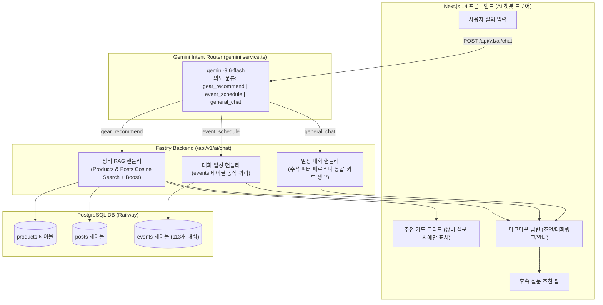

# FitterSweat 올인원 AI 서비스 비서(All-in-One Assistant) 고도화 계획서

> **For agentic workers:** REQUIRED SUB-SKILL: Use superpowers:subagent-driven-development to implement this plan task-by-task. Steps use checkbox (`- [ ]`) syntax for tracking.

**Goal:** FitterSweat AI 챗봇을 단순 장비 추천기에서 (1) 장비/기어 맞춤 추천(기존 RAG), (2) 실시간 글로벌/국내 대회 일정 동적 질의 및 1탭 라우팅(`events` DB 연동), (3) 페르소나 기반 일상 대화 및 서비스 길잡이(`general_chat`)를 상황에 맞게 지능적으로 분기 처리하는 '올인원 AI 서비스 비서'로 고도화한다.

**Architecture:**
사용자 질의가 유입되면 `gemini-3.6-flash` 기반의 Intent Router가 질의를 `gear_recommend`(장비 추천), `event_schedule`(대회 일정 문의), `general_chat`(인사/소개/일상 대화)의 3대 핵심 의도로 분류한다.
- `gear_recommend`: 기존 고도화된 pgvector 상품 + 커뮤니티 후기 RAG 파이프라인(+10% 키워드 가산점, +20% 태그 가산점)을 실행하고 추천 카드 3개를 렌더링한다.
- `event_schedule`: `events` 테이블을 직접 조회(국가, 대륙, 진행 상태 필터링)하여 현재 접수 중이거나 예정된 대회 목록, D-Day, 개최 일자 및 `/events` 또는 `/events/[id]` 바로가기 링크 마크다운을 동적으로 생성한다.
- `general_chat`: 불필요한 장비 추천 카드(`recommendedProducts: []`)를 숨기고, FitterSweat 서비스의 가치와 수석 기어 피터 페르소나에 맞춘 깔끔한 텍스트 대화 및 추천 질문 칩만을 제공한다.

**Architecture Diagram:**



**Tech Stack:**
- **AI Models**: Google Gemini `gemini-3.6-flash`, `gemini-embedding-001` (768-dim)
- **Backend**: Fastify 4, Prisma ORM 5.5, TypeScript
- **Database**: PostgreSQL 18 with pgvector (products, posts, events)
- **Frontend**: Next.js 14 App Router, Zustand (`useAIChatStore.ts`), Tailwind CSS, Lucide React

---

## Global Constraints

- `docs/erdcloud_schema.sql`은 절대 수정하거나 커밋하지 않는다.
- 기존 장비 RAG 추천 파이프라인의 성능과 정확도(Post 5 매칭 등)에 회귀(Regression)가 없어야 한다.
- `general_chat` 및 `event_schedule` 의도일 때는 프론트엔드에 무의미한 더미 상품 카드가 노출되지 않아야 한다(`recommendedProducts: []`).
- 대회 일정 안내 시 반드시 내부 라우팅 링크(`[대회명](/events)`)를 포함하여 사용자가 1탭으로 이동할 수 있도록 한다.

---

## 🚀 Task-by-Task Implementation Plan

### Task 1: Gemini Service에 3-Way Intent Router 구축

**Files:**
- Modify: `backend/src/services/gemini.service.ts:30-90`
- Test: `backend/tests/gemini.service.test.ts`

**Interfaces:**
- Produces:
  ```typescript
  export interface ComprehensiveIntent {
    intentType: 'gear_recommend' | 'event_schedule' | 'general_chat';
    category?: 'nutrition' | 'shoes' | 'gear' | 'equipment' | 'all';
    eventFilters?: { country?: string; continent?: string; status?: 'upcoming' | 'past' | 'all' };
    reason: string;
  }
  ```

- [ ] **Step 1: Write the failing unit test**
  - "발볼 넓은 신발 추천" ➔ `intentType: 'gear_recommend'`, `category: 'shoes'`
  - "현재 종료되지 않은 대한민국 대회 일정 알려줘" ➔ `intentType: 'event_schedule'`, `country: '대한민국'`, `status: 'upcoming'`
  - "안녕 챗봇 피터 넌 어떤 역할을 수행해?" ➔ `intentType: 'general_chat'`
- [ ] **Step 2: Update `classifyQueryIntent` prompt and schema in `gemini.service.ts`**
- [ ] **Step 3: Run unit tests to verify pass**
- [ ] **Step 4: Commit**
  `git commit -m "feat(ai): implement 3-way intent router for gear, events, and general chat"`

---

### Task 2: 실시간 대회 일정 검색 엔진 및 LLM 프롬프트 합성기 구축

**Files:**
- Create: `backend/src/services/event-advisor.service.ts`
- Modify: `backend/src/services/gemini.service.ts`
- Test: `backend/tests/event-advisor.test.ts`

- [ ] **Step 1: Write test for event querying and prompt formatting**
- [ ] **Step 2: Implement dynamic `events` query based on extracted filters**
  - 종료되지 않은 대회: `endDate >= NOW()`
  - 국가/대륙 조건 필터링
  - 상위 3~5개 대회 정보(명칭, 개최일, 도시, 링크) 추출
- [ ] **Step 3: Implement Gemini prompt for event guidance with markdown links**
- [ ] **Step 4: Run tests and commit**
  `git commit -m "feat(events): add dynamic event schedule query and advisor synthesis"`

---

### Task 3: 백엔드 `/api/v1/ai/chat` 통합 분기 라우팅

**Files:**
- Modify: `backend/src/routes/ai.ts:160-295`
- Test: `backend/tests/ai.test.ts`

- [ ] **Step 1: Route dispatch in `ai.ts` based on `intentType`**
  - `general_chat`: `recommendedProducts: []`, `relevantPosts: []` 반환 및 피터 페르소나 응답.
  - `event_schedule`: `recommendedProducts: []`, 대회 안내 텍스트 및 관련 대회 추천 칩 제공.
  - `gear_recommend`: 기존 pgvector RAG + +10% 키워드 가산점 + 상품 카드 반환.
- [ ] **Step 2: Integration tests across all 3 intent flows**
- [ ] **Step 3: Commit**
  `git commit -m "feat(ai): integrate 3-way intent dispatcher into /api/v1/ai/chat"`

---

### Task 4: 프론트엔드 AI 챗봇 드로어 UI 최적화

**Files:**
- Modify: `frontend/components/AIChatDrawer.tsx`
- Modify: `frontend/stores/useAIChatStore.ts`

- [ ] **Step 1: Conditionally render recommended product cards only when `recommendedProducts.length > 0`**
- [ ] **Step 2: Support clickable internal markdown links in assistant bubble (e.g. `[AirAsia 하이록스 서울](/events)`)**
- [ ] **Step 3: Verify responsive layout in drawer on mobile and desktop**
- [ ] **Step 4: Commit**
  `git commit -m "feat(frontend): optimize AIChatDrawer for general chat and event schedule links"`

---

### Task 5: 실운영 배포 및 3대 시나리오 라이브 검증

- [ ] **Step 1: Backend & Frontend production build & deploy**
- [ ] **Step 2: Live Puppeteer E2E Testing**:
  1. "안녕 챗봇 피터 넌 어떤 역할을 수행해?" ➔ 깔끔한 자기소개 확인 (상품 카드 미노출)
  2. "현재 종료되지 않은 대한민국 내 대회 일정을 알려줘" ➔ 서울/인천 대회 목록 및 링크 확인
  3. "발볼 넓은 러너 적합 신발 추천" ➔ Post 5 및 PUMA 와이드 접지화 카드 노출 확인
