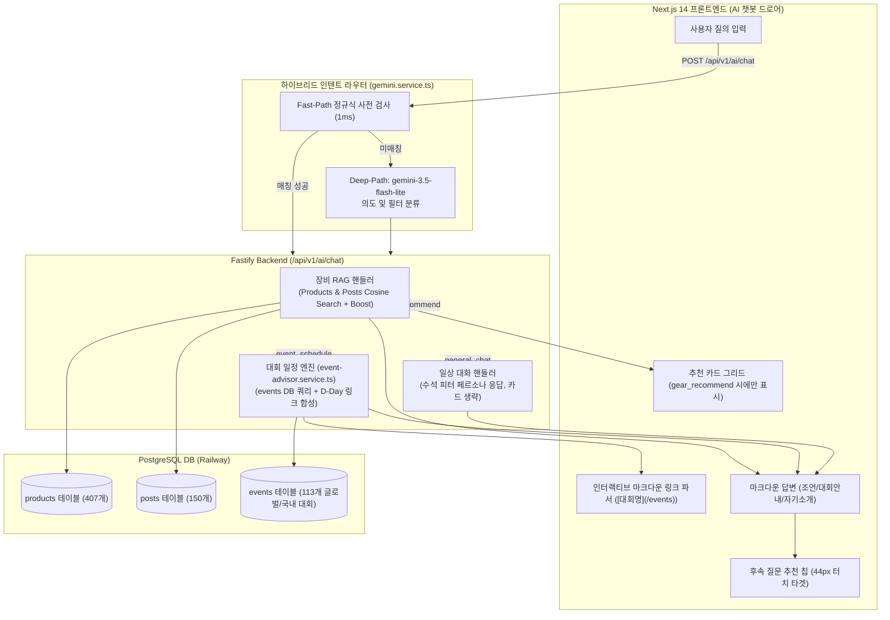

# FitterSweat 올인원 AI 서비스 비서(All-in-One Assistant) 고도화 구현 계획서

> **For agentic workers:** REQUIRED SUB-SKILL: Use superpowers:subagent-driven-development to implement this plan task-by-task. Steps use checkbox (`- [ ]`) syntax for tracking.

**Goal:** FitterSweat AI 챗봇을 단순 장비 추천기에서 (1) 장비/기어 맞춤 추천(기존 RAG), (2) 실시간 글로벌/국내 대회 일정 동적 질의 및 1탭 인터랙티브 라우팅(`events` DB 연동), (3) 수석 기어 피터 페르소나 기반 일상 대화 및 서비스 길잡이(`general_chat`)를 상황에 맞게 1ms 하이브리드 라우터로 분기 처리하는 '올인원 AI 서비스 비서'로 고도화한다.

**Architecture:**
사용자 질의가 유입되면 정규식 Fast-Path(1ms)와 `gemini-3.5-flash-lite` Fallback으로 구성된 하이브리드 Intent Router가 `gear_recommend`(장비 추천), `event_schedule`(대회 일정 문의), `general_chat`(인사/소개/일상 대화)의 3대 핵심 의도로 즉각 분류한다.
- `gear_recommend`: 기존 pgvector 상품 + 커뮤니티 후기 RAG 파이프라인(+10% 키워드 가산점, +20% 태그 가산점)을 실행하고 추천 카드 3개를 렌더링한다.
- `event_schedule`: `events` 테이블을 직접 조회(국가, 대륙, 진행 상태 필터링)하여 현재 접수 중이거나 예정된 대회 목록, D-Day, 개최 일자 및 `[대회명](/events)` 바로가기 인터랙티브 링크를 동적으로 생성한다 (카드 미노출).
- `general_chat`: 불필요한 장비 추천 카드(`recommendedProducts: []`)를 숨기고, FitterSweat 서비스의 3대 가치와 수석 기어 피터 페르소나에 맞춘 깔끔한 텍스트 대화 및 1탭 체험 유도 질문 칩만을 제공한다.
- 프론트엔드(`ChatMessageBubble.tsx`)는 `ui-ux-pro-max` 가이드라인에 따라 마크다운 링크 파서와 Dark Athletic 스타일 토큰을 적용하여 1탭 원클릭 내비게이션을 지원한다.

**Architecture Diagram:**



**Tech Stack:**
- **AI Models**: Google Gemini `gemini-3.5-flash-lite`, `gemini-embedding-2` (768-dim)
- **Backend**: Fastify 4, Prisma ORM 5.5, TypeScript
- **Database**: PostgreSQL 18 with pgvector (Railway Hosted)
- **Frontend**: Next.js 14 App Router, Zustand (`useAiChatStore.ts`), Tailwind CSS, Lucide React
- **Design Intelligence**: `ui-ux-pro-max` (Dark Athletic Tokens, Interactive Markdown Links, 44px Touch Targets)
- **Spec Document**: `docs/superpowers/specs/2026-09-20-all-in-one-ai-assistant-design.md`

---

## Global Constraints

- `docs/erdcloud_schema.sql`은 절대 수정하거나 커밋하지 않는다.
- 기존 장비 RAG 추천 파이프라인의 정확도(Post 5 1위 매칭 등)에 어떤 회귀(Regression)도 없어야 한다.
- `general_chat` 및 `event_schedule` 의도일 때는 프론트엔드에 무의미한 더미 상품 카드가 노출되지 않아야 한다(`recommendedProducts: []`).
- 대회 일정 안내 시 반드시 내부 라우팅 마크다운 링크(`[대회명](/events)`)를 포함하여 사용자가 1탭으로 이동할 수 있도록 한다.
- API Key는 `.env` 및 Railway 환경변수로만 관리하며 코드/문서에 노출하지 않는다.

---

## 🚀 Task-by-Task Implementation Plan

### Task 1: Gemini Service에 하이브리드 3-Way Intent Router 구축

**Files:**
- Modify: `backend/src/services/gemini.service.ts`
- Test: `backend/tests/gemini.service.test.ts`

**Interfaces:**
- Produces:
  ```typescript
  export type IntentType = 'gear_recommend' | 'event_schedule' | 'general_chat';

  export interface ComprehensiveIntent {
    intentType: IntentType;
    category?: 'nutrition' | 'shoes' | 'gear' | 'equipment' | 'all';
    eventFilters?: {
      country?: string;
      continent?: string;
      status?: 'upcoming' | 'past' | 'all';
    };
    reason: string;
  }
  ```

- [ ] **Step 1: Write failing unit tests for 3-way intent classification**
  `backend/tests/gemini.service.test.ts`에 테스트 추가:
  - "발볼 넓은 신발 추천" ➔ `intentType: 'gear_recommend'`, `category: 'shoes'`
  - "현재 종료되지 않은 대한민국 대회 일정 알려줘" ➔ `intentType: 'event_schedule'`, `country: '대한민국'`, `status: 'upcoming'`
  - "안녕 챗봇 피터 넌 어떤 역할을 수행해?" ➔ `intentType: 'general_chat'`
  - "반가워" ➔ `intentType: 'general_chat'` (Fast-Path 즉각 반환)
- [ ] **Step 2: Implement `classifyComprehensiveIntent` in `gemini.service.ts`**
  - Fast-Path Regex:
    - `general_chat`: `/^(안녕|반가워|하이|누구|역할|뭐해|도와줘|소개|반갑습니다|너는|피터)/i`
    - `event_schedule`: `/대회|일정|경기|접수|스케줄|언제 열려|마라톤|개최|레이스 일정|참가 신청/i`
    - `gear_recommend`: `/신발|러닝화|장비|보호대|에너지젤|추천|사이즈|구매|기어|옷/i`
  - Fallback: `gemini-3.5-flash-lite` JSON prompt로 복합/모호 질의 정밀 분류.
- [ ] **Step 3: Run unit tests**
  `npx jest tests/gemini.service.test.ts`
  Expected: PASS for all intent tests.
- [ ] **Step 4: Commit**
  `git commit -m "feat(ai): implement hybrid 3-way intent router for gear, events, and casual chat"`

---

### Task 2: 실시간 대회 일정 검색 엔진 및 어드바이저 합성기 구축

**Files:**
- Create: `backend/src/services/event-advisor.service.ts`
- Modify: `backend/src/services/gemini.service.ts`
- Test: `backend/tests/event-advisor.test.ts`

**Interfaces:**
- Produces:
  ```typescript
  export interface EventAdvisorResult {
    advice: string;
    followUpQuestion: string;
    suggestedQueries: string[];
  }

  export class EventAdvisorService {
    async handleEventQuery(query: string, filters?: ComprehensiveIntent['eventFilters']): Promise<EventAdvisorResult>;
  }
  ```

- [ ] **Step 1: Write unit test in `backend/tests/event-advisor.test.ts`**
  - "현재 종료되지 않은 대한민국 대회 일정 알려줘" 질의 시 `AirAsia HYROX Seoul 2026`, `HYROX Incheon Songdo 2026` 검색 확인
  - 반환된 마크다운 텍스트에 `[AirAsia HYROX Seoul 2026](/events)` 링크 포함 확인
  - D-Day 및 개최 일자 텍스트 포함 확인
- [ ] **Step 2: Implement `EventAdvisorService`**
  - Prisma `event.findMany` 동적 필터:
    - `status`: `upcoming` (기본값)
    - `country`: 질의에 "대한민국/한국/서울/인천" 포함 시 `{ contains: '대한민국' }`
    - `orderBy: { startDate: 'asc' }`, `take: 4`
  - D-Day 계산 및 정보 구조화.
  - `gemini-3.5-flash-lite` 호출하여 수석 피터 어조의 친절한 대회 안내문 합성.
  - 후속 질문 칩 3개 생성 (예: `["서울 대회 준비 장비 추천", "인천 송도 대회 상세 보기", "전체 글로벌 일정 보기"]`).
- [ ] **Step 3: Run unit test**
  `npx jest tests/event-advisor.test.ts`
  Expected: PASS.
- [ ] **Step 4: Commit**
  `git commit -m "feat(events): implement EventAdvisorService with dynamic DB query and markdown linking"`

---

### Task 3: 백엔드 `/api/v1/ai/chat` 3-Way 통합 라우팅

**Files:**
- Modify: `backend/src/routes/ai.ts`
- Test: `backend/tests/ai.test.ts`

- [ ] **Step 1: Update `/api/v1/ai/chat` endpoint logic**
  - `classifyComprehensiveIntent` 호출하여 `intentType` 판별.
  - `intentType === 'general_chat'`:
    - `geminiService.generateCasualResponse` 호출 (기어 피터 페르소나 소개).
    - `recommendedProducts: []`, `verifiedReviews: []` 반환.
  - `intentType === 'event_schedule'`:
    - `eventAdvisorService.handleEventQuery` 호출 (대회 일정 및 링크 안내).
    - `recommendedProducts: []`, `verifiedReviews: []` 반환.
  - `intentType === 'gear_recommend'`:
    - 기존 pgvector 검색 + 10% 키워드 가산점 + 20% 태그 가산점 유지.
    - `recommendedProducts: topProducts`, `verifiedReviews: topPosts` 반환.
- [ ] **Step 2: Add integration tests to `backend/tests/ai.test.ts`**
  - Test 1: General chat returns coach intro and 0 products.
  - Test 2: Event query returns upcoming events with markdown links and 0 products.
  - Test 3: Gear query returns Post 5 at rank 1 with 3 product cards.
- [ ] **Step 3: Run integration tests**
  `npx jest tests/ai.test.ts`
  Expected: PASS with all 3 scenarios verified.
- [ ] **Step 4: Commit**
  `git commit -m "feat(ai): integrate 3-way intent dispatcher into /api/v1/ai/chat"`

---

### Task 4: 프론트엔드 UI/UX Dark Athletic 최적화 (`ui-ux-pro-max`)

**Files:**
- Modify: `frontend/components/ai/ChatMessageBubble.tsx`
- Modify: `frontend/stores/useAiChatStore.ts`

- [ ] **Step 1: Implement Interactive Markdown Link Parser in `ChatMessageBubble.tsx`**
  - `[대회명](경로)` 마크다운 링크를 파싱하여 Next.js `<Link>` 컴포넌트로 렌더링:
    ```tsx
    <Link
      href={href}
      className="inline-flex items-center gap-1 text-[#FFD700] hover:text-[#FFE44D] font-semibold underline underline-offset-4 cursor-pointer transition-colors duration-200"
    >
      {label} ➔
    </Link>
    ```
- [ ] **Step 2: Verify Cardless Layout for Casual & Event Messages**
  - `recommendedProducts.length === 0`일 때 상단 기어 스냅 캐러셀 완전 숨김 유지.
  - `reviews.length === 0`일 때 하단 완주 후기 아코디언 완전 숨김 유지.
  - 일상 대화 및 대회 안내 시 깔끔한 단일 텍스트 버블 뷰 제공.
- [ ] **Step 3: Test Frontend Build**
  Run: `npm --prefix frontend build`
  Expected: 0 errors, successful build.
- [ ] **Step 4: Commit**
  `git commit -m "feat(frontend): add interactive markdown links and optimize cardless chat UI"`

---

### Task 5: Railway 실운영 배포 및 라이브 검증

**Files:**
- Entire repository

- [ ] **Step 1: Deploy updated backend to Railway**
  Run: `npx -y @railway/cli up ./backend --path-as-root --service backend -y`
- [ ] **Step 2: Git push to remote week-3 and merge into main**
  Run: `git push origin week-3 && git checkout main && git merge week-3 && git push origin main && git checkout week-3`
- [ ] **Step 3: Live Verification of the 3 Scenarios**:
  1. "안녕 챗봇 피터 넌 어떤 역할을 수행해?" ➔ 깔끔한 피터 소개 & 카드 0개 확인.
  2. "현재 종료되지 않은 대한민국 내 대회 일정을 알려줘" ➔ 서울/인천 대회 목록 및 `[대회명](/events)` 링크 확인.
  3. "발볼 넓은 러너 적합 신발 추천" ➔ Post 5 및 와이드 접지화 카드 노출 확인.
