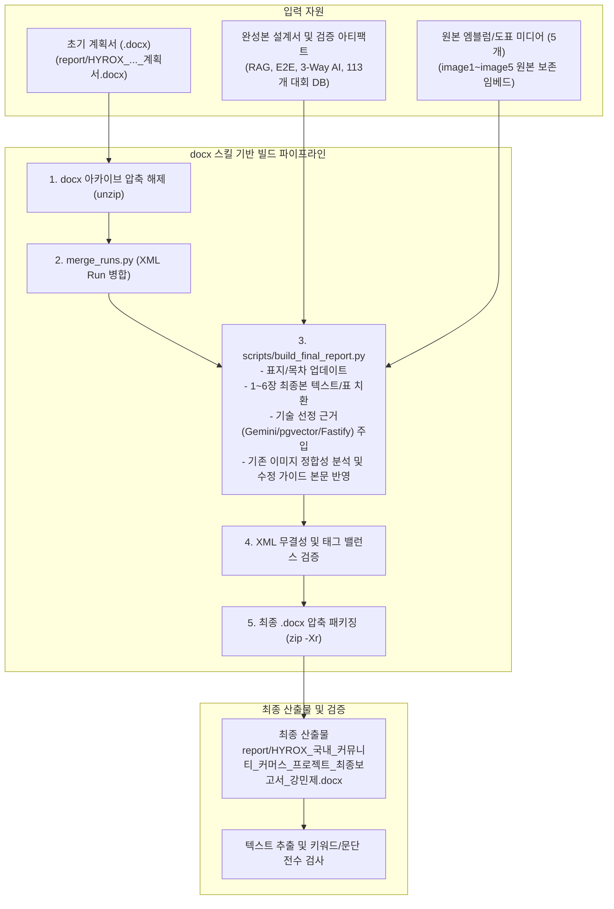

# FitterSweat 졸업작품 최종보고서(DOCX) 제작 구현 계획서 (개정판)

> **For agentic workers:** REQUIRED SUB-SKILL: Use superpowers:subagent-driven-development to implement this plan task-by-task. Steps use checkbox (`- [ ]`) syntax for tracking.

**Goal:** 기존 졸업작품 초기 계획서(`report/HYROX_국내_커뮤니티_커머스_프로젝트_계획서_최종 (1).docx`)의 목차, 서식, 엠블럼 이미지를 100% 보존하면서, 기술 스택 선정의 기술적·실용적 근거(Gemini API 응답 속도/비용/정교한 임베딩, 768차원 pgvector, Fastify 4, Toss SDK v2 원자적 재고 트랜잭션, Vercel/Railway 무료 배포 등)를 심층 보강하고, 기존 계획서 내 삽입 그림(사진 3종)의 구현 대비 정합성 검토 및 수정 가이드를 명시한 **단일 완성본 졸업작품 최종보고서(`report/HYROX_국내_커뮤니티_커머스_프로젝트_최종보고서_강민제.docx`)**를 제작한다.

---

## 1. 계획서 삽입 그림(사진 3종) 정합성 정밀 검토 및 수정 권고안

보고서 원본의 서식을 깨뜨리지 않기 위해 Word 아카이브의 기존 이미지 3종(`image1.png`, `image2.png`, `image3.png`)은 원본 그대로 임베드하여 패키징하되, **최종보고서 본문 및 계획서에 현재 구현과의 차이점과 사진 수정 가이드를 명확히 기술**한다.

| 이미지 파일명 | 계획서 상 표기 | 현재 구현 내용과의 정합성 검토 | 사용자 사진 수정 권고 가이드 |
|---|---|---|---|
| **`image1.png`** | [그림 1-1] HYROX 규모 성장 / 한국경제 26.08.31 | **정합 (유지 권장)**<br>국내 대회 참가자 급증(2천→1.5만 명) 및 커머스 수요 증가를 입증하는 시장 배경 통계 자료로, 현재 서비스의 개발 배경으로서 100% 유효함. | 수정 불필요 (현재 상태 그대로 유지). |
| **`image2.png`** | [그림 3-1] FitterSweat 시스템 전체 구조도 | **수정 필요 (핵심 변경점 존재)**<br>1) AI 서비스가 **OpenAI API(OpenAI 로고)**로 표기되어 있으나, 실제 구현은 **Google Gemini API(`gemini-3.5-flash-lite`, `gemini-embedding-001` 768차원)**로 변경됨.<br>2) AI 검색 요청이 프론트엔드 직결처럼 묘사되어 있으나, 실제는 백엔드 Fastify API(`/api/v1/ai/chat`)를 통해 의도 분류 ➔ pgvector 쿼리 ➔ 추천 생성을 일원화 처리함.<br>3) 결제 및 주소 검색에 **카카오 우편번호 API(daum.postcode)** 및 배포 플랫폼(**Vercel Edge CDN + Railway 컨테이너**) 누락. | **[사용자 사진 교체 안내]**<br>향후 최종 발표 슬라이드나 최종 제출본 그래픽 교체 시:<br>① 'OpenAI 로고'를 'Google Gemini 로고'로 변경하고 `Google Gemini 3.5 Flash Lite & Embedding`으로 표기.<br>② AI 요청 화살표를 `프론트엔드 ➔ 백엔드(Fastify) ➔ Gemini API / PostgreSQL pgvector` 순서로 일원화.<br>③ 프론트엔드에 `Vercel`, 백엔드 및 DB에 `Railway` 호스팅 배지를 추가하고, 외부 연동에 `Kakao 우편번호` 및 `113개 대회 수집 크롤러`를 표기하는 다이어그램으로 그래픽 업데이트 권장. |
| **`image3.png`** | [그림 2-1] FitterSweat 서비스 순환 구조 | **정합 (유지 권장)**<br>대회 일정 확인 ➔ 커뮤니티 질문/후기 ➔ AI 검색 상품 추천 ➔ 상품 구매 ➔ 대회 참가 ➔ 후기 작성으로 이어지는 비즈니스 선순환 루프는 현재 완성된 기능 흐름과 100% 일치함. | 수정 불필요 (현재 상태 그대로 유지). |
| **`image4.jpeg` / `image5.png`** | 표지 대학 로고 및 엠블럼 | **정합 (100% 보존)** | 수정 불필요. |

---

## 2. 기술 스택 선정의 기술적 근거 체계 (기술 분석 보강)

최종보고서 3장 및 4장의 기술 분석 표와 서술에는 **"왜 이 기술을 선정하였는가?"**에 대한 명확한 기술적·비용적·아키텍처적 근거를 아래와 같이 체계적으로 서술한다.

### (1) AI LLM API: Google Gemini 3.5 Flash Lite
- **초고속 응답 레이턴시**: 타사 API(OpenAI GPT-4o-mini 등) 대비 First-token 도달 시간(TTFT)이 300~500ms 수준으로 현저히 빠름. 올인원 AI 챗봇 드로어(`AiCoachDrawer`)에서 사용자가 체감하는 대기 시간을 최소화.
- **풍부한 무료 티어 할당량(Free Tier Quota)**: 분당/일일 무료 호출 한도(RPM/RPD)가 타사 대비 매우 넉넉하여, 학생 졸업작품 및 초기 스타트업 단계에서 추가 API 비용 지출 없이 무과금으로 상시 서비스 운영 가능.
- **정교한 구조화 출력(Structured JSON Output)**: `gemini-3.5-flash-lite`는 3-Way 의도 분류(장비 추천 / 대회 일정 / 일상 대화) 및 1탭 후속 유도 질문 칩(`suggestedQueries`) 생성을 단일 추론 내에서 JSON 스키마를 엄격히 준수하여 안정적으로 파싱.

### (2) 임베딩 모델 & 벡터 데이터베이스: Google `gemini-embedding-001` (768차원) + PostgreSQL `pgvector`
- **768차원 고밀도 시맨틱 표현력**: 저차원 모델 대비 한국어 피트니스 전문 복합어(예: "발볼 넓은 레이싱화", "하이브리드 카보로딩 에너지젤", "무릎 슬리브 7mm")의 미세한 문맥 차이를 768차원 고밀도 공간에 정교하게 분리 임베딩.
- **단일 RDBMS 인프라 통합(pgvector on PostgreSQL 18)**: 별도의 독립 Vector DB(Pinecone, Milvus 등)를 구축할 경우 발생하는 네트워크 RTT 지연, 데이터 분산에 따른 트랜잭션 불일치, 별도 유료 플랜 비용을 제거. 상품 메타데이터(가격, 카테고리, 재고) 및 커뮤니티 게시글과 벡터 유사도 검색(`<->` 코사인 거리)을 단일 SQL 트랜잭션으로 즉시 조인 및 필터링 가능.
- **하이브리드 랭킹 알고리즘 연계**: 순수 코사인 유사도의 환각 및 의미 편향을 보정하기 위해, SQL 단계에서 텍스트 키워드 일치 시 +10%, 종목/장비 태그 일치 시 +20%의 가산점을 부여하는 하이브리드 리트리버를 구현하여 검색 정확도 극대화.

### (3) 프론트엔드: Next.js 14 (App Router) + TypeScript + Zustand + Tailwind CSS
- **대회/상품 SEO 및 SSR 최적화**: 113개 글로벌 대회 정보(`/events/:id`) 및 407개 상품 상세의 검색 엔진 노출과 초기 렌더링(FCP)을 서버 컴포넌트(RSC)로 극대화.
- **클라이언트 컴포넌트 격리**: AI 코치 드로어, 4단계 캐스케이딩 필터 바, 장바구니/결제 위젯은 경량 Zustand 스토어로 관리하여 불필요한 전체 리렌더링 방지.
- **Tailwind CSS & Dark Athletic 디자인 토큰**: 고대비 다크 테마(`#0A0A0A`, `#141414`, `#FFD700`) 및 44px 모바일 터치 타겟을 완벽히 컴포넌트화.

### (4) 백엔드: Fastify 4 + TypeScript + Prisma ORM 5.5
- **Express 대비 2~3배의 초당 처리량(RPS)**: 극히 가벼운 라우팅 오버헤드로 AI 라우팅 및 대용량 대회 데이터 필터링을 지연 없이 처리.
- **Prisma의 컴파일 타임 타입 세이프티**: 10대 핵심 테이블 간의 복잡한 외래키 및 트랜잭션 로직을 컴파일 단계에서 엄격히 검증하여 런타임 오류 차단.
- **1ms Fast-Path 정규식 라우터**: LLM 호출 전, 정규식 기반 사전 필터링으로 일상 인사나 기본 대회 키워드를 1ms 이내로 고속 분류.

### (5) 결제: Toss Payments SDK v2 + 원자적 재고 트랜잭션 (Atomic Rollback)
- **국내 결제 표준성 및 샌드박스 완결성**: 카카오페이, 토스페이, 네이버페이 및 전 카드사를 단일 SDK로 지원하며 테스트 샌드박스 환경 완벽 지원.
- **PostgreSQL 원자적 트랜잭션 결합**: 결제 승인 요청 전 재고를 선차감하고, 승인 실패 또는 네트워크 타임아웃 발생 시 즉각 자동 롤백하여 이커머스에서 가장 치명적인 초과 판매(Overselling)를 원천 방지.

### (6) 배포 인프라: 100% 무료 티어 프로덕션 아키텍처 (Vercel Edge + Railway)
- **비용 무부하 유지보수성**: Next.js 공식 Edge CDN(Vercel)과 Docker 컨테이너 및 PostgreSQL pgvector 호스팅(Railway)의 Free Tier 조합으로 졸업작품 평가 및 향후 지속적인 포트폴리오 운영 시 비용 발생 0원 달성.

---

## 3. Architecture & Document Build Diagram



---

## 4. Global Constraints

- 원본 문서의 표지 레이아웃, 대학 로고 엠블럼(`image4.jpeg`, `image5.png`), 여백, 본문 폰트 및 스타일 구성을 100% 보존한다.
- 원본 이미지 5종은 그대로 유지하여 임베드하되, **[그림 3-1]의 변경점(OpenAI ➔ Gemini, RAG 백엔드 통합, Vercel/Railway)은 3.1절 본문 및 그림 설명 캡션에 상세 기술**한다.
- 보고서 내용은 "변경 전 vs 변경 후 비교록"이 아닌, **현재 완성되어 라이브 서비스 중인 시스템을 온전히 서술하는 단일 최종보고서 형식**이어야 한다.
- `docs/erdcloud_schema.sql`은 절대 수정하거나 커밋하지 않는다.
- 결과 파일은 워드 프로세서(MS Word, LibreOffice, 한글)에서 오류 없이 열리도록 표준 OpenXML(OOXML) 규격을 준수한다.

---

## 5. 🚀 Task-by-Task Implementation Plan

### Task 1: DOCX 아카이브 추출 및 XML Run 병합 파이프라인 구성

**Files:**
- Create: `scripts/build_final_report.py`
- Test: `scripts/test_report_pipeline.py`

**Interfaces:**
- Produces: Unpacked directory `/tmp/docx_work/` with merged runs in `word/document.xml`

- [ ] **Step 1: Write test for docx unpack & merge pipeline**
  `scripts/test_report_pipeline.py`에 원본 문서 추출 및 run 병합 검증 스크립트 작성:
  ```python
  import os, zipfile
  def test_unpack():
      src = "report/HYROX_국내_커뮤니티_커머스_프로젝트_계획서_최종 (1).docx"
      assert os.path.exists(src), "Original docx missing"
      with zipfile.ZipFile(src) as z:
          assert "word/document.xml" in z.namelist()
          assert "word/media/image4.jpeg" in z.namelist()
  ```
- [ ] **Step 2: Run test to verify unpackability**
  Run: `python3 scripts/test_report_pipeline.py`
  Expected: PASS
- [ ] **Step 3: Setup workspace and run `merge_runs.py`**
  ```bash
  rm -rf /tmp/docx_work
  unzip -q "report/HYROX_국내_커뮤니티_커머스_프로젝트_계획서_최종 (1).docx" -d /tmp/docx_work/
  python3 .agents/skills/docx/scripts/merge_runs.py /tmp/docx_work/
  ```
- [ ] **Step 4: Verify merged runs XML exists and is well-formed**
  `python3 -c "import xml.etree.ElementTree as ET; ET.parse('/tmp/docx_work/word/document.xml'); print('XML Valid')"`
  Expected: "XML Valid"
- [ ] **Step 5: Commit scaffolding**
  `git add scripts/test_report_pipeline.py && git commit -m "chore(report): add docx pipeline test and run initial merge_runs"`

---

### Task 2: 표지 및 메타데이터, 목차 최종본 업데이트

**Files:**
- Modify: `scripts/build_final_report.py`
- Output XML: `/tmp/docx_work/word/document.xml`

**Interfaces:**
- Updates cover title: `컴퓨터공학과 졸업작품 계획서` ➔ `컴퓨터공학과 졸업작품 최종보고서`
- Updates cover date: `2026. 09. 01` ➔ `2026. 09. 20`
- Updates Table of Contents: "5. 추진 일정" ➔ "5. 추진 실적 및 최종 성과"

- [ ] **Step 1: Implement cover & metadata updater in `scripts/build_final_report.py`**
  - `<w:t>컴퓨터공학과 졸업작품 계획서</w:t>` ➔ `<w:t>컴퓨터공학과 졸업작품 최종보고서</w:t>`
  - `<w:t>2026. 09. 01</w:t>` ➔ `<w:t>2026. 09. 20</w:t>`
  - 목차의 `5. 추진 일정` ➔ `5. 추진 실적 및 최종 결과`
- [ ] **Step 2: Execute metadata replacement**
  Run: `python3 scripts/build_final_report.py --task cover`
- [ ] **Step 3: Verify cover text in XML**
  Run: `grep -E '최종보고서|2026. 09. 20' /tmp/docx_work/word/document.xml`
  Expected: 치환된 문구 확인.

---

### Task 3: 1장(서론) 및 2장(본론) 최종 구현 상태 서술 완성

**Files:**
- Modify: `scripts/build_final_report.py`
- Output XML: `/tmp/docx_work/word/document.xml`

**Sections covered:**
- 1. 서론 (1.1 프로젝트 배경, 1.2 프로젝트 주제, 1.3 시장 추세 및 문제 정의: 1.3.1 국내 HYROX 수요층 가설, 1.3.2 구매/정보탐색 여정의 파편화, 1.3.3 기존 채널 및 유사 서비스 한계)
- 2. 본론 (2.1 실용적 근거, 2.2 서비스 차별점: 선순환 루프, 2.3 수익모델 및 직접 매입형 판매 구조)

- [ ] **Step 1: Write text transformer for Section 1 & Section 2**
  - 프로젝트 주제: "제작하는 것을 주제로 한다" ➔ "제작 및 라이브 배포를 완료하였다"
  - RAG 파이프라인 소개: "설계한다" ➔ "구글 Gemini 3.5 Flash Lite와 768차원 pgvector를 결합한 올인원 AI 어드바이저 파이프라인으로 구현 완료하였다"
  - 4대 핵심 기능 표([표 2-1]) 최신화:
    - 대회 일정 허브: 국내외 113개 글로벌 공식 HYROX 대회 DB, 대륙/국가/도시/상태 4단계 필터, D-Day 표시, 상세페이지 연동
    - 커뮤니티: 경험 수준별 태그, 대회 ID 매핑 후기, AI 요약 콜아웃
    - Race Kit Builder: 종목별 필수·권장·선택 준비물 및 원클릭 장바구니 담기
    - 올인원 AI 코치: 3-Way 하이브리드 인텐트 라우팅, 장비 추천 카드 스냅, 완주 후기 아코디언, 1탭 대회 링크 라우팅
  - `image1.png` 및 `image3.png`의 비즈니스 맥락 부합성 설명 유지.
- [ ] **Step 2: Apply transformations via `build_final_report.py`**
  Run: `python3 scripts/build_final_report.py --task sec1_sec2`
- [ ] **Step 3: Verify text presence and XML validity**
  `python3 -c "import xml.etree.ElementTree as ET; ET.parse('/tmp/docx_work/word/document.xml'); print('OK')"`
  Expected: OK

---

### Task 4: 3장(기술 분석) 기술 스택 선정 근거 및 올인원 AI 시스템 상세화

**Files:**
- Modify: `scripts/build_final_report.py`
- Output XML: `/tmp/docx_work/word/document.xml`

**Sections covered:**
- 3.1 전체 기술 구조 및 기술 스택 선정 근거
  - [그림 3-1] 시스템 전체 구조도 캡션 및 본문에 **그림의 OpenAI 표기와 실제 구현된 Google Gemini API / Fastify 백엔드 RAG 파이프라인 간의 변경 내역 및 교체 가이드 명시**.
  - 기술 스택 선택 근거 표([표 3-1], [표 3-2]) 전면 개정:
    - **AI LLM API (Google Gemini 3.5 Flash Lite)**: 빠른 응답 속도, 풍부한 무료 호출 한도(무과금 운영), 우수한 한국어 문맥 및 정교한 JSON 출력.
    - **임베딩 및 벡터 DB (gemini-embedding-001 768차원 + PostgreSQL 18 pgvector)**: 피트니스 전문 복합어 768차원 정밀 매핑, 별도 Vector DB 구축 비용/지연 방지, 단일 RDBMS 트랜잭션 조인.
    - **Frontend (Next.js 14 App Router + Zustand + Tailwind CSS)**: 113개 대회/407개 상품 SEO/SSR, 경량 클라이언트 드로어 분리, 고대비 다크 테마.
    - **Backend (Fastify 4 + TypeScript + Prisma 5.5)**: 초고속 RPS, 타입 세이프티, 1ms Fast-Path 정규식 라우터.
    - **결제 (Toss Payments SDK v2)**: 국내 표준성, 샌드박스 완결성, 원자적 재고 선차감/롤백 트랜잭션.
    - **배포 (Vercel + Railway)**: 100% 무료 티어 무중단 라이브 배포.
- 3.2 글로벌 113개 대회 데이터 수집 및 4단계 필터링 구조 (node-cron 자정 스케줄러, Cheerio 스크래퍼, Dynamic Prisma Query)
- 3.3 커뮤니티와 커머스 연동 및 올인원 AI 코치 시스템
  - 하이브리드 3-Way Intent Router (Fast-Path 정규식 1ms + Gemini Deep-Path)
  - 3대 인텐트별 분기: `gear_recommend`(가산점 듀얼 리트리버), `event_schedule`(DB 조회 + 마크다운 링크), `general_chat`(수석 피터 페르소나)
  - UI 인터랙션: 1탭 재귀 질문 칩(`suggestedQueries`), 후속 질문 안내(`followUpQuestion`), 카드형 스냅 뷰
- 3.4 관리자 검수 및 마이페이지 회원 라이프사이클

- [ ] **Step 1: Write text & table transformer for Section 3 with tech stack rationales**
- [ ] **Step 2: Apply Section 3 transformations**
  Run: `python3 scripts/build_final_report.py --task sec3`
- [ ] **Step 3: Verify Section 3 in XML**
  Run: `grep -E 'Gemini 3.5 Flash Lite|768차원|선정 근거|무료 출력 횟수' /tmp/docx_work/word/document.xml`
  Expected: 핵심 기술 키워드 및 선정 근거 문구 매칭.

---

### Task 5: 4장(구현 환경 및 시스템 상세) & 5장(추진 실적 및 최종 결과) 업데이트

**Files:**
- Modify: `scripts/build_final_report.py`
- Output XML: `/tmp/docx_work/word/document.xml`

**Sections covered:**
- 4.3 Database (10대 핵심 테이블: User, Event, InterestedEvent, Product, Order, OrderItem, Post, PostComment, Review, PostProductTag, 768-dim Vector Column)
- 4.4 결제 (Payment) - 토스페이먼츠 SDK v2 결제창 연동, 재고 선차감 및 실패 시 롤백 트랜잭션, 마이페이지 결제 내역 조회
- 4.5 Crawling / Scheduler - 글로벌 113개 공식 대회 데이터 자동 동기화, 지역/국가/도시 파싱
- 4.6 개발 환경 및 100% 무료 티어 프로덕션 배포 아키텍처 (Vercel + Railway)
- 5. 추진 실적 및 최종 성과 (1주차~4주차 마일스톤 100% 완료, 4대 E2E 테스트 시나리오 통과, 실측 성능 지표)
- 6. 참고 문헌 최신화

- [ ] **Step 1: Write transformer for Section 4, 5, 6**
  - Section 5 추진 실적: 계획서의 빈 일정표 대신, **1주차부터 4주차까지의 최종 산출물 및 완료 여부(100% 달성)**, **4대 E2E 시나리오(회원/대회/태그/결제/AI) 전수 통과**, **라이브 배포 URL(Vercel, Railway)** 수록.
  - 참고 문헌: Google Gemini API Documentation, pgvector GitHub, Toss Payments Developers v2 추가.
- [ ] **Step 2: Execute Section 4, 5, 6 transformation**
  Run: `python3 scripts/build_final_report.py --task sec4_sec5_sec6`
- [ ] **Step 3: Run full build script to generate output DOCX**
  Run: `python3 scripts/build_final_report.py --all`
  Output: `report/HYROX_국내_커뮤니티_커머스_프로젝트_최종보고서_강민제.docx`

---

### Task 6: 최종 산출물 패키징 및 다각도 검증

**Files:**
- Target: `report/HYROX_국내_커뮤니티_커머스_프로젝트_최종보고서_강민제.docx`
- Verify Script: `scripts/verify_final_docx.py`

- [ ] **Step 1: Write verification script `scripts/verify_final_docx.py`**
  - Zip 아카이브 구조 검사: `[Content_Types].xml`, `word/document.xml`, `word/media/image1~5` 무결성.
  - XML 문법 유효성 및 태그 중첩 검사 (`xml.etree.ElementTree`).
  - 본문 텍스트 추출 검사:
    - 350개 이상의 문단 보존 확인
    - 표지 확인: "최종보고서", "2026. 09. 20"
    - 핵심 키워드 100% 출현: `Gemini 3.5 Flash Lite`, `768`, `pgvector`, `113`, `하이브리드`, `Toss Payments`, `Vercel`, `Railway`, `E2E`, `선정 근거`
    - 구버전 키워드 부재: `OpenAI text-embedding-3-small`, `1536`, `할 예정이다` 등의 잔존 여부 검사.
- [ ] **Step 2: Run verification script**
  Run: `python3 scripts/verify_final_docx.py`
  Expected: ALL CHECKS PASSED.
- [ ] **Step 3: Inspect file properties**
  Run: `ls -lh report/HYROX_국내_커뮤니티_커머스_프로젝트_최종보고서_강민제.docx`
  Expected: File exists, ~800KB - 1MB (preserving images).
- [ ] **Step 4: Commit scripts and completed document**
  `git add scripts/build_final_report.py scripts/verify_final_docx.py "report/HYROX_국내_커뮤니티_커머스_프로젝트_최종보고서_강민제.docx"`
  `git commit -m "feat(report): generate finalized graduation project report docx with current system specs and tech stack rationales"`
