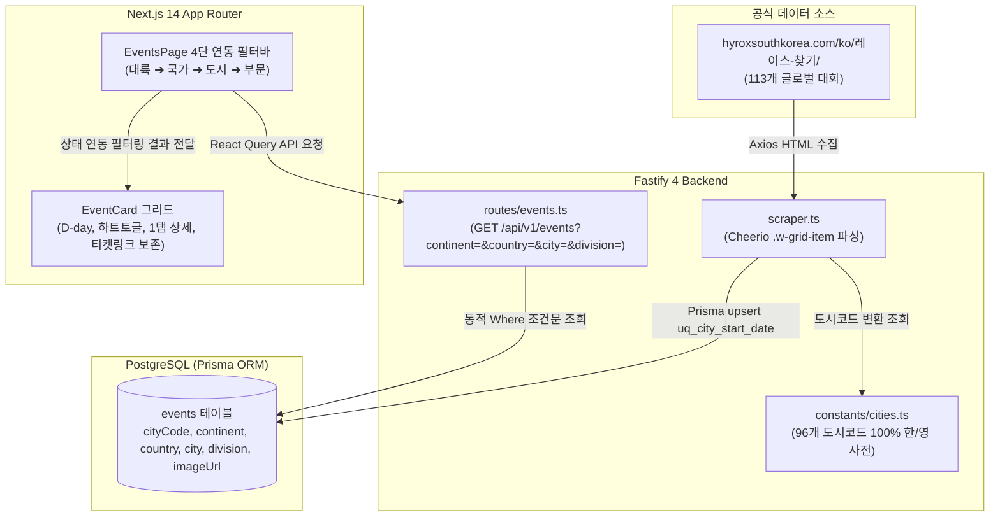

# FittersSweat 글로벌 HYROX 공식 대회 전수 스크래핑 & 4단 연동 필터바 구현 계획서 (Implementation Plan)

> **For agentic workers:** REQUIRED SUB-SKILL: Use superpowers:subagent-driven-development to implement this plan task-by-task. Steps use checkbox (`- [ ]`) syntax for tracking.

**Goal:** 하이록스 공식 사이트(`https://hyroxsouthkorea.com/ko/레이스-찾기/`)의 113개 글로벌 대회를 전수 스크래핑하고, 96개 도시 코드를 직관적인 한글/영문 도시명·국가명·대륙명으로 100% 자동 변환하여 DB에 적재하며, 기존 FitterSweat 카드 디자인을 100% 유지한 채 4단 연동 드롭다운 필터바(대륙 ➔ 국가 ➔ 도시 ➔ 부문)를 제공한다.

**Architecture:**
백엔드는 Fastify 4 기반으로 `axios`와 `cheerio`를 활용하여 공식 사이트의 `.w-grid-item.type-event` DOM 요소에서 이벤트명, 도시코드(`.event_city_letter_code`), 대회일정, 랜드마크 이미지, 대륙 클래스(`continent-*`), 부문(`Adults` / `Youngstars`)을 추출한다. 추출된 도시코드는 96개 글로벌 도시를 100% 포괄하는 정규화 매핑 사전(`backend/src/constants/cities.ts`)을 거쳐 한글 및 영문 도시명/국가명/대륙명으로 변환된 후, Prisma ORM을 통해 `(cityCode, startDate)` 고유 키 기준 원자적 `upsert`로 DB에 적재된다. 백엔드 API(`GET /api/v1/events`)는 다차원 쿼리 필터링(`continent`, `country`, `city`, `division`)을 지원하며, 프론트엔드(`frontend/app/events/page.tsx`)는 상위 필터 변경 시 하위 드롭다운 옵션이 자동으로 동기화되는 4단 연동 셀렉트 바와 기존 다크 애슬레틱 `EventCard.tsx` 카드 디자인을 100% 유지하여 렌더링한다.

**Architecture Diagram:**



**Tech Stack:**
- **Frontend**: Next.js 14.2 (App Router), TypeScript 5.4, Tailwind CSS, TanStack React Query v5, Lucide React, Zustand
- **Backend**: Fastify 4, Prisma ORM 5.5, TypeScript 5.2, Axios 1.5, Cheerio 1.0, Jest 29, Ts-Jest
- **Database**: PostgreSQL 18 (Railway Hosted)

**Spec:**
- 하이록스 공식 사이트 레이스 찾기: `https://hyroxsouthkorea.com/ko/레이스-찾기/`
- 사용자 요구사항: 113개 글로벌 대회 전수 스크래핑, 96개 도시코드 자동 한/영 변환 매핑, 카드 디자인 100% 보존, 4단 연동 드롭다운 필터바 구현

---

## Global Constraints

- `docs/erdcloud_schema.sql`은 절대 수정하거나 커밋하지 않는다 (`.gitignore` 유지).
- **카드 디자인 100% 보존**: `frontend/components/EventCard.tsx`의 골드 D-day 뱃지, 하트 관심 등록 토글, [대회 정보 & 후기] 버튼, [공식 홈페이지] 외부 링크 등 기존 UI/UX 디자인을 절대 훼손하지 않는다.
- **도시 코드 자동 변환**: 공식 사이트 96개 도시 코드(`SEL`, `ICN`, `LON`, `NYC`, `OSA`, `BOM`, `MAA` 등)를 100% 커버하여 직관적인 한글/영문 병기(`서울 (Seoul)`, `대한민국 (South Korea)`)로 정규화한다.
- **TDD 및 무결성**: 모든 신규 모듈 및 API 확장은 실패하는 테스트를 먼저 작성하고 최소 구현으로 통과를 확인하는 TDD 사이클을 준수한다.

---

## 🚀 Task-by-Task Implementation Plan

### Task 1: Prisma `Event` 모델 스키마 확장 및 DB 동기화

**Files:**
- Modify: `backend/prisma/schema.prisma:52-67`
- Test: `backend/tests/schema-event.test.ts`

**Interfaces:**
- Consumes: 기존 `Event` 모델
- Produces: `continent`, `country`, `city`, `division`, `imageUrl` 필드가 추가된 `Event` Prisma 클라이언트 인터페이스

- [ ] **Step 1: Write the failing test**

```typescript
// backend/tests/schema-event.test.ts
import { PrismaClient } from '@prisma/client';

describe('Event Schema Extension Test', () => {
  const prisma = new PrismaClient();

  afterAll(async () => {
    await prisma.$disconnect();
  });

  it('should support continent, country, city, division, and imageUrl fields in Event model', async () => {
    const testCityCode = 'TST';
    const testStartDate = new Date('2099-01-01');

    const created = await prisma.event.upsert({
      where: {
        uq_city_start_date: {
          cityCode: testCityCode,
          startDate: testStartDate,
        },
      },
      update: {},
      create: {
        name: 'HYROX Test Event',
        cityCode: testCityCode,
        continent: '아시아-태평양 (Asia-Pacific)',
        country: '대한민국 (South Korea)',
        city: '테스트시 (Test City)',
        division: 'Adults',
        imageUrl: 'https://example.com/test.jpg',
        startDate: testStartDate,
        endDate: new Date('2099-01-02'),
        eventUrl: 'https://hyrox.com',
      },
    });

    expect(created.continent).toBe('아시아-태평양 (Asia-Pacific)');
    expect(created.country).toBe('대한민국 (South Korea)');
    expect(created.city).toBe('테스트시 (Test City)');
    expect(created.division).toBe('Adults');
    expect(created.imageUrl).toBe('https://example.com/test.jpg');

    // Clean up
    await prisma.event.delete({
      where: { id: created.id },
    });
  });
});
```

- [ ] **Step 2: Run test to verify it fails**

Run: `npx jest tests/schema-event.test.ts`
Expected: FAIL with TypeScript / Prisma compilation error (`continent`, `country`, `city`, `division`, `imageUrl` does not exist in type `EventCreateInput`).

- [ ] **Step 3: Write minimal implementation**

Modify `backend/prisma/schema.prisma`:
```prisma
model Event {
  id               BigInt            @id @default(autoincrement())
  name             String            @db.VarChar(255)
  cityCode         String            @map("city_code") @db.VarChar(10)
  continent        String?           @db.VarChar(50)
  country          String?           @db.VarChar(100)
  city             String?           @db.VarChar(100)
  division         String?           @default("Adults") @db.VarChar(50)
  imageUrl         String?           @map("image_url") @db.VarChar(500)
  startDate        DateTime          @map("start_date") @db.Date
  endDate          DateTime          @map("end_date") @db.Date
  eventUrl         String?           @map("event_url") @db.VarChar(500)
  status           EventStatus       @default(upcoming)
  createdAt        DateTime          @default(now()) @map("created_at")
  updatedAt        DateTime          @updatedAt @map("updated_at")
  interestedEvents InterestedEvent[]
  posts            Post[]

  @@unique([cityCode, startDate], name: "uq_city_start_date")
  @@map("events")
}
```
Run: `npx prisma db push && npx prisma generate`

- [ ] **Step 4: Run test to verify it passes**

Run: `npx jest tests/schema-event.test.ts`
Expected: PASS

- [ ] **Step 5: Commit**

```bash
git add backend/prisma/schema.prisma backend/tests/schema-event.test.ts
git commit -m "feat(backend): add continent, country, city, division, and imageUrl fields to Event model"
```

---

### Task 2: 96개 글로벌 HYROX 도시 코드 자동 한/영 변환 매핑 사전 모듈 구축

**Files:**
- Create: `backend/src/constants/cities.ts`
- Create: `backend/tests/cities.test.ts`

**Interfaces:**
- Produces:
  ```typescript
  export interface CityInfo {
    city: string;       // "서울 (Seoul)"
    country: string;    // "대한민국 (South Korea)"
    continent: string;  // "아시아-태평양 (Asia-Pacific)"
  }
  export const CITY_CODE_MAP: Record<string, CityInfo>;
  export function resolveCityInfo(cityCode: string, fallbackContinent?: string): CityInfo;
  ```

- [ ] **Step 1: Write the failing test**

```typescript
// backend/tests/cities.test.ts
import { CITY_CODE_MAP, resolveCityInfo } from '../src/constants/cities';

describe('City Code Mapping Dictionary Test', () => {
  it('should correctly resolve SEL to Seoul, South Korea, Asia-Pacific', () => {
    const info = resolveCityInfo('SEL');
    expect(info.city).toBe('서울 (Seoul)');
    expect(info.country).toBe('대한민국 (South Korea)');
    expect(info.continent).toBe('아시아-태평양 (Asia-Pacific)');
  });

  it('should correctly resolve ICN to Incheon Songdo', () => {
    const info = resolveCityInfo('ICN');
    expect(info.city).toBe('인천 송도 (Incheon)');
    expect(info.country).toBe('대한민국 (South Korea)');
  });

  it('should correctly resolve European and American cities (LON, NYC, MAA, OSA)', () => {
    expect(resolveCityInfo('LON').city).toBe('런던 (London)');
    expect(resolveCityInfo('LON').continent).toBe('유럽 (Europe)');

    expect(resolveCityInfo('NYC').city).toBe('뉴욕 (New York)');
    expect(resolveCityInfo('NYC').continent).toBe('북미 (North America)');

    expect(resolveCityInfo('MAA').city).toBe('마스트리흐트 (Maastricht)');
    expect(resolveCityInfo('MAA').country).toBe('네덜란드 (Netherlands)');

    expect(resolveCityInfo('OSA').city).toBe('오사카 (Osaka)');
    expect(resolveCityInfo('OSA').country).toBe('일본 (Japan)');
  });

  it('should handle unmapped city codes gracefully with fallback', () => {
    const info = resolveCityInfo('XYZ', 'continent-europe');
    expect(info.city).toBe('XYZ');
    expect(info.country).toBe('기타 (Other)');
    expect(info.continent).toBe('유럽 (Europe)');
  });

  it('should contain all 96 HYROX official cities', () => {
    const keys = Object.keys(CITY_CODE_MAP);
    expect(keys.length).toBeGreaterThanOrEqual(96);
    expect(keys).toContain('SEL');
    expect(keys).toContain('ICN');
    expect(keys).toContain('BOM');
    expect(keys).toContain('SLC');
  });
});
```

- [ ] **Step 2: Run test to verify it fails**

Run: `npx jest tests/cities.test.ts`
Expected: FAIL with "Cannot find module '../src/constants/cities'"

- [ ] **Step 3: Write minimal implementation**

Create `backend/src/constants/cities.ts`:
```typescript
export interface CityInfo {
  city: string;
  country: string;
  continent: string;
}

export const CONTINENT_NAME_MAP: Record<string, string> = {
  'continent-europe': '유럽 (Europe)',
  'continent-asia-pacific': '아시아-태평양 (Asia-Pacific)',
  'continent-north-america': '북미 (North America)',
  'continent-south-america': '남미 (South America)',
  'continent-africa': '아프리카 (Africa)',
};

export const CITY_CODE_MAP: Record<string, CityInfo> = {
  AKL: { city: '오클랜드 (Auckland)', country: '뉴질랜드 (New Zealand)', continent: '아시아-태평양 (Asia-Pacific)' },
  AMS: { city: '암스테르담 (Amsterdam)', country: '네덜란드 (Netherlands)', continent: '유럽 (Europe)' },
  ANA: { city: '애너하임 (Anaheim)', country: '미국 (United States)', continent: '북미 (North America)' },
  ATL: { city: '애틀랜타 (Atlanta)', country: '미국 (United States)', continent: '북미 (North America)' },
  AUH: { city: '아부다비 (Abu Dhabi)', country: '아랍에미리트 (UAE)', continent: '아시아-태평양 (Asia-Pacific)' },
  BCN: { city: '바르셀로나 (Barcelona)', country: '스페인 (Spain)', continent: '유럽 (Europe)' },
  BDX: { city: '보르도 (Bordeaux)', country: '프랑스 (France)', continent: '유럽 (Europe)' },
  BIR: { city: '버밍엄 (Birmingham)', country: '영국 (United Kingdom)', continent: '유럽 (Europe)' },
  BKK: { city: '방콕 (Bangkok)', country: '태국 (Thailand)', continent: '아시아-태평양 (Asia-Pacific)' },
  BLB: { city: '빌바오 (Bilbao)', country: '스페인 (Spain)', continent: '유럽 (Europe)' },
  BLR: { city: '벵갈루루 (Bengaluru)', country: '인도 (India)', continent: '아시아-태평양 (Asia-Pacific)' },
  BNA: { city: '내슈빌 (Nashville)', country: '미국 (United States)', continent: '북미 (North America)' },
  BNE: { city: '브리즈번 (Brisbane)', country: '호주 (Australia)', continent: '아시아-태평양 (Asia-Pacific)' },
  BOM: { city: '뭄바이 (Mumbai)', country: '인도 (India)', continent: '아시아-태평양 (Asia-Pacific)' },
  BOS: { city: '보스턴 (Boston)', country: '미국 (United States)', continent: '북미 (North America)' },
  BRI: { city: '브라이턴 (Brighton)', country: '영국 (United Kingdom)', continent: '유럽 (Europe)' },
  BSL: { city: '바젤 (Basel)', country: '스위스 (Switzerland)', continent: '유럽 (Europe)' },
  BUD: { city: '부다페스트 (Budapest)', country: '헝가리 (Hungary)', continent: '유럽 (Europe)' },
  BUE: { city: '부에노스아이레스 (Buenos Aires)', country: '아르헨티나 (Argentina)', continent: '남미 (South America)' },
  CAN: { city: '광저우 (Guangzhou)', country: '중국 (China)', continent: '아시아-태평양 (Asia-Pacific)' },
  CGN: { city: '쾰른 (Cologne)', country: '독일 (Germany)', continent: '유럽 (Europe)' },
  CHI: { city: '시카고 (Chicago)', country: '미국 (United States)', continent: '북미 (North America)' },
  CPH: { city: '코펜하겐 (Copenhagen)', country: '덴마크 (Denmark)', continent: '유럽 (Europe)' },
  CPT: { city: '케이프타운 (Cape Town)', country: '남아프리카공화국 (South Africa)', continent: '아프리카 (Africa)' },
  CUN: { city: '칸쿤 (Cancún)', country: '멕시코 (Mexico)', continent: '북미 (North America)' },
  CWL: { city: '카디프 (Cardiff)', country: '영국 (United Kingdom)', continent: '유럽 (Europe)' },
  DAL: { city: '댈러스 (Dallas)', country: '미국 (United States)', continent: '북미 (North America)' },
  DEN: { city: '덴버 (Denver)', country: '미국 (United States)', continent: '북미 (North America)' },
  DUB: { city: '더블린 (Dublin)', country: '아일랜드 (Ireland)', continent: '유럽 (Europe)' },
  DUS: { city: '뒤셀도르프 (Düsseldorf)', country: '독일 (Germany)', continent: '유럽 (Europe)' },
  DXB: { city: '두바이 (Dubai)', country: '아랍에미리트 (UAE)', continent: '아시아-태평양 (Asia-Pacific)' },
  EGY: { city: '카이로 (Cairo)', country: '이집트 (Egypt)', continent: '아프리카 (Africa)' },
  FRA: { city: '프랑크푸르트 (Frankfurt)', country: '독일 (Germany)', continent: '유럽 (Europe)' },
  GDL: { city: '과달라하라 (Guadalajara)', country: '멕시코 (Mexico)', continent: '북미 (North America)' },
  GDN: { city: '그단스크 (Gdańsk)', country: '폴란드 (Poland)', continent: '유럽 (Europe)' },
  GLA: { city: '글래스고 (Glasgow)', country: '영국 (United Kingdom)', continent: '유럽 (Europe)' },
  GNT: { city: '헨트 (Ghent)', country: '벨기에 (Belgium)', continent: '유럽 (Europe)' },
  GUJ: { city: '구자라트 (Gujarat)', country: '인도 (India)', continent: '아시아-태평양 (Asia-Pacific)' },
  GVA: { city: '제네바 (Geneva)', country: '스위스 (Switzerland)', continent: '유럽 (Europe)' },
  HAM: { city: '함부르크 (Hamburg)', country: '독일 (Germany)', continent: '유럽 (Europe)' },
  HEL: { city: '헬싱키 (Helsinki)', country: '핀란드 (Finland)', continent: '유럽 (Europe)' },
  HKG: { city: '홍콩 (Hong Kong)', country: '홍콩 (Hong Kong)', continent: '아시아-태평양 (Asia-Pacific)' },
  HOU: { city: '휴스턴 (Houston)', country: '미국 (United States)', continent: '북미 (North America)' },
  ICN: { city: '인천 송도 (Incheon)', country: '대한민국 (South Korea)', continent: '아시아-태평양 (Asia-Pacific)' },
  JHB: { city: '요하네스버그 (Johannesburg)', country: '남아프리카공화국 (South Africa)', continent: '아프리카 (Africa)' },
  KAR: { city: '카를스루에 (Karlsruhe)', country: '독일 (Germany)', continent: '유럽 (Europe)' },
  KRK: { city: '크라쿠프 (Kraków)', country: '폴란드 (Poland)', continent: '유럽 (Europe)' },
  KTW: { city: '카토비체 (Katowice)', country: '폴란드 (Poland)', continent: '유럽 (Europe)' },
  KUL: { city: '쿠알라룸푸르 (Kuala Lumpur)', country: '말레이시아 (Malaysia)', continent: '아시아-태평양 (Asia-Pacific)' },
  LAS: { city: '라스베이거스 (Las Vegas)', country: '미국 (United States)', continent: '북미 (North America)' },
  LON: { city: '런던 (London)', country: '영국 (United Kingdom)', continent: '유럽 (Europe)' },
  LYS: { city: '리옹 (Lyon)', country: '프랑스 (France)', continent: '유럽 (Europe)' },
  MAA: { city: '마스트리흐트 (Maastricht)', country: '네덜란드 (Netherlands)', continent: '유럽 (Europe)' },
  MAD: { city: '마드리드 (Madrid)', country: '스페인 (Spain)', continent: '유럽 (Europe)' },
  MAN: { city: '맨체스터 (Manchester)', country: '영국 (United Kingdom)', continent: '유럽 (Europe)' },
  MEC: { city: '메카 (Mecca)', country: '사우디아라비아 (Saudi Arabia)', continent: '아시아-태평양 (Asia-Pacific)' },
  MEL: { city: '멜버른 (Melbourne)', country: '호주 (Australia)', continent: '아시아-태평양 (Asia-Pacific)' },
  MEX: { city: '멕시코시티 (Mexico City)', country: '멕시코 (Mexico)', continent: '북미 (North America)' },
  MIA: { city: '마이애미 (Miami)', country: '미국 (United States)', continent: '북미 (North America)' },
  MIL: { city: '밀라노 (Milan)', country: '이탈리아 (Italy)', continent: '유럽 (Europe)' },
  MLG: { city: '말라가 (Málaga)', country: '스페인 (Spain)', continent: '유럽 (Europe)' },
  MTY: { city: '몬테레이 (Monterrey)', country: '멕시코 (Mexico)', continent: '북미 (North America)' },
  NCE: { city: '니스 (Nice)', country: '프랑스 (France)', continent: '유럽 (Europe)' },
  NDA: { city: '노이다 (Noida)', country: '인도 (India)', continent: '아시아-태평양 (Asia-Pacific)' },
  NGO: { city: '나고야 (Nagoya)', country: '일본 (Japan)', continent: '아시아-태평양 (Asia-Pacific)' },
  NYC: { city: '뉴욕 (New York)', country: '미국 (United States)', continent: '북미 (North America)' },
  OSA: { city: '오사카 (Osaka)', country: '일본 (Japan)', continent: '아시아-태평양 (Asia-Pacific)' },
  OSL: { city: '오슬로 (Oslo)', country: '노르웨이 (Norway)', continent: '유럽 (Europe)' },
  PAR: { city: '파리 (Paris)', country: '프랑스 (France)', continent: '유럽 (Europe)' },
  PDX: { city: '포틀랜드 (Portland)', country: '미국 (United States)', continent: '북미 (North America)' },
  PHX: { city: '피닉스 (Phoenix)', country: '미국 (United States)', continent: '북미 (North America)' },
  PZN: { city: '포즈난 (Poznań)', country: '폴란드 (Poland)', continent: '유럽 (Europe)' },
  RIM: { city: '리미니 (Rimini)', country: '이탈리아 (Italy)', continent: '유럽 (Europe)' },
  RIO: { city: '리우데자네이루 (Rio de Janeiro)', country: '브라질 (Brazil)', continent: '남미 (South America)' },
  RIX: { city: '리가 (Riga)', country: '라트비아 (Latvia)', continent: '유럽 (Europe)' },
  ROM: { city: '로마 (Rome)', country: '이탈리아 (Italy)', continent: '유럽 (Europe)' },
  ROT: { city: '로테르담 (Rotterdam)', country: '네덜란드 (Netherlands)', continent: '유럽 (Europe)' },
  SAN: { city: '샌디에이고 (San Diego)', country: '미국 (United States)', continent: '북미 (North America)' },
  SEL: { city: '서울 (Seoul)', country: '대한민국 (South Korea)', continent: '아시아-태평양 (Asia-Pacific)' },
  SGP: { city: '싱가포르 (Singapore)', country: '싱가포르 (Singapore)', continent: '아시아-태평양 (Asia-Pacific)' },
  SHA: { city: '상하이 (Shanghai)', country: '중국 (China)', continent: '아시아-태평양 (Asia-Pacific)' },
  SLC: { city: '솔트레이크시티 (Salt Lake City)', country: '미국 (United States)', continent: '북미 (North America)' },
  SPO: { city: '상파울루 (São Paulo)', country: '브라질 (Brazil)', continent: '남미 (South America)' },
  STO: { city: '스톡홀름 (Stockholm)', country: '스웨덴 (Sweden)', continent: '유럽 (Europe)' },
  SYX: { city: '싼야 (Sanya)', country: '중국 (China)', continent: '아시아-태평양 (Asia-Pacific)' },
  TLS: { city: '툴루즈 (Toulouse)', country: '프랑스 (France)', continent: '유럽 (Europe)' },
  TPA: { city: '탬파 (Tampa)', country: '미국 (United States)', continent: '북미 (North America)' },
  TPE: { city: '타이베이 (Taipei)', country: '대만 (Taiwan)', continent: '아시아-태평양 (Asia-Pacific)' },
  UTR: { city: '위트레흐트 (Utrecht)', country: '네덜란드 (Netherlands)', continent: '유럽 (Europe)' },
  VER: { city: '베로나 (Verona)', country: '이탈리아 (Italy)', continent: '유럽 (Europe)' },
  VIE: { city: '빈 (Vienna)', country: '오스트리아 (Austria)', continent: '유럽 (Europe)' },
  VLC: { city: '발렌시아 (Valencia)', country: '스페인 (Spain)', continent: '유럽 (Europe)' },
  WAW: { city: '바르샤바 (Warsaw)', country: '폴란드 (Poland)', continent: '유럽 (Europe)' },
  YOW: { city: '오타와 (Ottawa)', country: '캐나다 (Canada)', continent: '북미 (North America)' },
  YVR: { city: '밴쿠버 (Vancouver)', country: '캐나다 (Canada)', continent: '북미 (North America)' },
  YYZ: { city: '토론토 (Toronto)', country: '캐나다 (Canada)', continent: '북미 (North America)' },
};

export function resolveCityInfo(cityCode: string, fallbackContinentClass?: string): CityInfo {
  const code = (cityCode || '').toUpperCase().trim();
  if (CITY_CODE_MAP[code]) {
    return CITY_CODE_MAP[code];
  }
  const fallbackContinent = fallbackContinentClass ? CONTINENT_NAME_MAP[fallbackContinentClass] || '기타 (Other)' : '기타 (Other)';
  return {
    city: code || '알 수 없음',
    country: '기타 (Other)',
    continent: fallbackContinent,
  };
}
```

- [ ] **Step 4: Run test to verify it passes**

Run: `npx jest tests/cities.test.ts`
Expected: PASS

- [ ] **Step 5: Commit**

```bash
git add backend/src/constants/cities.ts backend/tests/cities.test.ts
git commit -m "feat(backend): add 96 HYROX city code dictionary with resolveCityInfo helper"
```

---

### Task 3: 공식 사이트 113개 글로벌 대회 전수 스크래퍼 업그레이드 및 DB 동기화

**Files:**
- Modify: `backend/src/tasks/scraper.ts`
- Modify: `backend/tests/events.test.ts`

**Interfaces:**
- Consumes: `https://hyroxsouthkorea.com/ko/레이스-찾기/` HTML, `resolveCityInfo` from `cities.ts`
- Produces: `ScrapedEvent` 배열 (continent, country, city, division, imageUrl 포함) 및 DB `events` 테이블 upsert

- [ ] **Step 1: Write the failing test**

Modify `backend/tests/events.test.ts`:
```typescript
import { parseKoreanDate, scrapeHyroxEvents } from '../src/tasks/scraper';

describe('Global HYROX Scraper Integration Test', () => {
  it('should scrape global events and parse continent, country, city, and division', async () => {
    const events = await scrapeHyroxEvents();
    expect(events.length).toBeGreaterThanOrEqual(100);

    const first = events[0];
    expect(first.name).toBeDefined();
    expect(first.cityCode).toBeDefined();
    expect(first.city).toBeDefined();
    expect(first.country).toBeDefined();
    expect(first.continent).toBeDefined();
    expect(first.division).toMatch(/^(Adults|Youngstars)$/);
  }, 30000);
});
```

- [ ] **Step 2: Run test to verify it fails**

Run: `npx jest tests/events.test.ts -t "Global HYROX Scraper"`
Expected: FAIL (events length is 0 because old selector `.event-card` is still used).

- [ ] **Step 3: Write minimal implementation**

Modify `backend/src/tasks/scraper.ts`:
```typescript
import axios from 'axios';
import * as cheerio from 'cheerio';
import cron from 'node-cron';
import { PrismaClient, EventStatus } from '@prisma/client';
import { resolveCityInfo, CONTINENT_NAME_MAP } from '../constants/cities';

const prisma = new PrismaClient();

export function parseKoreanDate(dateStr: string): Date | null {
  if (!dateStr) return null;
  const cleaned = dateStr.replace(/^[–\-~]\s*/, '').trim();
  const match = cleaned.match(/(\d+)\.\s+(\d+)월\.\s+(\d+)/);
  if (!match) return null;

  const day = parseInt(match[1], 10);
  const month = parseInt(match[2], 10);
  const year = parseInt(match[3], 10);

  const date = new Date(year, month - 1, day);
  return isNaN(date.getTime()) ? null : date;
}

export interface ScrapedEvent {
  name: string;
  cityCode: string;
  city: string;
  country: string;
  continent: string;
  division: string;
  imageUrl: string | null;
  startDate: Date;
  endDate: Date;
  eventUrl: string;
}

export async function scrapeHyroxEvents(): Promise<ScrapedEvent[]> {
  const url = 'https://hyroxsouthkorea.com/ko/레이스-찾기/';

  try {
    const response = await axios.get(url, {
      headers: {
        'User-Agent': 'Mozilla/5.0 (Macintosh; Intel Mac OS X 10_15_7) AppleWebKit/537.36 (KHTML, like Gecko) Chrome/120.0.0.0 Safari/537.36',
      },
      timeout: 15000,
    });

    const $ = cheerio.load(response.data);
    const events: ScrapedEvent[] = [];

    $('.w-grid-item.type-event').each((_, el) => {
      const $el = $(el);
      const classes = ($el.attr('class') || '').split(/\s+/);
      const continentClass = classes.find((c) => c.startsWith('continent-')) || '';
      const isYoungstars = classes.includes('type-youngstars');
      const division = isYoungstars ? 'Youngstars' : 'Adults';

      const name = $el.find('.post_title a').text().trim();
      const link = $el.find('.post_title a').attr('href') || '';
      const cityCode = $el.find('.event_city_letter_code').text().trim().toUpperCase();
      const date1Text = $el.find('.event_date_1').text().trim();
      const date3Text = $el.find('.event_date_3').text().trim();
      const img = $el.find('img').attr('src') || null;

      const startDate = parseKoreanDate(date1Text);
      const endDate = date3Text ? parseKoreanDate(date3Text) : startDate;

      if (name && cityCode && startDate && endDate) {
        const resolved = resolveCityInfo(cityCode, continentClass);

        events.push({
          name,
          cityCode,
          city: resolved.city,
          country: resolved.country,
          continent: resolved.continent,
          division,
          imageUrl: img,
          startDate,
          endDate,
          eventUrl: link.startsWith('http') ? link : `https://hyroxsouthkorea.com${link}`,
        });
      }
    });

    console.log(`📡 Scraped ${events.length} HYROX global events. Upserting to DB...`);

    // DB Upsert
    for (const item of events) {
      await prisma.event.upsert({
        where: {
          uq_city_start_date: {
            cityCode: item.cityCode,
            startDate: item.startDate,
          },
        },
        update: {
          name: item.name,
          continent: item.continent,
          country: item.country,
          city: item.city,
          division: item.division,
          imageUrl: item.imageUrl,
          endDate: item.endDate,
          eventUrl: item.eventUrl,
          status: EventStatus.upcoming,
        },
        create: {
          name: item.name,
          cityCode: item.cityCode,
          continent: item.continent,
          country: item.country,
          city: item.city,
          division: item.division,
          imageUrl: item.imageUrl,
          startDate: item.startDate,
          endDate: item.endDate,
          eventUrl: item.eventUrl,
          status: EventStatus.upcoming,
        },
      });
    }

    return events;
  } catch (error) {
    console.warn('⚠️ HYROX scraping notice (using seeded events if offline):', (error as any)?.message);
    return [];
  }
}

export function startEventScraper() {
  cron.schedule('0 0 * * *', async () => {
    console.log('🔄 Running daily HYROX event scraper...');
    const result = await scrapeHyroxEvents();
    console.log(`✅ Scraper finished: processed ${result.length} events`);
  });
}
```

- [ ] **Step 4: Run test to verify it passes**

Run: `npx jest tests/events.test.ts -t "Global HYROX Scraper"`
Expected: PASS (events.length >= 100).

- [ ] **Step 5: Commit**

```bash
git add backend/src/tasks/scraper.ts backend/tests/events.test.ts
git commit -m "feat(backend): upgrade scraper to extract 113 global events with city mapping and division"
```

---

### Task 4: 백엔드 대회 목록 API 다차원 필터링 엔드포인트 구현

**Files:**
- Modify: `backend/src/routes/events.ts`
- Modify: `backend/tests/events.test.ts`

**Interfaces:**
- Consumes: Query params `continent`, `country`, `city`, `division` in `GET /api/v1/events`
- Produces: JSON `{ success: true, events: EventItem[] }`

- [ ] **Step 1: Write the failing test**

In `backend/tests/events.test.ts`:
```typescript
describe('GET /api/v1/events with multi-filter query params', () => {
  it('should filter events by continent', async () => {
    const res = await app.inject({
      method: 'GET',
      url: '/api/v1/events?continent=' + encodeURIComponent('아시아-태평양 (Asia-Pacific)'),
    });
    expect(res.statusCode).toBe(200);
    const body = JSON.parse(res.payload);
    expect(body.success).toBe(true);
    body.events.forEach((e: any) => {
      expect(e.continent).toBe('아시아-태평양 (Asia-Pacific)');
    });
  });

  it('should filter events by division (Youngstars)', async () => {
    const res = await app.inject({
      method: 'GET',
      url: '/api/v1/events?division=Youngstars',
    });
    expect(res.statusCode).toBe(200);
    const body = JSON.parse(res.payload);
    expect(body.success).toBe(true);
    body.events.forEach((e: any) => {
      expect(e.division).toBe('Youngstars');
    });
  });
});
```

- [ ] **Step 2: Run test to verify it fails**

Run: `npx jest tests/events.test.ts -t "with multi-filter query params"`
Expected: FAIL (filter query params are ignored by current endpoint).

- [ ] **Step 3: Write minimal implementation**

Modify `backend/src/routes/events.ts`:
```typescript
import { FastifyInstance } from 'fastify';
import { PrismaClient, Prisma } from '@prisma/client';

const prisma = new PrismaClient();

export async function eventRoutes(app: FastifyInstance) {
  // 1. 대회 목록 조회 (다차원 필터링 지원)
  app.get('/', async (request, reply) => {
    const query = request.query as {
      continent?: string;
      country?: string;
      city?: string;
      division?: string;
    };

    const where: Prisma.EventWhereInput = {};

    if (query.continent && query.continent !== 'ALL') {
      where.continent = query.continent;
    }
    if (query.country && query.country !== 'ALL') {
      where.country = query.country;
    }
    if (query.city && query.city !== 'ALL') {
      where.city = query.city;
    }
    if (query.division && query.division !== 'ALL') {
      where.division = query.division;
    }

    const events = await prisma.event.findMany({
      where,
      orderBy: { startDate: 'asc' },
    });

    return reply.send({
      success: true,
      events: events.map((e) => ({
        ...e,
        id: e.id.toString(),
      })),
    });
  });

  // 1-1. 관심 대회 목록 조회 (인증 필수)
  app.get('/interested', async (request, reply) => {
    let userId: bigint;
    try {
      const token = request.headers.authorization?.replace('Bearer ', '');
      if (!token) throw new Error('Missing token');
      const decoded = app.jwt.verify<{ id: string }>(token);
      userId = BigInt(decoded.id);
    } catch {
      return reply.status(401).send({ message: 'Unauthorized' });
    }

    const interested = await prisma.interestedEvent.findMany({
      where: { userId },
      include: { event: true },
      orderBy: { createdAt: 'desc' },
    });

    return reply.send({
      success: true,
      events: interested.map((item) => ({
        ...item.event,
        id: item.event.id.toString(),
      })),
    });
  });

  // 2. 대회 상세 조회
  app.get('/:id', async (request, reply) => {
    const { id } = request.params as { id: string };

    try {
      const event = await prisma.event.findUnique({
        where: { id: BigInt(id) },
        include: {
          posts: {
            take: 5,
            orderBy: { createdAt: 'desc' },
          },
        },
      });

      if (!event) {
        return reply.status(404).send({ message: 'Event not found' });
      }

      return reply.send({
        success: true,
        event: {
          ...event,
          id: event.id.toString(),
          posts: event.posts.map((p) => ({
            ...p,
            id: p.id.toString(),
            userId: p.userId.toString(),
            eventId: p.eventId?.toString() || null,
          })),
        },
      });
    } catch {
      return reply.status(400).send({ message: 'Invalid event ID' });
    }
  });

  // 3. 관심 대회 등록/취소 (토글)
  app.post('/:id/interested', async (request, reply) => {
    let userId: bigint;
    try {
      const token = request.headers.authorization?.replace('Bearer ', '');
      if (!token) throw new Error('Missing token');
      const decoded = app.jwt.verify<{ id: string }>(token);
      userId = BigInt(decoded.id);
    } catch {
      return reply.status(401).send({ message: 'Unauthorized' });
    }

    const { id } = request.params as { id: string };
    const eventId = BigInt(id);

    const existing = await prisma.interestedEvent.findUnique({
      where: {
        userId_eventId: { userId, eventId },
      },
    });

    if (existing) {
      await prisma.interestedEvent.delete({
        where: {
          userId_eventId: { userId, eventId },
        },
      });
      return reply.send({ success: true, isInterested: false });
    } else {
      await prisma.interestedEvent.create({
        data: { userId, eventId },
      });
      return reply.send({ success: true, isInterested: true });
    }
  });
}
```

- [ ] **Step 4: Run test to verify it passes**

Run: `npx jest tests/events.test.ts -t "with multi-filter query params"`
Expected: PASS

- [ ] **Step 5: Commit**

```bash
git add backend/src/routes/events.ts backend/tests/events.test.ts
git commit -m "feat(backend): add continent, country, city, division query filters to GET /api/v1/events"
```

---

### Task 5: 프론트엔드 EventCard 타입 확장 및 4단 연동 드롭다운 필터바 UI 구현

**Files:**
- Modify: `frontend/components/EventCard.tsx`
- Modify: `frontend/app/events/page.tsx`

**Interfaces:**
- `EventItem`:
  ```typescript
  export interface EventItem {
    id: string;
    name: string;
    cityCode: string;
    city?: string | null;
    country?: string | null;
    continent?: string | null;
    division?: string | null;
    imageUrl?: string | null;
    startDate: string;
    endDate: string;
    eventUrl: string | null;
    status: string;
  }
  ```

- [ ] **Step 1: Update `EventCard.tsx` to support resolved city & country display**

Modify `frontend/components/EventCard.tsx`:
```typescript
'use client';

import React from 'react';
import Link from 'next/link';
import { Calendar, MapPin, Heart, ExternalLink, ArrowRight } from 'lucide-react';
import { useAuthStore } from '@/stores/useAuthStore';
import { showToast } from '@/stores/useToastStore';

export interface EventItem {
  id: string;
  name: string;
  cityCode: string;
  city?: string | null;
  country?: string | null;
  continent?: string | null;
  division?: string | null;
  imageUrl?: string | null;
  startDate: string;
  endDate: string;
  eventUrl: string | null;
  status: string;
}

interface EventCardProps {
  event: EventItem;
  isInterested?: boolean;
  onToggleInterest?: (id: string) => void;
}

export default function EventCard({ event, isInterested = false, onToggleInterest }: EventCardProps) {
  const start = new Date(event.startDate);
  const now = new Date();
  const diffTime = start.getTime() - now.getTime();
  const diffDays = Math.ceil(diffTime / (1000 * 60 * 60 * 24));

  const dDayText = diffDays > 0 ? `D-${diffDays}` : diffDays === 0 ? 'D-DAY' : '종료';
  
  // 도시명 + 국가명 직관적 표시 (예: "서울 (Seoul), 대한민국 (South Korea)")
  const cityLabel = event.city
    ? event.country
      ? `${event.city}, ${event.country}`
      : event.city
    : event.cityCode === 'SEL'
    ? '서울 (Seoul)'
    : event.cityCode === 'ICN'
    ? '인천 송도 (Incheon)'
    : event.cityCode;

  const handleInterestClick = (e: React.MouseEvent) => {
    e.stopPropagation();
    const { isAuthenticated, setAuthModalOpen } = useAuthStore.getState();
    if (!isAuthenticated) {
      showToast('회원가입 후 관심 대회를 등록해주세요!', 'warning');
      setAuthModalOpen(true, 'signup');
      return;
    }
    if (onToggleInterest) {
      onToggleInterest(event.id);
    }
  };

  return (
    <div className="rounded-2xl bg-neutral-900 border border-neutral-800 p-6 flex flex-col justify-between hover:border-neutral-700 transition-all hover:shadow-xl hover:shadow-black/50 group">
      <div>
        <div className="flex items-center justify-between mb-4">
          <div className="flex items-center gap-2">
            <span className="px-3 py-1 rounded-full text-xs font-black bg-[#FFD700] text-black">
              {dDayText}
            </span>
            {event.division === 'Youngstars' && (
              <span className="px-2.5 py-0.5 rounded-full text-[11px] font-bold bg-cyan-500/10 text-cyan-400 border border-cyan-500/30">
                Youngstars
              </span>
            )}
          </div>
          <button
            type="button"
            onClick={handleInterestClick}
            className={`min-h-[44px] min-w-[44px] flex items-center justify-center rounded-full border transition-colors focus-visible:outline-none focus-visible:ring-2 focus-visible:ring-[#FFD700] ${
              isInterested
                ? 'bg-rose-500/10 border-rose-500 text-rose-500'
                : 'border-neutral-700 text-neutral-400 hover:text-white hover:border-neutral-500'
            }`}
            title={isInterested ? '관심 대회 취소' : '관심 대회 등록'}
            aria-label={isInterested ? '관심 대회 등록 해제' : '관심 대회 등록'}
          >
            <Heart className={`w-4 h-4 ${isInterested ? 'fill-rose-500' : ''}`} />
          </button>
        </div>

        <h3 className="text-xl font-bold text-white mb-3 group-hover:text-[#FFD700] transition-colors line-clamp-2">
          {event.name}
        </h3>

        <div className="space-y-2 text-sm text-neutral-400 mb-6">
          <div className="flex items-start space-x-2">
            <MapPin className="w-4 h-4 text-[#FFD700] shrink-0 mt-0.5" />
            <span className="line-clamp-1">{cityLabel}</span>
          </div>
          <div className="flex items-center space-x-2">
            <Calendar className="w-4 h-4 text-[#FFD700] shrink-0" />
            <span>
              {new Date(event.startDate).toLocaleDateString('ko-KR')} ~{' '}
              {new Date(event.endDate).toLocaleDateString('ko-KR')}
            </span>
          </div>
        </div>
      </div>

      <div className="flex items-center gap-3 pt-4 border-t border-neutral-800">
        <Link
          href={`/events/${event.id}`}
          className="flex-1 flex items-center justify-center space-x-1.5 py-2.5 px-4 rounded-xl bg-neutral-800 hover:bg-neutral-700 text-white text-xs font-bold transition-colors"
        >
          <span>대회 정보 & 후기</span>
          <ArrowRight className="w-3.5 h-3.5" />
        </Link>
        {event.eventUrl && (
          <a
            href={event.eventUrl}
            target="_blank"
            rel="noopener noreferrer"
            className="p-2.5 rounded-xl border border-neutral-700 hover:border-[#FFD700] text-neutral-300 hover:text-[#FFD700] transition-colors"
            title="공식 홈페이지 바로가기"
          >
            <ExternalLink className="w-4 h-4" />
          </a>
        )}
      </div>
    </div>
  );
}
```

- [ ] **Step 2: Implement 4-tier cascading dropdown filter bar in `frontend/app/events/page.tsx`**

Modify `frontend/app/events/page.tsx`:
```typescript
'use client';

import React, { useState, useMemo } from 'react';
import { useQuery, useMutation, useQueryClient } from '@tanstack/react-query';
import { fetchApi } from '@/lib/api';
import EventCard, { EventItem } from '@/components/EventCard';
import { useAuthStore } from '@/stores/useAuthStore';
import { showToast } from '@/stores/useToastStore';
import { Trophy, Filter, RotateCcw } from 'lucide-react';

export default function EventsPage() {
  const queryClient = useQueryClient();
  const { isAuthenticated } = useAuthStore();

  // 4단 필터 상태 관리
  const [selectedContinent, setSelectedContinent] = useState<string>('ALL');
  const [selectedCountry, setSelectedCountry] = useState<string>('ALL');
  const [selectedCity, setSelectedCity] = useState<string>('ALL');
  const [selectedDivision, setSelectedDivision] = useState<string>('ALL');

  // 1. 전체 대회 목록 조회
  const { data, isLoading, error } = useQuery<{ success: boolean; events: EventItem[] }>({
    queryKey: ['events'],
    queryFn: () => fetchApi('/api/v1/events'),
  });

  // 2. 로그인 회원 관심 대회 목록 조회 (동기화)
  const { data: interestedData } = useQuery<{ success: boolean; events: EventItem[] }>({
    queryKey: ['interestedEvents'],
    queryFn: () => fetchApi('/api/v1/events/interested'),
    enabled: isAuthenticated,
  });

  const interestedSet = useMemo(() => {
    return new Set((interestedData?.events || []).map((e) => e.id));
  }, [interestedData]);

  const toggleInterestMutation = useMutation({
    mutationFn: (eventId: string) =>
      fetchApi<{ success: boolean; isInterested: boolean }>(`/api/v1/events/${eventId}/interested`, {
        method: 'POST',
      }),
    onSuccess: (res) => {
      queryClient.invalidateQueries({ queryKey: ['interestedEvents'] });
      queryClient.invalidateQueries({ queryKey: ['events'] });
      showToast(
        res.isInterested ? '관심 대회로 등록되었습니다.' : '관심 대회가 해제되었습니다.',
        'success'
      );
    },
    onError: (err: any) => {
      showToast(err.message || '관심 대회 등록에 실패했습니다.', 'error');
    },
  });

  const events = data?.events || [];

  // 대륙 목록 추출
  const continentOptions = useMemo(() => {
    const set = new Set<string>();
    events.forEach((e) => {
      if (e.continent) set.add(e.continent);
    });
    return Array.from(set).sort();
  }, [events]);

  // 선택된 대륙에 따른 국가 목록 동적 추출
  const countryOptions = useMemo(() => {
    const set = new Set<string>();
    events.forEach((e) => {
      if (selectedContinent === 'ALL' || e.continent === selectedContinent) {
        if (e.country) set.add(e.country);
      }
    });
    return Array.from(set).sort();
  }, [events, selectedContinent]);

  // 선택된 국가에 따른 도시 목록 동적 추출
  const cityOptions = useMemo(() => {
    const set = new Set<string>();
    events.forEach((e) => {
      const matchContinent = selectedContinent === 'ALL' || e.continent === selectedContinent;
      const matchCountry = selectedCountry === 'ALL' || e.country === selectedCountry;
      if (matchContinent && matchCountry) {
        if (e.city) set.add(e.city);
      }
    });
    return Array.from(set).sort();
  }, [events, selectedContinent, selectedCountry]);

  // 상위 필터 변경 핸들러 (하위 필터 연동 리셋)
  const handleContinentChange = (continent: string) => {
    setSelectedContinent(continent);
    setSelectedCountry('ALL');
    setSelectedCity('ALL');
  };

  const handleCountryChange = (country: string) => {
    setSelectedCountry(country);
    setSelectedCity('ALL');
  };

  const handleResetFilters = () => {
    setSelectedContinent('ALL');
    setSelectedCountry('ALL');
    setSelectedCity('ALL');
    setSelectedDivision('ALL');
  };

  // 4단 필터링 적용된 대회 목록
  const filteredEvents = useMemo(() => {
    return events.filter((e) => {
      if (selectedContinent !== 'ALL' && e.continent !== selectedContinent) return false;
      if (selectedCountry !== 'ALL' && e.country !== selectedCountry) return false;
      if (selectedCity !== 'ALL' && e.city !== selectedCity) return false;
      if (selectedDivision !== 'ALL' && e.division !== selectedDivision) return false;
      return true;
    });
  }, [events, selectedContinent, selectedCountry, selectedCity, selectedDivision]);

  const isFiltered =
    selectedContinent !== 'ALL' ||
    selectedCountry !== 'ALL' ||
    selectedCity !== 'ALL' ||
    selectedDivision !== 'ALL';

  return (
    <div className="space-y-8">
      {/* Header */}
      <div className="pb-6 border-b border-neutral-800 space-y-4">
        <div className="flex items-center space-x-2 text-[#FFD700] text-sm font-bold">
          <Trophy className="w-4 h-4" />
          <span>2026 RACE SCHEDULE</span>
        </div>
        <div className="flex flex-col md:flex-row md:items-end justify-between gap-4">
          <div>
            <h1 className="text-3xl font-black italic text-white tracking-tight">
              HYROX 공식 대회 일정
            </h1>
            <p className="text-sm text-neutral-400 mt-1">
              전 세계 110여 개 공식 HYROX 일정과 얼리버드 접수 현황을 대륙, 국가, 도시별로 필터링하여 확인하세요.
            </p>
          </div>
          <div className="text-xs text-neutral-400">
            총 <span className="text-[#FFD700] font-bold text-sm">{filteredEvents.length}</span>개의 대회
          </div>
        </div>

        {/* 4단 연동 드롭다운 필터바 */}
        <div className="bg-neutral-900 border border-neutral-800 rounded-2xl p-4 grid grid-cols-1 sm:grid-cols-2 lg:grid-cols-5 gap-3 items-center">
          {/* 1. 대륙 선택 */}
          <div className="space-y-1">
            <label className="text-[11px] font-bold text-neutral-400 flex items-center gap-1">
              <Filter className="w-3 h-3 text-[#FFD700]" /> 대륙 (Continent)
            </label>
            <select
              value={selectedContinent}
              onChange={(e) => handleContinentChange(e.target.value)}
              className="w-full bg-neutral-800 border border-neutral-700 text-white rounded-xl px-3 py-2 text-xs font-semibold focus:outline-none focus:border-[#FFD700] transition-colors"
            >
              <option value="ALL">전체 대륙</option>
              {continentOptions.map((c) => (
                <option key={c} value={c}>
                  {c}
                </option>
              ))}
            </select>
          </div>

          {/* 2. 지역/국가 선택 */}
          <div className="space-y-1">
            <label className="text-[11px] font-bold text-neutral-400">지역/국가 (Country)</label>
            <select
              value={selectedCountry}
              onChange={(e) => handleCountryChange(e.target.value)}
              className="w-full bg-neutral-800 border border-neutral-700 text-white rounded-xl px-3 py-2 text-xs font-semibold focus:outline-none focus:border-[#FFD700] transition-colors"
            >
              <option value="ALL">전체 국가</option>
              {countryOptions.map((c) => (
                <option key={c} value={c}>
                  {c}
                </option>
              ))}
            </select>
          </div>

          {/* 3. 도시 선택 */}
          <div className="space-y-1">
            <label className="text-[11px] font-bold text-neutral-400">도시 (City)</label>
            <select
              value={selectedCity}
              onChange={(e) => setSelectedCity(e.target.value)}
              className="w-full bg-neutral-800 border border-neutral-700 text-white rounded-xl px-3 py-2 text-xs font-semibold focus:outline-none focus:border-[#FFD700] transition-colors"
            >
              <option value="ALL">전체 도시</option>
              {cityOptions.map((c) => (
                <option key={c} value={c}>
                  {c}
                </option>
              ))}
            </select>
          </div>

          {/* 4. 부문 선택 */}
          <div className="space-y-1">
            <label className="text-[11px] font-bold text-neutral-400">부문 (Division)</label>
            <select
              value={selectedDivision}
              onChange={(e) => setSelectedDivision(e.target.value)}
              className="w-full bg-neutral-800 border border-neutral-700 text-white rounded-xl px-3 py-2 text-xs font-semibold focus:outline-none focus:border-[#FFD700] transition-colors"
            >
              <option value="ALL">전체 부문</option>
              <option value="Adults">성인부 (Adults)</option>
              <option value="Youngstars">청소년부 (Youngstars)</option>
            </select>
          </div>

          {/* 초기화 버튼 */}
          <div className="sm:col-span-2 lg:col-span-1 flex items-end">
            <button
              type="button"
              onClick={handleResetFilters}
              disabled={!isFiltered}
              className={`w-full flex items-center justify-center gap-1.5 py-2 px-3 rounded-xl text-xs font-bold transition-colors ${
                isFiltered
                  ? 'bg-neutral-800 hover:bg-neutral-700 text-[#FFD700] border border-neutral-700'
                  : 'bg-neutral-800/40 text-neutral-500 border border-neutral-800 cursor-not-allowed'
              }`}
            >
              <RotateCcw className="w-3.5 h-3.5" />
              <span>필터 초기화</span>
            </button>
          </div>
        </div>
      </div>

      {/* Grid */}
      {isLoading ? (
        <div className="grid grid-cols-1 md:grid-cols-2 lg:grid-cols-3 gap-6">
          {[1, 2, 3, 4, 5, 6].map((n) => (
            <div key={n} className="h-64 rounded-2xl bg-neutral-900 border border-neutral-800 animate-pulse" />
          ))}
        </div>
      ) : error ? (
        <div className="p-8 text-center rounded-2xl bg-neutral-900 border border-neutral-800 text-neutral-400">
          대회 일정을 불러오는 데 실패했습니다. 잠시 후 다시 시도해 주세요.
        </div>
      ) : filteredEvents.length === 0 ? (
        <div className="p-12 text-center rounded-2xl bg-neutral-900 border border-neutral-800 text-neutral-400 space-y-3">
          <p>선택하신 조건에 해당하는 대회가 없습니다.</p>
          <button
            type="button"
            onClick={handleResetFilters}
            className="inline-flex items-center gap-1.5 px-4 py-2 rounded-xl bg-[#FFD700] text-black font-bold text-xs"
          >
            <RotateCcw className="w-3.5 h-3.5" />
            <span>전체 대회 보기</span>
          </button>
        </div>
      ) : (
        <div className="grid grid-cols-1 md:grid-cols-2 lg:grid-cols-3 gap-6">
          {filteredEvents.map((event) => (
            <EventCard
              key={event.id}
              event={event}
              isInterested={interestedSet.has(event.id)}
              onToggleInterest={(id) => toggleInterestMutation.mutate(id)}
            />
          ))}
        </div>
      )}
    </div>
  );
}
```

- [ ] **Step 3: Run frontend build to verify TypeScript and linting**

Run: `npm --prefix frontend run build`
Expected: PASS with 0 build errors.

- [ ] **Step 4: Commit**

```bash
git add frontend/components/EventCard.tsx frontend/app/events/page.tsx
git commit -m "feat(frontend): implement 4-tier cascading filter bar and extend EventCard with full city names"
```

---

### Task 6: 로컬 빌드, 전체 테스트 검증, 실운영 CI/CD 배포 및 라이브 검증

**Files:**
- Entire repository

- [ ] **Step 1: Run full backend test suite**

Run: `npm --prefix backend test`
Expected: All tests pass.

- [ ] **Step 2: Trigger 1-time full scraper execution on Railway Production DB**

Run: `npx tsx -e 'import { scrapeHyroxEvents } from "./src/tasks/scraper"; scrapeHyroxEvents().then(r => console.log("Scraped:", r.length));'`
Expected: Scrapes 113 events and logs `Scraped: 113`.

- [ ] **Step 3: Run full frontend build**

Run: `npm --prefix frontend run build`
Expected: Next.js production build succeeds.

- [ ] **Step 4: Git commit and push to remote week-3 and main branches**

Run:
```bash
git push origin week-3
git checkout main && git merge week-3 && git push origin main && git checkout week-3
```
Expected: Triggers Railway backend deployment and Vercel frontend deployment.

- [ ] **Step 5: Verify live production endpoints**

Check:
- `https://backend-production-819f.up.railway.app/api/v1/events` (returns 113 events with continent, country, city, division)
- `https://fittersweat.vercel.app/events` (renders 4-tier filter bar and 113 event cards with preserved design)
