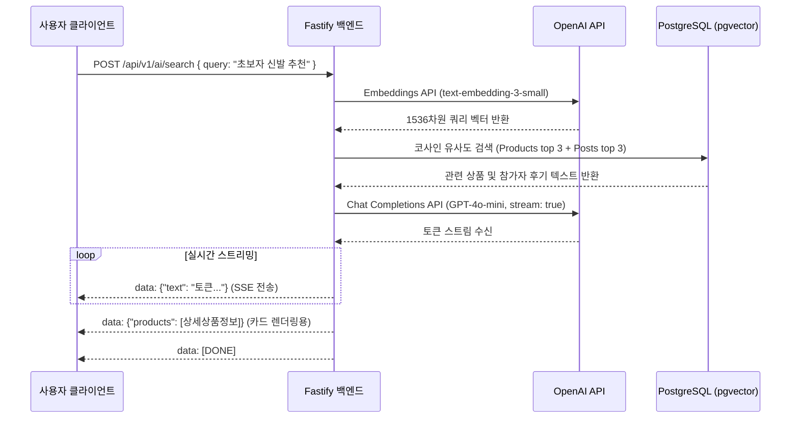

# FitterSweat - 아키텍처 및 시스템 상세 설계 사양서 (Design Spec)

**문서 번호**: SPEC-2026-09-06  
**프로젝트명**: FitterSweat (국내 HYROX 커뮤니티 & 커머스 플랫폼)  
**과제 구분**: 2026학년도 컴퓨터공학과 졸업작품  
**설계 방식**: Superpowers Architectural Design & Ponytail YAGNI 최적화  
**작성일**: 2026-09-06  
**상태**: Approved by User (Ready for Implementation Planning)  

---

## 1. 프로젝트 개요 및 목표 (Executive Summary)

### 1.1 배경 및 문제 정의
- 국내 HYROX 피트니스 레이스 참여자가 급증하고 있으나, 대회 일정 확인, 공식 티켓팅, 러닝/트레이닝 용품 구매, 영양(에너지젤/전해질) 준비, 실제 참가자 후기 확인이 여러 플랫폼(공식 사이트, 브랜드몰, SNS, 카페)으로 심각하게 파편화되어 있음.
- 본 프로젝트는 **대회 일정 허브 + 커뮤니티 + 직매입 쇼핑몰 + AI RAG 자연어 추천 검색 엔진**을 결합한 통합 웹 플랫폼을 구축함.

### 1.2 핵심 성공 기준 (Success Criteria)
1. **완벽한 MVP 확보**: 1인 풀스택 기준 4주(160시간) 내에 프론트엔드-백엔드-DB-결제 플로우가 실제로 동작하는 상용 수준의 웹 서비스를 구축함.
2. **풀 RAG AI 검색 탑재**: 커뮤니티 참가자 후기와 직매입 상품 데이터를 `pgvector` 코사인 유사도로 검색하고, OpenAI `GPT-4o-mini`가 0.5초 이내 실시간 SSE 스트리밍으로 맞춤 추천 답변을 출력함.
3. **무중단 스크래핑 & 안정적 결제**: 공식 HYROX 일정의 일 1회 자동 수집(Cheerio) 및 Toss Payments 트랜잭션 결제 승인/재고 차감 무결성을 보장함.

---

## 2. 시스템 전체 아키텍처 (Architecture Overview)

```
┌─────────────────────────────────────────────────────────────────────────────┐
│                            Next.js 14 Frontend                              │
│  (App Router, React 18, Tailwind CSS, shadcn/ui, TanStack Query, Zustand)   │
└──────────────────────────────────────┬──────────────────────────────────────┘
                                       │ HTTPS / SSE (EventSource)
┌──────────────────────────────────────▼──────────────────────────────────────┐
│                             Fastify 4 Backend                               │
│  (Node.js 20 LTS, TypeScript 5, Prisma 5, Zod, JWT Auth, Swagger OpenAPI)   │
├──────────────────────────────────────┬──────────────────────────────────────┤
│  [Core Domains]                      │  [AI & Scraper Tasks]                │
│  • Event Service (대회 일정 / 관심)  │  • RAG Search Service (OpenAI SDK)   │
│  • Commerce Service (상품/주문/결제) │  • Scraper Task (node-cron, Cheerio) │
│  • Community Service (게시글/댓글)   │  • Embedder Task (배치 임베딩)       │
└──────────────────┬───────────────────┴───────────────────┬──────────────────┘
                   │ PostgreSQL Protocol                   │ HTTPS
┌──────────────────▼───────────────────┐  ┌────────────────▼──────────────────┐
│        PostgreSQL 14+ + pgvector     │  │          OpenAI API               │
│  (10 Tables, IVFFLAT Vector Index)   │  │  (text-embedding-3-small,        │
│  • Products/Posts embedding(1536)    │  │   GPT-4o-mini Streaming)          │
└──────────────────────────────────────┘  └───────────────────────────────────┘
```

---

## 3. 데이터베이스 상세 설계 (10개 핵심 테이블)

### 3.1 테이블 정의 및 스키마 명세
1. **`users`**: 회원 계정 메타데이터
   - `id` (BIGSERIAL PK), `email` (VARCHAR UNIQUE), `password_hash` (VARCHAR), `name` (VARCHAR), `role` (VARCHAR: `USER` / `ADMIN`), `created_at`, `updated_at`
2. **`events`**: HYROX 대회 일정 (자동 스크래핑 수집)
   - `id` (BIGSERIAL PK), `name` (VARCHAR), `city_code` (VARCHAR), `start_date` (DATE), `end_date` (DATE), `event_url` (VARCHAR), `status` (`upcoming`/`past`/`cancelled`), `created_at`, `updated_at`
   - *Constraint*: `UNIQUE(city_code, start_date)`
3. **`interested_events`**: 관심 대회 등록 (N:M 연결)
   - `user_id` (BIGINT FK), `event_id` (BIGINT FK), `created_at`
   - *Constraint*: `PRIMARY KEY(user_id, event_id)`
4. **`products`**: 직접 매입 상품 정보
   - `id` (BIGSERIAL PK), `name` (VARCHAR), `description` (TEXT), `category_id` (VARCHAR), `price` (DECIMAL), `stock_quantity` (INT), **`embedding` (vector(1536))**, `created_at`, `updated_at`
5. **`orders`**: 주문 메타데이터
   - `id` (BIGSERIAL PK), `user_id` (BIGINT FK), `status` (`pending`/`paid`/`shipped`/`delivered`/`cancelled`), `total_amount` (DECIMAL), `payment_key` (VARCHAR), `paid_at` (TIMESTAMP), `created_at`, `updated_at`
6. **`order_items`**: 주문 상세 품목
   - `id` (BIGSERIAL PK), `order_id` (BIGINT FK), `product_id` (BIGINT FK), `quantity` (INT), `unit_price` (DECIMAL)
7. **`posts`**: 커뮤니티 질문 및 참가 후기 게시글
   - `id` (BIGSERIAL PK), `user_id` (BIGINT FK), `event_id` (BIGINT FK nullable), `title` (VARCHAR), `content` (TEXT), **`embedding` (vector(1536))**, `created_at`, `updated_at`
8. **`post_comments`**: 게시글 댓글
   - `id` (BIGSERIAL PK), `post_id` (BIGINT FK), `user_id` (BIGINT FK), `content` (TEXT), `created_at`
9. **`reviews`**: 실구매자 전용 상품 리뷰
   - `id` (BIGSERIAL PK), `product_id` (BIGINT FK), `user_id` (BIGINT FK), `rating` (INT: 1~5), `content` (TEXT), `created_at`
10. **`post_product_tags`**: 게시글-상품 N:M 태그 연결
    - `post_id` (BIGINT FK), `product_id` (BIGINT FK)
    - *Constraint*: `PRIMARY KEY(post_id, product_id)`

### 3.2 벡터 인덱스 (pgvector IVFFLAT)
```sql
CREATE EXTENSION IF NOT EXISTS vector;
CREATE INDEX idx_products_embedding ON products USING ivfflat (embedding vector_cosine_ops) WITH (lists = 100);
CREATE INDEX idx_posts_embedding ON posts USING ivfflat (embedding vector_cosine_ops) WITH (lists = 100);
```

---

## 4. 핵심 서비스 흐름 (Core Service Flows)

### 4.1 AI RAG 검색 & 실시간 SSE 스트리밍


### 4.2 주문 생성 및 Toss Payments 결제 트랜잭션
1. **주문서 작성**: 클라이언트가 장바구니에서 배송지 정보와 함께 `POST /api/v1/orders` 요청 ➔ `pending` 주문 생성.
2. **결제 위젯 인증**: 프론트엔드에서 `@toss/payment-sdk`로 결제창 호출 및 카드 인증 완료 ➔ `paymentKey` 획득.
3. **원자적 결제 승인 (`POST /api/v1/orders/:id/payment`)**:
   - `prisma.$transaction` 블록 내에서:
     1. 해당 상품들의 `stock_quantity` 실시간 차감 (재고 부족 시 에러 반환)
     2. Toss Payments 공식 승인 API 호출
     3. 주문 상태를 `paid`로 업데이트하고 `payment_key` 기록
   - 결제 승인 실패 또는 네트워크 예외 발생 시 트랜잭션 자동 롤백 (재고 복구).

### 4.3 대회 정보 스크래핑 & 변경 감지
- **스케줄**: `node-cron`으로 매일 자정(`0 0 * * *`) 백엔드 단일 프로세스 내에서 트리거.
- **수집 파이프라인**:
  1. `axios`로 `https://hyroxsouthkorea.com/ko/레이스-찾기/` 정적 HTML 수신
  2. `Cheerio`로 대회명, 도시코드, 개최일자, 공식 URL 추출
  3. 날짜 정규식 파싱 후 기존 DB 조회 (Diff 분석)
  4. `city_code + start_date` 기준 DB Upsert 수행
  5. 신규 대회 등록 또는 일정 변경 발생 시 관리자 이메일 발송 (`Nodemailer`)

---

## 5. 핵심 REST API 명세 (16개 표준 엔드포인트)

| 영역 | 메서드 | URI | 역할 | 인증 |
| :--- | :---: | :--- | :--- | :---: |
| **대회** | `GET` | `/api/v1/events` | 대회 일정 목록 조회 (필터/페이징) | ❌ |
| | `GET` | `/api/v1/events/:id` | 대회 상세 정보 조회 | ❌ |
| | `POST` | `/api/v1/events/:id/interested` | 관심 대회 등록/취소 (토글) | ✅ |
| **상품** | `GET` | `/api/v1/products` | 상품 목록 조회 (카테고리/검색어) | ❌ |
| | `GET` | `/api/v1/products/:id` | 상품 상세 정보 (실구매 리뷰/태그 포함) | ❌ |
| | `POST` | `/api/v1/products/:id/reviews` | 상품 리뷰 작성 (실구매자 전용) | ✅ |
| **주문** | `POST` | `/api/v1/orders` | 주문서 생성 (재고 사전 확인) | ✅ |
| | `POST` | `/api/v1/orders/:id/payment` | Toss 결제 승인 및 재고 차감 트랜잭션 | ✅ |
| | `GET` | `/api/v1/orders` | 내 주문 이력 및 배송 상태 조회 | ✅ |
| **커뮤니티** | `GET` | `/api/v1/posts` | 게시글 목록 조회 (대회 ID 필터) | ❌ |
| | `POST` | `/api/v1/posts` | 게시글 작성 (상품 태그 바인딩) | ✅ |
| | `POST` | `/api/v1/posts/:id/comments` | 게시글 댓글 작성 | ✅ |
| **AI 검색** | `POST` | `/api/v1/ai/search` | **RAG 자연어 추천 실시간 SSE 스트리밍 응답** | ❌ |
| | `POST` | `/api/v1/ai/embed` | 상품/게시글 텍스트 임베딩 배치 생성 | ✅ (Admin) |
| **인증** | `POST` | `/api/v1/auth/signup` | 회원가입 (bcrypt 해싱) | ❌ |
| | `POST` | `/api/v1/auth/login` | 로그인 (JWT Access/Refresh 발급) | ❌ |
| | `POST` | `/api/v1/auth/refresh` | Access Token 갱신 | ❌ |

---

## 6. 개발 로드맵 및 4주 마일스톤 (총 160시간)

```
[Week 1] 환경 구성 + 핵심 백엔드 (40시간)
  - Docker Compose (PostgreSQL 14 + pgvector)
  - Prisma ORM 10개 모델 정의 및 pgvector 마이그레이션
  - JWT 회원가입/로그인 API (bcrypt 해싱)
  - HYROX 대회 스크래핑 모듈(Cheerio) 및 node-cron 스케줄러 등록
  - Jest 단위 테스트 (인증, 스크래퍼)
  👉 Milestone 1: 인증 정상 동작, pgvector 설치 확인, 대회 일정 자동 수집 검증

[Week 2] 커머스 + 커뮤니티 백엔드 (40시간)
  - 상품 목록/상세/검색 API (카테고리 필터링)
  - 커뮤니티 게시글 CRUD 및 댓글 API + 상품 태그(PostProductTags)
  - 주문 생성 API 및 Toss Payments 결제 승인 API
  - PostgreSQL 단일 트랜잭션 기반 재고 차감 및 롤백 보장
  - Swagger UI OpenAPI 3.0 자동 문서화 (/docs)
  👉 Milestone 2: 핵심 백엔드 REST API 완성 및 Toss Sandbox 결제 통과

[Week 3] Frontend 전체 UI 구현 (40시간)
  - Next.js 14 App Router + Tailwind CSS + shadcn/ui 레이아웃
  - 홈 / 대회 목록 및 상세 / 관심 대회 D-Day 토글 UI
  - 상품 쇼핑 / 상세 / 장바구니(Zustand) / Toss 결제 위젯 연동
  - 커뮤니티 게시판 (목록, 상세, 작성 시 상품 태그 모달)
  - TanStack Query v5 API 캐싱 연동 및 전체 결제 E2E 플로우 검증
  👉 Milestone 3: 전체 화면 반응형 UI 완성 및 결제 E2E 동작 완료

[Week 4] 풀 RAG AI 검색 엔진 + 배포 + 최종 발표 (40시간)
  - OpenAI text-embedding-3-small 배치 임베딩 스크립트 실행 (초기 시딩 데이터 벡터화)
  - /api/v1/ai/search 엔드포인트 구현 (pgvector 코사인 유사도 + GPT-4o-mini SSE)
  - 프론트엔드 실시간 AI 스트리밍 검색 UI 컴포넌트 구현
  - Vercel (FE) + Railway (BE + PostgreSQL pgvector) 프로덕션 배포
  - 최종 종합 점검 및 발표 슬라이드/시연 시나리오 완성
  👉 Milestone 4: AI 검색 스트리밍 정상 동작, 실서버 배포 완료, 졸업작품 완주
```

---

## 7. 자체 점검 체크리스트 (Spec Self-Review)
- [x] **Placeholder scan**: "TBD", "TODO" 없이 모든 컬럼, 엔드포인트, 패키지 버전 구체화 완료.
- [x] **Internal consistency**: DB 10개 테이블 스키마와 API 16개 명세, 4주 추진 일정 간 모순 없음.
- [x] **Scope check**: 1인 풀스택 기준 4주 160시간 내에 완수 가능한 Safety-First 스코프 준수.
- [x] **Ambiguity check**: RAG 파이프라인의 임베딩 모델(1536차원)과 검색 알고리즘(`<=>`), 결제 트랜잭션 롤백 정책을 단일하고 명확하게 정의함.
