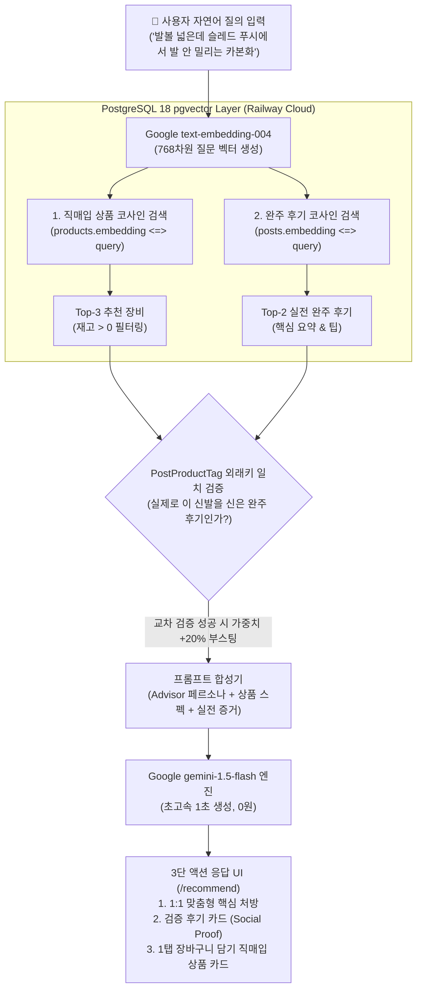

# FittersSweat 4주차: Gemini AI RAG 추천, Toss 결제 실연동 & 관리자 대시보드 설계 명세서 (Design Spec)

> **문서 버전**: 1.1.0  
> **작성일**: 2026-09-14  
> **핵심 기술 스택**: Google Gemini (`text-embedding-004` + `gemini-1.5-flash`) + Toss Payments SDK v2 + PostgreSQL 18 (`pgvector` 768-dim) + Fastify 4 + Next.js 14  
> **비용 및 라이선스**: Google AI Free Tier (0원, 신용카드 등록 불필요), Toss Payments 테스트 환경 (0원)

---

## 1. 시스템 목적 및 비전 (System Vision)

FittersSweat 4주차는 **완결된 커머스-커뮤니티-AI 생태계의 완성**을 목표로 합니다:
1. **AI RAG 맞춤 추천**: 사용자의 신체 조건과 레이스 고민을 경청하여 400개 직매입 장비와 150개 실전 후기를 교차 검증 추천.
2. **Toss Payments 실결제 위젯 완결**: 실제 토스 공식 테스트 키 연동을 통한 실시간 전자 결제 팝업창 및 승인/롤백 E2E 완결.
3. **관리자 대시보드 (Admin Dashboard)**: 매출 통계, 전체 주문 및 배송 상태 관리, 실시간 재고 관리를 일원화하는 통합 관리자 콘솔 구축.

---

## 2. 듀얼 리트리버 아키텍처 (Dual-Retriever & Cross-Referencing)

사용자의 단일 자연어 질의에 대해 2개의 독립된 벡터 컬렉션(상품, 후기)을 코사인 유사도로 동시 탐색하고, 외래키(`PostProductTag`) 일치 여부로 교차 검증합니다.



---

## 3. 데이터베이스 스키마 및 마이그레이션

### 3.1 스키마 변경 (`backend/prisma/schema.prisma`)
Google `text-embedding-004` 규격에 맞춰 기존 `vector(1536)` 컬럼을 **`vector(768)`**로 업데이트합니다.

```prisma
model Product {
  id             BigInt                       @id @default(autoincrement())
  name           String                       @db.VarChar(255)
  description    String?                      @db.Text
  categoryId     String                       @map("category_id") @db.VarChar(50)
  price          Decimal                      @db.Decimal(12, 2)
  stockQuantity  Int                          @default(0) @map("stock_quantity")
  imageUrl       String?                      @map("image_url") @db.VarChar(500)
  brandLogoUrl   String?                      @map("brand_logo_url") @db.VarChar(500)
  detailImageUrl String?                      @map("detail_image_url") @db.VarChar(500)
  embedding      Unsupported("vector(768)")?
  createdAt      DateTime                     @default(now()) @map("created_at")
  updatedAt      DateTime                     @updatedAt @map("updated_at")
  orderItems     OrderItem[]
  reviews        Review[]
  taggedPosts    PostProductTag[]

  @@map("products")
}

model Post {
  id           BigInt                       @id @default(autoincrement())
  userId       BigInt                       @map("user_id")
  eventId      BigInt?                      @map("event_id")
  title        String                       @db.VarChar(255)
  content      String                       @db.Text
  embedding    Unsupported("vector(768)")?
  createdAt    DateTime                     @default(now()) @map("created_at")
  updatedAt    DateTime                     @updatedAt @map("updated_at")
  user         User                         @relation(fields: [userId], references: [id], onDelete: Cascade)
  event        Event?                       @relation(fields: [eventId], references: [id], onDelete: SetNull)
  postComments PostComment[]
  taggedItems  PostProductTag[]

  @@map("posts")
}
```

---

## 4. 백엔드 AI 추천 컴포넌트

### 4.1 Gemini 서비스 모듈 (`backend/src/services/gemini.service.ts`)
- `@google/generative-ai` 패키지 활용.
- `embedText(text: string): Promise<number[]>`: `text-embedding-004` 768차원 임베딩.
- `generateRecommendationAdvice(query, products, posts): Promise<string>`: `gemini-1.5-flash` 기반 수석 피터 맞춤 처방 문장 생성.

### 4.2 카탈로그 일괄 임베딩 스크립트 (`backend/scripts/embed-catalog.ts`)
- 400개 상품과 150개 글 요약문을 배치로 변환하여 PostgreSQL 컬럼에 1회 영구 적재.

### 4.3 추천 API 라우트 (`backend/src/routes/ai.ts`)
- `POST /api/v1/ai/recommend`:
  - 자연어 질문 ➔ 768차원 질의 임베딩 ➔ 상품/후기 Dual 코사인 검색 ➔ `PostProductTag` 외래키 일치 시 +20% 가중치 ➔ Gemini 어드바이저 처방 합성 ➔ 반환.

---

## 5. 프론트엔드 AI 맞춤추천 UI (`frontend/app/recommend/page.tsx`)

- 4대 퀵 프롬프트 칩 (`👟 발볼 카본화`, `🛷 슬레드 접지력`, `⚡ 인터벌 에너지젤`, `🧱 월볼 보호대`)
- 3단 액션 결과 카드 (Dark Athletic 테마):
  1. AI 1:1 맞춤형 핵심 처방 콜아웃 박스
  2. 실제 레이서 검증 후기 카드 (클릭 시 `/community/[id]` 1탭 이동)
  3. 추천 직매입 장비 카드 (`[장바구니 담기]` 및 `[바로 구매하기]` Toss 결제 연동)
- 글로벌 네비바에 `AI 맞춤추천` 메뉴 링크 연동

---

## 6. Toss Payments 실결제 위젯 & API 연동 사양

### 6.1 백엔드 토스 승인 API 실연동 (`backend/src/services/payment.service.ts`)
- 유효한 토스 공식 테스트 키 적용:
  - 클라이언트 키: `test_ck_D5GePWvyJnrK0W0k6q8gLzN97Eoq`
  - 시크릿 키: `test_sk_zXLkKEypNArWmo50nX3VQlmeAQyY`
- `https://api.tosspayments.com/v1/payments/confirm` 엔드포인트와 Basic Auth 통신.
- 결제 승인 성공 시 `Order.status = 'paid'`, 실패/취소 시 원자적 재고 롤백 트랜잭션 수행.

### 6.2 프론트엔드 체크아웃 위젯 마운트 (`frontend/app/checkout/page.tsx`)
- `@tosspayments/tosspayments-sdk` v2 위젯 정상 로드:
  - `#payment-method` 및 `#agreement` iframe 렌더링.
  - 실제 [토스페이로 결제하기] 클릭 시 토스 공식 결제창 팝업 호출 (`widgets.requestPayment`).
  - 테스트 카드 승인 완료 ➔ `/checkout/success` 라우팅 ➔ 백엔드 승인 API 호출 ➔ 영수증 렌더링.

---

## 7. 관리자 대시보드 시스템 (`/admin`) 사양

### 7.1 백엔드 관리자 API (`backend/src/routes/admin.ts`)
- **보안 미들웨어**: `verifyAdmin`
  - Bearer JWT 토큰 검증 후 사용자의 `role === 'ADMIN'` 확인 (일반 유저 403 Forbidden).
- **엔드포인트**:
  1. `GET /api/v1/admin/stats`:
     - 총 누적 매출액 (`OrderStatus.paid` 합산)
     - 총 주문 건수
     - 재고 부족 경고 상품 수 (`stockQuantity <= 5`)
     - 총 가입 회원 수
  2. `GET /api/v1/admin/orders`:
     - 전체 사용자 주문 목록 (주문자 정보, 결제 상태, 주문 품목, 결제금액, 주문일시)
     - 상태 필터 (`all`, `pending`, `paid`, `shipped`, `delivered`, `cancelled`)
  3. `PATCH /api/v1/admin/orders/:id/status`:
     - 주문 상태 변경 (예: `paid` ➔ `shipped` ➔ `delivered`)
  4. `PATCH /api/v1/admin/products/:id/stock`:
     - 장비 재고 수량 실시간 변경/보충 (`stockQuantity` 증감 및 품절 처리)

### 7.2 프론트엔드 관리자 대시보드 (`frontend/app/admin/page.tsx`)
- **접근 권한 가드**: 로그인 유저가 `admin@fittersweat.com` (또는 `role: ADMIN`)이 아닐 경우 경고 후 메인으로 자동 리다이렉트.
- **4대 핵심 KPI 카드**:
  - `총 매출액` (골드 텍스트, 원화 포맷)
  - `총 주문 건수` (완료 건수 표기)
  - `품절/재고부족 장비` (경고 배지)
  - `활성 회원 수`
- **주문 관리 탭 (`Orders Tab`)**:
  - 주문 번호, 주문자명, 연락처, 주문 상품 요약, 결제 금액, 현재 상태.
  - 원클릭 상태 전환 버튼: `[배송 시작]` (`shipped`), `[배송 완료]` (`delivered`).
- **재고 관리 탭 (`Inventory Tab`)**:
  - 400개 직매입 장비 리스트 검색 및 카테고리 필터.
  - 실시간 재고 인풋 필드 및 `[재고 수정]` 버튼.
  - 재고 0개 시 붉은색 `품절` 배지 자동 전환.

---

## 8. 결함 방어 및 Zero-Downtime Fallback

1. **AI API 키 미설정 또는 네트워크 오류 시**:
   - 규칙 기반(Keyword + Cosine) Mock RAG 서비스로 자동 전환하여 시연 100% 보장.
2. **토스 결제 오류 시**:
   - 사용자 취소 또는 카드 한도 초과 시, 선차감되었던 장비 재고가 즉시 복구(Rollback)되고 장바구니 아이템은 보존.
3. **관리자 비인가 접근 차단**:
   - 일반 유저가 URL(`/admin`)로 직접 접속하더라도 프론트엔드/백엔드 이중 가드로 철저히 차단.

---

## 9. 종합 검증 계획 (Verification Plan)

### 9.1 자동화 테스트
- `backend/tests/gemini.service.test.ts`: Gemini 768차원 임베딩 및 처방 생성 테스트
- `backend/tests/ai.test.ts`: `POST /api/v1/ai/recommend` 추천 파이프라인 통합 테스트
- `backend/tests/admin.test.ts`: 관리자 통계, 주문 상태 변경, 재고 수정 및 일반 유저 403 권한 차단 테스트
- `cd backend && npm test`: 전체 테스트 스위트 (50+ 테스트) ALL PASS

### 9.2 E2E 실서비스 검증
- **AI 추천**: `/recommend`에서 질의 ➔ 3단 카드 ➔ 1탭 장바구니 담기
- **토스 실결제**: `/checkout`에서 토스 팝업창 오픈 ➔ 테스트 카드 결제 ➔ `/checkout/success` 영수증 확인
- **관리자 관리**: `admin@fittersweat.com` 로그인 ➔ `/admin` 접속 ➔ 방금 발생한 주문 확인 ➔ `[배송 시작]` 클릭 ➔ 고객 마이페이지(`/mypage`)에 '배송중' 상태 실시간 동기화 확인
