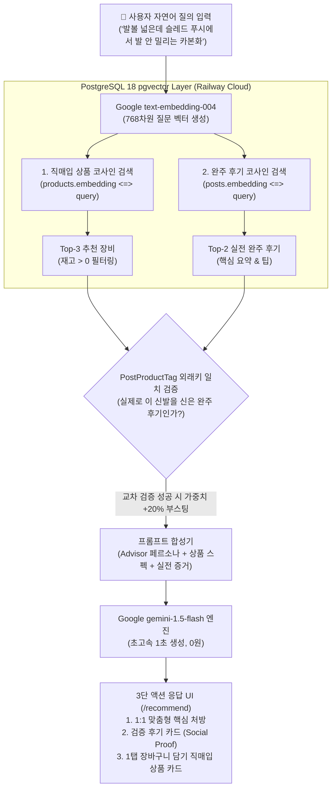

# FittersSweat 4주차: Gemini 기반 AI RAG 추천 시스템 설계 명세서 (Design Spec)

> **문서 버전**: 1.0.0  
> **작성일**: 2026-09-14  
> **핵심 기술 스택**: Google Gemini (`text-embedding-004` + `gemini-1.5-flash`) + PostgreSQL 18 (`pgvector` 768-dim) + Fastify 4 + Next.js 14  
> **비용 및 라이선스**: Google AI Free Tier (0원, 신용카드 등록 불필요)

---

## 1. 시스템 목적 및 비전 (System Vision)

기존 커머스의 단순 키워드 검색이나 일반 챗봇은 제조사의 정형화된 스펙만을 나열하여 HYROX 같은 고강도 복합 레이스 입문자 및 선수들의 실질적 고민(예: "발볼 2E 규격인데 152kg 슬레드 푸시에서 발이 안 밀리는 카본화", "8km 인터벌 런 후반부 다리 경련 방지용 젤")을 해결하지 못합니다.

본 시스템은 **"HYROX 플래그십 스토어의 1:1 베테랑 전문 매니저"** 페르소나를 구현합니다:
1. 고객의 신체 조건, 목표 시간, 취약 스테이션을 깊이 공감합니다.
2. 400개 직매입 장비 풀에서 정밀 매칭되는 장비를 제안합니다.
3. 해당 장비를 착용하고 동일한 스테이션을 완주한 선배 레이서들의 **실전 커뮤니티 후기 150건을 증거(Social Proof)**로 함께 제시합니다.
4. 설명에 그치지 않고 화면에서 **1탭으로 즉시 장바구니에 담거나 Toss Payments로 결제할 수 있는 완결된 쇼핑 플로우**를 완성합니다.

---

## 2. 듀얼 리트리버 아키텍처 (Dual-Retriever & Cross-Referencing)

사용자의 단일 자연어 질의에 대해 2개의 독립된 벡터 컬렉션(상품, 후기)을 코사인 유사도로 동시 탐색하고, 외래키(`PostProductTag`) 일치 여부로 교차 검증합니다.



### 2.1 검색 단계별 동작
1. **질의 벡터화**: `text-embedding-004`를 호출하여 768차원 부동소수점 벡터 생성.
2. **상품 스펙 벡터 검색 (Spec Matching)**:
   - 400개 직매입 상품의 `name`, `description`, `categoryId` 임베딩과 질의 벡터 간 코사인 유사도 연산 (`1 - (embedding <=> $query::vector)`).
   - `stock_quantity > 0` (품절 제외) 조건 자동 필터링.
3. **커뮤니티 경험 벡터 검색 (Experience Matching)**:
   - 150개 실전 후기의 `> 💡 **핵심 요약**: ...` 텍스트 임베딩과 질의 벡터 간 코사인 유사도 연산.
4. **외래키(`PostProductTag`) 교차 신뢰도 부스팅 (Cross-Validation Reranking)**:
   - 추천 상품 ID가 추천 후기 게시글의 `taggedItems` 외래키에 포함되어 있을 경우 유사도 점수에 +20% 가중치를 부여하여 최상단 랭크.
   - **"후기가 실제로 입증하는 바로 그 장비"**가 항상 1순위로 노출됩니다.

---

## 3. 데이터베이스 스키마 및 마이그레이션

### 3.1 스키마 변경 (`backend/prisma/schema.prisma`)
Google `text-embedding-004` 규격에 맞춰 기존 `vector(1536)` 컬럼을 **`vector(768)`**로 업데이트합니다.

```prisma
model Product {
  id             BigInt                       @id @default(autoincrement())
  name           String                       @db.VarChar(255)
  description    String?                      @db.Text
  categoryId     String                       @map("category_id") @db.VarChar(50)
  price          Decimal                      @db.Decimal(12, 2)
  stockQuantity  Int                          @default(0) @map("stock_quantity")
  imageUrl       String?                      @map("image_url") @db.VarChar(500)
  brandLogoUrl   String?                      @map("brand_logo_url") @db.VarChar(500)
  detailImageUrl String?                      @map("detail_image_url") @db.VarChar(500)
  embedding      Unsupported("vector(768)")?
  createdAt      DateTime                     @default(now()) @map("created_at")
  updatedAt      DateTime                     @updatedAt @map("updated_at")
  orderItems     OrderItem[]
  reviews        Review[]
  taggedPosts    PostProductTag[]

  @@map("products")
}

model Post {
  id           BigInt                       @id @default(autoincrement())
  userId       BigInt                       @map("user_id")
  eventId      BigInt?                      @map("event_id")
  title        String                       @db.VarChar(255)
  content      String                       @db.Text
  embedding    Unsupported("vector(768)")?
  createdAt    DateTime                     @default(now()) @map("created_at")
  updatedAt    DateTime                     @updatedAt @map("updated_at")
  user         User                         @relation(fields: [userId], references: [id], onDelete: Cascade)
  event        Event?                       @relation(fields: [eventId], references: [id], onDelete: SetNull)
  postComments PostComment[]
  taggedItems  PostProductTag[]

  @@map("posts")
}
```

---

## 4. 백엔드 구현 컴포넌트

### 4.1 Gemini 서비스 모듈 (`backend/src/services/gemini.service.ts`)
- `@google/genai` (또는 `@google/generative-ai`) 패키지 활용.
- `embedText(text: string): Promise<number[]>`:
  - 모델: `text-embedding-004` (output: 768-dim float array).
- `generateRecommendationAdvice(query, products, posts): Promise<string>`:
  - 모델: `gemini-1.5-flash` (temperature: 0.4).
  - System Persona: "HYROX 공식 인증 매장 1:1 수석 피터(Chief Fitter). 공감형 오프닝 + 장비 메커니즘 설명 + 실전 완주 팁 결합".

### 4.2 카탈로그 일괄 임베딩 스크립트 (`backend/scripts/embed-catalog.ts`)
- 400개 상품: `[카테고리] 상품명 - 설명` 포맷으로 임베딩 일괄 생성 (배치 처리).
- 150개 게시글: 본문에서 `> 💡 **핵심 요약**: ...` 정규식 추출 후 임베딩 생성.
- `prisma.$executeRawUnsafe`로 DB 컬럼에 1회 적재 (소요 시간 30~40초, 비용 0원).

### 4.3 신규 글 작성 시 비동기 임베딩 (`backend/src/routes/posts.ts`)
- `POST /api/v1/posts` 완료 직후 백그라운드로 `embedText`를 비동기 실행하여 해당 글의 `embedding` 컬럼을 갱신 (사용자 응답 대기 0초).

### 4.4 추천 API 라우트 (`backend/src/routes/ai.ts`)
- **엔드포인트**: `POST /api/v1/ai/recommend`
- **입력 스키마**:
  ```json
  {
    "query": "string (필수, 2자 이상)",
    "station": "string (선택)",
    "category": "string (선택)"
  }
  ```
- **출력 스키마**:
  ```json
  {
    "success": true,
    "advice": "추천 분석 및 처방 본문",
    "recommendedProducts": [
      {
        "id": "1",
        "name": "PUMA Deviate NITRO Elite 3 카본 레이서",
        "price": 249000,
        "stockQuantity": 35,
        "imageUrl": "https://...",
        "similarity": 0.88,
        "isVerifiedByPost": true
      }
    ],
    "supportingPosts": [
      {
        "id": "42",
        "title": "발볼러의 첫 HYROX 송도 슬레드 구간 극복기",
        "keyTakeaway": "발볼 실측 10.4cm인데...",
        "authorName": "런린이탈출",
        "finisherBadge": true
      }
    ]
  }
  ```

---

## 5. 프론트엔드 UI/UX 사양 (`frontend/app/recommend/page.tsx`)

### 5.1 페이지 레이아웃 및 인터랙션
1. **Hero Header**:
   - `AI RACER FITTER` 골드 배지.
   - `"나만의 체형과 목표 시간에 꼭 맞는 실전 장비 & 공략법 추천"`.
2. **자연어 검색 & 퀵 프롬프트 바**:
   - 대형 인풋창 + 실시간 검색 버튼 (`Lucide Sparkles` 아이콘).
   - 4대 퀵 프롬프트 칩:
     - `👟 발볼 넓은 카본화`
     - `🛷 150kg 슬레드 접지력`
     - `⚡ 8km 런 에너지젤 섭취 타이밍`
     - `🧱 100개 월볼 손목 보호대`
3. **3단 액션 결과 카드 (Dark Athletic 스타일)**:
   - **섹션 1: 1:1 맞춤형 핵심 처방**:
     - `bg-[#141414] border border-[#FFD700]/30 rounded-2xl p-6`
     - 상단에 `👨‍💼 FittersSweat AI 전문 어드바이저` 뱃지 및 구조화된 마크다운 텍스트 렌더링.
   - **섹션 2: 실제 완주 레이서 검증 후기 (Social Proof)**:
     - 2열 그리드 카드. 작성자 닉네임, 🏅 HYROX Finisher 배지, 핵심 요약 골드 인용구.
     - 클릭 시 해당 커뮤니티 상세(`/community/[id]`) 1탭 이동.
   - **섹션 3: 추천 직매입 장비 (1탭 구매 연계)**:
     - 1:1 Cloudinary 고해상도 썸네일, 카테고리 태그, 재고 상태, 가격.
     - 우측 액션: `[장바구니 담기]` (Zustand 스토어 즉시 연동) 및 `[바로 구매하기]` (`/checkout` 직접 라우팅).

### 5.2 전역 네비바 연동 (`frontend/components/Navbar.tsx`)
- 네비바 메뉴에 `AI 맞춤추천` (`/recommend`) 링크 추가. 활성 탭 시 골드 텍스트 및 하단 인디케이터 표시.

---

## 6. 결함 방어 및 Zero-Downtime Fallback

1. **API 키 미설정 또는 네트워크 오류 시**:
   - 에러로 화면이 멈추지 않고, 내장된 **규칙 기반(Keyword + Cosine Similarity) Mock RAG 서비스**로 자동 전환.
   - 사전에 준비된 대표 페르소나 매칭 답변을 즉시 반환하여 캡스톤 최종 발표 시연 100% 보장.
2. **Rate Limit (15 RPM 초과 방지)**:
   - 프론트엔드 제출 버튼 3초 쿨다운 디바운스 적용.

---

## 7. 검증 계획 (Verification Plan)

### 7.1 자동화 단위/통합 테스트
- `backend/tests/ai.test.ts`:
  - Gemini 임베딩 벡터 차원 수(768) 검증.
  - `POST /api/v1/ai/recommend` 정상 호출 및 JSON 응답 구조 검증.
  - Fallback 모드 동작 검증.
  - 45개 기존 테스트 + 신규 AI 테스트 전체 통과 확인.

### 7.2 E2E 사용자 시나리오 검증
- 브라우저에서 `/recommend` 접속 ➔ 퀵 프롬프트 클릭 ➔ 3단 카드 정상 렌더링 ➔ 장바구니 1탭 담기 ➔ `/cart` 배지 숫자 증가 확인.
