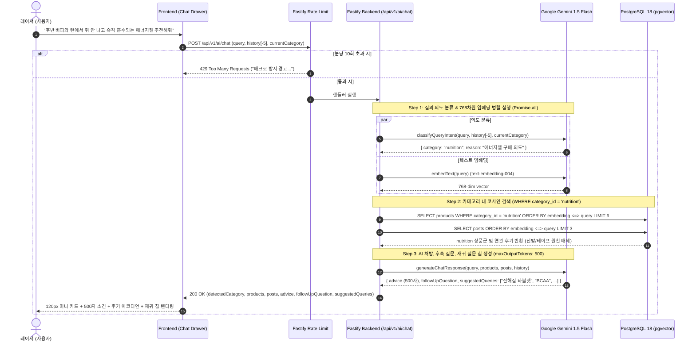

# FittersSweat AI 기어 코치: 대화형 챗 드로어, Gemini 인텐트 분류 & 세션 지속성 설계 명세서 (PRD & Design Spec)

> **문서 버전**: 2.1.0 (QA 및 설계 최종 확정본)  
> **확정일**: 2026-09-15  
> **상태**: 승인 완료 (Approved) ➔ 구현 계획서(writing-plans) 단계 진입  
> **적용 스택**: Next.js 14 + Tailwind CSS + Framer Motion + Zustand (LocalStorage Persist) + Fastify 4 (`@fastify/rate-limit`) + Google Gemini (`gemini-1.5-flash` JSON Mode + `text-embedding-004`) + PostgreSQL 18 `pgvector`

---

## 1. 배경 및 해결하려는 문제 (Problem Statement)

### 1.1 현상의 원인: Dense Vector 유사도 검색의 '의미론적 표류(Semantic Drift)'
- **실제 사례**: 사용자가 `"후반 버피와 런에서 쥐 안 나고 즉각 흡수되는 카페인 전해질 에너지젤 추천해줘"`라고 질의했을 때, 핵심 타깃 제품군인 **뉴트리션(NUTRITION, 에너지젤)** 외에 문맥 키워드인 `"버피"`, `"런"`, `"쥐 안 나고"`(하체 피로)의 임베딩에 이끌려 **러닝화(Hoka Arahi)**와 **터프 테이프(장비)**가 100% 유사도로 잘못 매칭되는 문제 발생.
- **원인**: 사용자의 입력 문장에는 **'상황 맥락(버피, 런 스테이션)'**과 **'실제 구매 대상(에너지젤)'**이 공존하는데, 전 카탈로그(400개)를 대상으로 단일 코사인 유사도 검색만 수행하면 상황 키워드의 벡터 거리가 구매 대상을 희석시킴.

### 1.2 UX 구조의 한계: 단발성 결과 뷰 vs 연속적 대화 경험 부재
- 기존 `/recommend` 페이지는 1회 질의 후 결과를 카드 형태로 나열하는 단발성 페이지였음.
- 실전 레이스 준비는 "신발 ➔ 양말 ➔ 뉴트리션 ➔ 테이핑"처럼 **연속적이고 질문-답변이 꼬리를 무는 상담 과정**임.
- 사용자가 페이지를 이동하거나 새로고침하면 이전 추천 기록이 유실되는 불편함이 있음.

---

## 2. 제품 요구사항 및 확정 정책 (Product Requirements & Decisions)

마이프로틴의 `Fuel Coach` 대화형 AI 인터페이스를 벤치마킹하여, FittersSweat의 감성에 맞는 **'Fit Coach (HYROX AI 기어 코치)'** 시스템을 구축합니다.

```
┌─────────────────────────────────────────────────────────────────────────────┐
│                          FittersSweat Global Layout                          │
│                                                                             │
│  [Top Navbar]  대회일정   장비몰   커뮤니티   [⚡ AI 기어 코치]  장바구니    │
├───────────────────────┬─────────────────────────────────────────────────────┤
│  [좌측 슬라이드 드로어] │  [메인 화면] (/products, /events, /community 등)     │
│  ┌─────────────────┐  │                                                     │
│  │ ⚡ Fit Coach [✕]│  │   8만 원 이상 무료배송 | 100% 본사 직매입 정품 보증 │
│  ├─────────────────┤  │                                                     │
│  │ 1. 미니 기어 캐러셀│  │                                                     │
│  │   [젤] [신발] [기어]│  │                                                     │
│  │ 2. AI 소견(500자) │  │                                                     │
│  │ 3. 후기 아코디언  │  │                                                     │
│  │ 4. 재귀 칩 3~4개  │  │                                                     │
│  ├─────────────────┤  │                                                     │
│  │ [💬 질문 입력...] │  │                                  [⚡ AI 코치 FAB] │
│  └─────────────────┘  │                                     (모바일/데스크톱)│
└───────────────────────┴─────────────────────────────────────────────────────┘
```

### 2.1 사용자 QA를 통해 최종 확정된 6대 핵심 정책

1. **드로어 UI 위치: 좌측(Left) 슬라이드 드로어 (확정: A안)**
   - 마이프로틴 레퍼런스와 동일하게 화면 좌측에서 오버레이 형태로 스르륵 열림 (데스크톱 너비 400px 고정, 모바일 100vw).
   - 우측의 쇼핑몰 상품 목록과 커뮤니티 글을 탐색하면서 동시에 AI 코치와 자연스럽게 대화 가능.
2. **페이지 연동: 일관된 드로어 모드 (확정: A안)**
   - 상단 네비바의 [AI 맞춤추천] 클릭 시 페이지 이동 없이 현재 화면에서 좌측 챗 드로어가 오픈.
   - `/recommend` URL로 직접 진입 시에도 메인 화면 위에서 좌측 챗 드로어가 자동 오픈되어 일관된 경험 제공.
3. **슬라이딩 윈도우 (Sliding Window)**
   - 브라우저 로컬스토리지에는 사용자가 스크롤하여 확인할 수 있도록 전체 대화 내역을 보존하되, **백엔드 API 요청 시에는 최근 5개 메시지(`history.slice(-5)`)만 전송**하여 전송 페이로드와 토큰 낭비를 차단하고 0.5초대 초고속 응답 유지.
4. **악의적 매크로 & 쿼터 3단계 방어 체계**
   - **1단계 (속도 제한)**: `@fastify/rate-limit` 기반 분당 10회 제한. (비회원은 IP 기준, 회원은 JWT `user.id` 기준 분당 10회 적용). 429 에러 반환 시 드로어 내에 `"매크로 방지를 위해 분당 메세지 제한이 설정되었습니다. 5회 경고 시 아이디가 영구 차단됩니다. (경고 {count}/5회)"` 경고 배너 노출.
   - **2단계 (하이브리드 티저 쿼터)**: 비회원은 10회 무료 대화 제공 후 1초 간편 로그인 모달 유도(그로스해킹), 로그인 회원은 일일 100회 쿼터 제공.
   - **3단계 (토큰 캡)**: Gemini 1.5 Flash에 `maxOutputTokens: 500`을 강제 적용하여 AI 소견 텍스트 출력을 500자 이내로 제한.
5. **점진적 공개 (Progressive Disclosure) 3단 컴포넌트 UI**
   - **상단**: 1:1 정사각 **미니 기어 3선 스냅 카드 (120px)** + 1탭 장바구니 담기.
   - **중단**: **AI 수석 피터 소견 (최대 500자, 약 5~7문장)**.
   - **하단**: **실전 후기 인라인 아코디언 배지** (클릭 시 2줄 핵심 팁 스르륵 펼쳐짐, 페이지 이탈 없음).
   - **최하단**: **후속 유도 질문 & 3~4개 1탭 재귀 질문 칩 (`suggestedQueries`)**.
   - 결과 높이: 기존 수직 나열 시 900px ➔ **약 380px로 55% 압축**되어 모바일 한 화면에 완벽 수납.
6. **세션 지속성 (Session Persistence)**
   - Zustand `persist` (`localStorage`) 기반으로 페이지 이동(`/products`, `/events`, `/community`) 및 브라우저 새로고침(F5) 시에도 대화 기록 및 드로어 상태 100% 보존.

---

## 3. 백엔드 상세 아키텍처 및 파이프라인

### 3.1 백엔드 4단계 검색·추론 시퀀스



---

## 4. 백엔드 컴포넌트 및 API 명세

### 4.1 신규 AI 메서드 (`backend/src/services/gemini.service.ts`)

#### 1) `classifyQueryIntent(query: string, history?: ChatHistoryItem[], currentCategory?: string): Promise<CategoryClassification>`
- 모델: `gemini-1.5-flash` (JSON Mode)
- 프롬프트 규칙:
  - 새 카테고리 단어(신발, 슬리브, 젤 등) 등장 시 즉시 카테고리 전환.
  - 생략형 질문("카페인 없는 건?", "와이드 핏은?") 시 `currentCategory` 맥락 계승.
  - 종합 질문("풀세트 맞춰줘") 시 `all` 반환.
- Fallback: 키 미설정/에러 시 0ms 정규식 키워드 감지 적용.

#### 2) `generateChatResponse(query, products, posts, history): Promise<ChatAdvisorResponse>`
- `maxOutputTokens: 500` 강제 설정.
- 반환 JSON 스키마:
  ```typescript
  interface ChatAdvisorResponse {
    advice: string;            // 500자 이내 마크다운 피팅 소견
    followUpQuestion: string;  // 대화 유도형 후속 질문 1문장
    suggestedQueries: string[]; // 1탭 클릭용 재귀 질문 칩 3~4개
  }
  ```

### 4.2 API 엔드포인트 (`POST /api/v1/ai/chat`)
- **Fastify Rate Limit**: `max: 10, timeWindow: '1 minute'` (IP or User ID key)
- **Request Body**:
  ```typescript
  interface ChatRequest {
    query: string;
    history?: Array<{ role: 'user' | 'assistant'; content: string }>; // 최근 5개
    currentCategory?: string;
  }
  ```
- **Response Body**:
  ```typescript
  interface ChatResponse {
    success: boolean;
    detectedCategory: 'nutrition' | 'shoes' | 'gear' | 'equipment' | 'all';
    categoryReason: string;
    advice: string;
    followUpQuestion: string;
    suggestedQueries: string[];
    recommendedProducts: Array<{
      id: string;
      name: string;
      description: string;
      categoryId: string;
      price: number;
      stockQuantity: number;
      imageUrl: string;
      similarity: number;
      rerankScore: number;
      isSocialVerified: boolean;
    }>;
    verifiedReviews: Array<{
      id: string;
      title: string;
      content: string;
      userName: string;
      similarity: number;
    }>;
  }
  ```

---

## 5. 프론트엔드 UI/UX 컴포넌트 상세 설계

### 5.1 파일 구조

```
frontend/
├── stores/
│   └── useAiChatStore.ts         # Zustand + LocalStorage persist (메시지, isOpen, 쿼터 카운트)
├── components/
│   ├── ai/
│   │   ├── AiCoachDrawer.tsx     # 좌측 슬라이드 드로어 (Framer Motion slide-in from left)
│   │   ├── ChatMessageBubble.tsx # 메시지 버블 (상단 미니 카드 + 소견 + 후기 아코디언 + 재귀 칩)
│   │   ├── MiniProductCard.tsx   # 120px 높이 1:1 썸네일 & 1탭 장바구니 미니 카드
│   │   ├── ReviewAccordion.tsx   # 인라인 아코디언 완주 후기 팁 배지
│   │   └── RecursiveQueryPills.tsx # 1탭 재귀 질문 칩 버튼 리스트
│   ├── AiCoachFab.tsx            # 전역 우측 하단 플로팅 토글 버튼 (골드 펄스 배지)
│   └── Navbar.tsx                # "AI 맞춤추천" 클릭 시 드로어 토글 연동
└── app/
    └── recommend/page.tsx        # /recommend 진입 시 드로어가 자동 열린 상태로 마운트
```

### 5.2 Zustand 스토어 명세 (`useAiChatStore.ts`)
```typescript
interface ChatMessage {
  id: string;
  role: 'user' | 'assistant';
  content: string;
  detectedCategory?: string;
  products?: RecommendedProduct[];
  reviews?: VerifiedReview[];
  followUpQuestion?: string;
  suggestedQueries?: string[];
  createdAt: number;
}

interface AiChatState {
  isOpen: boolean;
  messages: ChatMessage[];
  currentCategory: string;
  isLoading: boolean;
  warningCount: number; // 5회 초과 시 차단
  isBanned: boolean;
  guestQueryCount: number; // 비회원 10회 제한
  
  toggleOpen: () => void;
  setOpen: (open: boolean) => void;
  sendMessage: (query: string) => Promise<void>;
  resetConversation: () => void;
}
```

---

## 6. E2E 테스트 및 검증 시나리오

1. **시나리오 1: 에너지젤 의도 분류 & 카테고리 격리 검증**
   - 질의: `"후반 버피와 런에서 쥐 안 나고 즉각 흡수되는 에너지젤 추천해줘"`
   - 검증: `detectedCategory: 'nutrition'`, 반환된 3개 상품의 `categoryId`가 모두 `'nutrition'` (러닝화, 테이프 0건).
2. **시나리오 2: 재귀 질문 칩 클릭 인터랙션 검증**
   - 검증: 응답 하단에 3~4개의 재귀 추천 칩 노출.
   - 동작: 사용자가 `[전해질 타블렛]` 클릭 ➔ 타이핑 없이 즉시 2차 질의 전송 및 영양제 맥락 유지 답변 수신.
3. **시나리오 3: 세션 지속성 (Navigation & Reload Persistence)**
   - 대화 진행 ➔ 페이지 이동(`/products`) ➔ 좌측 드로어 열림 상태 및 이전 대화 유지.
   - 브라우저 새로고침(F5) ➔ 이전 대화 내역 및 스크롤 위치 유지.
4. **시나리오 4: 매크로 방어 및 비회원 티저 쿼터 검증**
   - 1분 내 11회 연타 ➔ HTTP 429 에러 및 경고 배너 노출.
   - 비회원 10회 대화 초과 ➔ 1초 간편 로그인 모달 팝업 노출 및 입력창 잠금.
