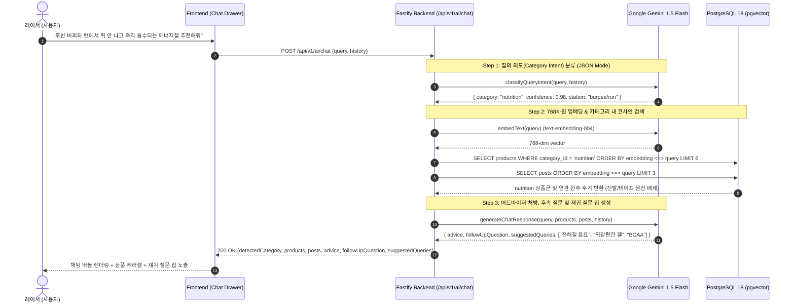

# FittersSweat AI 기어 코치: 대화형 챗 드로어, Gemini 인텐트 분류 & 세션 지속성 설계 명세서 (PRD & Design Spec)

> **문서 버전**: 2.0.0  
> **작성일**: 2026-09-15  
> **상태**: 사용자 QA 및 설계 확정 대기 (Draft)  
> **적용 스택**: Next.js 14 + Tailwind CSS + Framer Motion + Zustand (LocalStorage Persist) + Fastify 4 + Google Gemini (`gemini-1.5-flash` JSON Mode + `text-embedding-004`) + PostgreSQL 18 `pgvector`

---

## 1. 배경 및 해결하려는 문제 (Problem Statement)

### 1.1 현상의 원인: Dense Vector 유사도 검색의 '의미론적 표류(Semantic Drift)'
- **실제 사례**: 사용자가 `"후반 버피와 런에서 쥐 안 나고 즉각 흡수되는 카페인 전해질 에너지젤 추천해줘"`라고 질의했을 때, 핵심 타깃 제품군인 **뉴트리션(NUTRITION, 에너지젤)** 외에 문맥 키워드인 `"버피"`, `"런"`, `"쥐 안 나고"`(하체 피로)의 임베딩에 이끌려 **러닝화(Hoka Arahi)**와 **터프 테이프(장비)**가 100% 유사도로 잘못 매칭되는 문제 발생.
- **원인**: 사용자의 입력 문장에는 **'상황 맥락(버피, 런 스테이션)'**과 **'실제 구매 대상(에너지젤)'**이 공존하는데, 전 카탈로그(400개)를 대상으로 단일 코사인 유사도 검색만 수행하면 상황 키워드의 벡터 거리가 구매 대상을 희석시킴.

### 1.2 UX 구조의 한계: 단발성 결과 뷰 vs 연속적 대화 경험 부재
- 기존 `/recommend` 페이지는 1회 질의 후 결과를 카드 형태로 나열하는 단발성 페이지였음.
- 실전 레이스 준비는 "신발 ➔ 양말 ➔ 뉴트리션 ➔ 테이핑"처럼 **연속적이고 질문-답변이 꼬리를 무는 상담 과정**임.
- 사용자가 페이지를 이동하거나 새로고침하면 이전 추천 기록이 유실되는 불편함이 있음.

---

## 2. 제품 요구사항 및 비전 (Product Requirements)

마이프로틴의 `Fuel Coach` 대화형 AI 인터페이스를 벤치마킹하여, FittersSweat의 감성에 맞는 **'Fit Coach (HYROX AI 기어 코치)'** 시스템을 구축합니다.

```
┌─────────────────────────────────────────────────────────────────────────────┐
│                          FittersSweat Global Layout                          │
│                                                                             │
│  [Top Navbar]  대회일정   장비몰   커뮤니티   [⚡ AI 기어 코치]  장바구니    │
├───────────────────────┬─────────────────────────────────────────────────────┤
│  [토글식 슬라이드 드로어]   │  [메인 화면] (/products, /events, /community 등)     │
│  ┌─────────────────┐  │                                                     │
│  │ ⚡ Fit Coach  [✕]│  │   8만 원 이상 무료배송 | 100% 본사 직매입 정품 보증 │
│  ├─────────────────┤  │                                                     │
│  │ 🤖 어드바이저 답변│  │                                                     │
│  │ [상품 카드 캐러셀] │  │                                                     │
│  │                 │  │                                                     │
│  │ "후반부 빠른 회복을│  │                                                     │
│  │ 위한 전해질 음료도│  │                                                     │
│  │ 함께 보실까요?" │  │                                                     │
│  │                 │  │                                                     │
│  │ [재귀 질문 칩들] │  │                                                     │
│  │ [전해질 이온 음료]│  │                                                     │
│  │ [위장편한 젤]    │  │                                                     │
│  ├─────────────────┤  │                                                     │
│  │ [💬 질문 입력...] │  │                                  [⚡ AI 코치 FAB] │
│  └─────────────────┘  │                                     (모바일/데스크톱)│
└───────────────────────┴─────────────────────────────────────────────────────┘
```

### 2.1 핵심 4대 요구사항
1. **Gemini 1.5 Flash 기반 지능형 카테고리 의도(Category Intent) 분류**:
   - 하드코딩 정규식이 아닌 LLM이 질의의 진짜 구매 대상을 `nutrition | shoes | gear | equipment | all`로 200ms 내 분류.
   - 분류된 카테고리 내에서만 pgvector 코사인 검색을 수행하여 오매칭을 원천 차단.
2. **토글식 대화형 채팅 드로어 (Slide-over Chat Drawer)**:
   - 화면 좌측(또는 우측)에서 부드럽게 열리고 닫히는 반응형 토글 인터페이스.
   - 상단 네비바 버튼 및 전역 플로팅 액션 버튼(FAB)을 통해 어느 페이지에서든 즉시 오픈.
3. **새로고침 및 페이지 이동에도 유지되는 세션 지속성 (Session Persistence)**:
   - Zustand + `localStorage` 기반 대화 기록(`messages`) 및 열림 상태(`isOpen`) 영구 보존.
   - 장비몰을 둘러보며 추천받은 젤을 확인하고 장바구니에 담아도 대화 맥락이 끊기지 않음.
4. **맥락 기반 재귀 질문(Follow-up) 및 1탭 후속 질문 칩**:
   - AI 답변 말미에 레이서의 다음 행동을 유도하는 맞춤 질문 제시.
   - 3~4개의 재귀 추천 칩(`[단백질 보충제]`, `[전해질 이온음료]`, `[위장 트러블 방지 팁]` 등)을 원탭 클릭 시 즉시 후속 질의 전송.

---

## 3. 상세 아키텍처 및 파이프라인

### 3.1 백엔드 4단계 검색·추론 파이프라인



---

## 4. 백엔드 상세 변경 명세

### 4.1 신규 AI 챗 서비스 메서드 (`backend/src/services/gemini.service.ts`)

#### 1) `classifyQueryIntent(query: string, history?: ChatHistoryItem[]): Promise<CategoryClassification>`
- **모델**: `gemini-1.5-flash`
- **설정**: `responseMimeType: "application/json"`
- **시스템 지침**:
  ```
  당신은 HYROX 피트니스 이커머스 전문 질의 분류기입니다.
  사용자의 문장에서 맥락(훈련 스테이션, 통증)과 실제 구매하려는 목표 제품군을 정확히 분리하세요.
  
  카테고리 규격:
  - "shoes": 러닝화, 카본화, 접지화, 베어풋 슈즈 등 신발
  - "nutrition": 에너지젤, 아미노산, 단백질, 전해질, 마그네슘, 스포츠음료, 회복 보충제
  - "gear": 무릎 슬리브, 짐내스틱 그립, 리프팅 스트랩, 테이핑, 양말, 장갑 등 착용 기어
  - "equipment": 슬레드, 케틀벨, 월볼, 덤벨, 인조잔디 매트, 스키에르그 등 훈련 기구
  - "all": 풀세트 추천, 하이록스 입문 필수템, 종합 레이스 패키지 등 다중 카테고리 질의
  ```
- **Mock / Fallback**: API 장애나 키 미설정 시 정규식 키워드(젤/단백질 ➔ nutrition, 신발/러너 ➔ shoes 등)로 0ms 즉시 대체.

#### 2) `generateChatResponse(...)`: 재귀 질문 및 후속 칩 생성
- 반환 JSON 스키마:
  ```typescript
  interface ChatAdvisorResponse {
    advice: string;            // 마크다운 형식의 1:1 레이서 맞춤 처방
    followUpQuestion: string;  // 대화를 이끌어갈 레이서 맞춤형 후속 유도 질문
    suggestedQueries: string[]; // 클릭 시 다음 질문으로 전송될 3~4개의 재귀 추천 칩
  }
  ```

### 4.2 백엔드 API 엔드포인트 (`backend/src/routes/ai.ts`)

- **엔드포인트**: `POST /api/v1/ai/chat` (기존 `/recommend` 하위 호환 유지)
- **Request Body**:
  ```typescript
  interface ChatRequest {
    query: string;
    history?: Array<{
      role: 'user' | 'assistant';
      content: string;
    }>;
    categoryId?: string; // 사용자가 수동 선택한 경우 우선 적용
  }
  ```
- **Response Body**:
  ```typescript
  interface ChatResponse {
    success: boolean;
    detectedCategory: 'nutrition' | 'shoes' | 'gear' | 'equipment' | 'all';
    categoryReason: string;
    advice: string;
    followUpQuestion: string;
    suggestedQueries: string[];
    recommendedProducts: Array<{
      id: string;
      name: string;
      description: string;
      categoryId: string;
      price: number;
      stockQuantity: number;
      imageUrl: string;
      similarity: number;
      rerankScore: number;
      isSocialVerified: boolean;
    }>;
    verifiedReviews: Array<{
      id: string;
      title: string;
      content: string;
      userName: string;
      similarity: number;
    }>;
  }
  ```

---

## 5. 프론트엔드 UI/UX 상세 설계

### 5.1 컴포넌트 아키텍처

```
frontend/
├── stores/
│   └── useAiChatStore.ts      # [NEW] Zustand + persist (대화 히스토리, isOpen, 세션 관리)
├── components/
│   ├── ai/
│   │   ├── AiCoachDrawer.tsx  # [NEW] 토글식 좌/우 슬라이드 드로어 컨테이너 (Framer Motion)
│   │   ├── ChatMessageBubble.tsx # [NEW] 텍스트 + 상품 카드 캐러셀 + 후기 인용구 렌더러
│   │   ├── ProductMiniCarousel.tsx # [NEW] 드로어 내부 1:1 정사각 썸네일 & 1탭 장바구니 상품 카드
│   │   └── SuggestedQueryPills.tsx # [NEW] 재귀 질문 칩 리스트 (가로 스크롤 및 1탭 전송)
│   ├── AiCoachFab.tsx         # [NEW] 전역 우측 하단 플로팅 토글 버튼 (배지 포함)
│   └── Navbar.tsx             # [MODIFY] "AI 맞춤추천" 클릭 시 드로어 토글 열기 연동
└── app/
    └── recommend/page.tsx     # [MODIFY] 드로어가 열린 전용 뷰 제공 또는 드로어와의 심리스 연계
```

### 5.2 Zustand 영구 스토어 (`useAiChatStore.ts`)
- **저장소**: `localStorage` (`name: 'fittersweat-ai-coach-session'`)
- **상태 정의**:
  - `isOpen: boolean`: 드로어 노출 여부
  - `messages: ChatMessage[]`: 주고받은 전체 대화 내역 (시간, 역할, 텍스트, 추천 상품, 재귀 질문 칩 등)
  - `isLoading: boolean`: 답변 생성 중 로딩 상태
  - `actions`: `toggleOpen()`, `sendMessage(query)`, `clearSession()`, `feedbackMessage(id, type)`

### 5.3 Dark Athletic 디자인 시스템 준수 (`ui-ux-pro-max`)
- **배경 및 서피스**: 드로어 배경 `#141414`, 보더 `#262626`, 글래스모피즘 `backdrop-blur-md`
- **포인트 컬러**: 브랜드 시그니처 골드 `#FFD700`, 라임 `#CCFF00`, 텍스트 화이트 `#FFFFFF`
- **터치 타겟**: 재귀 질문 알약 칩, 장바구니 버튼, 닫기 버튼 모두 최소 **44x44px** 확보
- **키보드 접근성**: `Escape` 키 입력 시 드로어 닫기, `Enter` 키로 메시지 전송, 명확한 `focus-visible:ring-2`

---

## 6. E2E 테스트 및 검증 시나리오

1. **시나리오 1: 에너지젤 의도 분류 검증 (오매칭 차단)**
   - 입력: `"후반 버피와 런에서 쥐 안 나고 즉각 흡수되는 카페인 전해질 에너지젤 추천해줘"`
   - 검증:
     - `detectedCategory`가 `'nutrition'`으로 판별됨.
     - 응답된 `recommendedProducts` 3개 상품의 `categoryId`가 모두 `'nutrition'`임 (러닝화, 테이프 0건).
2. **시나리오 2: 재귀 질문(Follow-up) 인터랙션 검증**
   - 검증: 답변 하단에 `followUpQuestion` 텍스트와 3~4개의 `suggestedQueries` 알약 칩 노출.
   - 동작: 사용자가 `[전해질 이온 음료]` 칩 클릭 ➔ 입력창 입력 없이 즉시 다음 질문으로 전송 및 2차 맞춤 답변 수신.
3. **시나리오 3: 세션 지속성(Session Persistence) 검증**
   - 대화 진행 후 브라우저 새로고침(F5) ➔ 이전 대화 내역 및 스크롤 위치 유지.
   - 드로어를 연 상태에서 `/products` 또는 `/community`로 라우팅 ➔ 드로어 상태 및 대화 내역 온전히 유지.
   - [새 대화 시작] 버튼 클릭 시 대화 내역 초기화 및 안내 메시지 재출력.
4. **시나리오 4: 1탭 커머스 연동 검증**
   - 드로어 내 추천 상품 카드에서 [장바구니 담기] 클릭 ➔ 네비바 카운터 즉시 +1 반영 및 토스트 안내.

---

## 7. 설계 검토 및 사용자 QA 질의 (Clarification Questions)

구현을 시작하기 전, 최상의 사용자 경험을 위해 다음 3가지 결정 사항에 대한 의견을 확인하고자 합니다:

1. **드로어 UI 위치**:
   - **(권장) 좌측 슬라이드 드로어 (마이프로틴 스타일)**: 좌측에 고정되어 우측의 쇼핑몰/커뮤니티 상품을 둘러보며 대화하기 용이함.
   - **우측 슬라이드 드로어**: 일반적인 웹 챗봇 표준 위치.
2. **기존 `/recommend` 페이지와의 관계**:
   - **(권장) `/recommend` 방문 시 드로어가 활성화된 전용 모드로 렌더링**: 모바일/데스크톱 모두 일관된 챗 경험 제공.
   - **`/recommend`는 전체 화면 채팅 뷰로 유지하고, 드로어는 타 페이지(`/products`, `/events`)에서만 열림**.
3. **멀티턴 대화 시 카테고리 유지 정책**:
   - 사용자가 1차로 "에너지젤"을 물어본 뒤, 2차로 "카페인 없는 건?"이라고 짧게 물었을 때, 이전 맥락(`nutrition`)을 그대로 유지하여 카페인 없는 에너지젤을 검색하도록 히스토리를 유지할까요? (권장: **예, 이전 카테고리 맥락 계승**)
