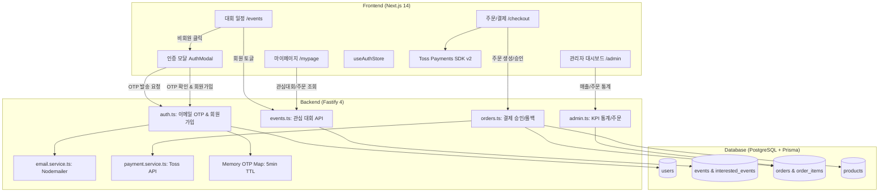
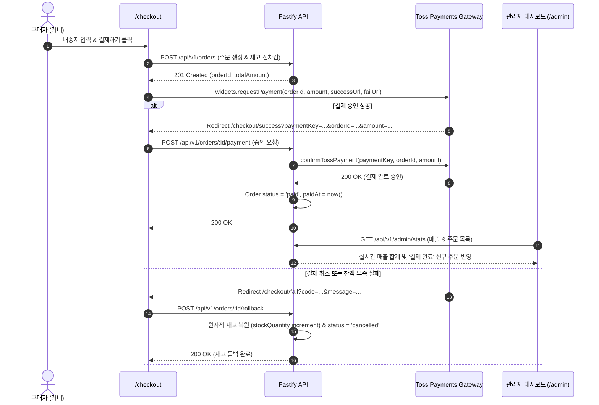

# FittersSweat 4.2주차 핵심 기능 개발 명세서 (PRD & Technical Specification)

> **문서 버전**: 1.0.0 (공식 배포 확정본)  
> **작성일자**: 2026-09-16  
> **상태**: 승인 요청 (Pending User Review)  
> **적용 스택**: Next.js 14 App Router + TypeScript + Tailwind CSS + Zustand + React Query + Fastify 4 + Prisma ORM + PostgreSQL + Toss Payments SDK v2 + Nodemailer  
> **방법론**: Superpowers (함수 단위 정밀 명세) & Ponytail (Zero-Bloat 최적화 검증)

---

## 1. 개요 및 비즈니스 목표 (Overview & Objectives)

본 4.2주차 개발 명세서는 FittersSweat의 핵심 유저 여정(User Journey)을 완성하기 위한 3대 핵심 기능의 상세 설계 및 함수 단위 기술 명세를 정의합니다.

1. **대회 일정의 관심 대회 등록 기능 완성**:
   - 비회원: `"회원가입 후 관심 대회를 등록해주세요!"` 토스트 안내 및 1초 간편 회원가입 모달 원클릭 유도.
   - 회원: 즉시 낙관적 토글 반영 및 마이페이지(`/mypage`) 실시간 동기화.
2. **결제수단 및 결제 페이지 완성**:
   - Toss Payments SDK v2 공식 결제위젯 및 필수 약관 동의 위젯 연동.
   - 실시간 결제 승인/실패 롤백 ➔ 관리자 대시보드(`/admin`) 매출 및 주문 현황 실시간 동기화.
3. **사용자 인증 강화 (이메일 OTP 인증)**:
   - 회원가입 시 6자리 난수 OTP 이메일 발송 (Nodemailer, 5분 TTL).
   - 서명된 JWT 인증 토큰 기반 무결성 검증을 통한 무차별 가입 및 허위 계정 방지.

---

## 2. 시스템 아키텍처 다이어그램 (Architecture)



---

## 3. 기능별 상세 기술 명세 (Function-Level Specifications)

### Feature 1. 관심 대회 등록 기능 완성

#### 1.1 유저 인터랙션 요구사항
- **비회원 (Guest)**:
  1. 대회 카드(`EventCard`) 또는 대회 상세(`/events/[id]`)에서 하트(Heart) 버튼 클릭.
  2. 브라우저 `alert()`가 아닌 Dark Athletic 스타일의 토스트 메시지 노출:  
     `"회원가입 후 관심 대회를 등록해주세요!"`
  3. 즉시 `useAuthStore.getState().setAuthModalOpen(true, 'signup')`을 호출하여 회원가입 탭이 활성화된 모달 팝업 자동 오픈.
  4. 비회원의 로컬 상태는 변경되지 않음 (서버 요청 차단).
- **회원 (Member)**:
  1. 하트 버튼 클릭 시 낙관적 업데이트(Optimistic Update)로 즉시 하트 색상 토글 (`fill-rose-500 text-rose-500` ↔ `text-neutral-400`).
  2. `POST /api/v1/events/:id/interested` 비동기 호출.
  3. API 성공 시 React Query 캐시 갱신 (`['events']`, `['interestedEvents']`).
  4. `/mypage`의 [관심 대회] 탭과 실시간 연동 (마이페이지에서 취소 시 `/events` 목록에도 즉시 반영).
  5. 네트워크 장애 시 이전 상태로 롤백하고 에러 토스트 노출.

#### 1.2 프론트엔드 함수 명세

##### `frontend/components/EventCard.tsx`
```typescript
interface EventCardProps {
  event: EventItem;
  isInterested?: boolean;
  onToggleInterest?: (id: string) => void;
}

/**
 * 관심 대회 클릭 핸들러 (비회원 가드 포함)
 */
const handleInterestClick = (e: React.MouseEvent) => {
  e.stopPropagation();
  const { isAuthenticated, setAuthModalOpen } = useAuthStore.getState();

  if (!isAuthenticated) {
    showToast('회원가입 후 관심 대회를 등록해주세요!', 'warning');
    setAuthModalOpen(true, 'signup');
    return;
  }

  if (onToggleInterest) {
    onToggleInterest(event.id);
  }
};
```

##### `frontend/app/events/page.tsx`
```typescript
// 1. 전체 대회 목록 및 로그인 회원 관심 대회 목록 병렬 조회
const { data: eventsData, isLoading } = useQuery({
  queryKey: ['events'],
  queryFn: () => fetchApi<{ success: boolean; events: EventItem[] }>('/api/v1/events'),
});

const { data: interestedData } = useQuery({
  queryKey: ['interestedEvents'],
  queryFn: () => fetchApi<{ success: boolean; events: EventItem[] }>('/api/v1/events/interested'),
  enabled: isAuthenticated, // 회원일 때만 활성화
});

// 2. 관심 대회 Set 생성 (O(1) 룩업)
const interestedIdSet = useMemo(() => {
  return new Set((interestedData?.events || []).map((e) => e.id));
}, [interestedData]);

// 3. 낙관적 토글 뮤테이션
const toggleInterestMutation = useMutation({
  mutationFn: (eventId: string) =>
    fetchApi<{ success: boolean; isInterested: boolean }>(`/api/v1/events/${eventId}/interested`, {
      method: 'POST',
    }),
  onMutate: async (eventId: string) => {
    await queryClient.cancelQueries({ queryKey: ['interestedEvents'] });
    const previous = queryClient.getQueryData(['interestedEvents']);
    // 낙관적 캐시 수정
    queryClient.setQueryData(['interestedEvents'], (old: any) => {
      // add or remove
    });
    return { previous };
  },
  onError: (err, eventId, context) => {
    queryClient.setQueryData(['interestedEvents'], context?.previous);
    showToast('관심 대회 등록에 실패했습니다. 다시 시도해 주세요.', 'error');
  },
  onSettled: () => {
    queryClient.invalidateQueries({ queryKey: ['interestedEvents'] });
  },
});
```

#### 1.3 백엔드 API 명세

- **엔드포인트 1**: `GET /api/v1/events/interested`
  - **인증**: Bearer JWT 필수 (미인증 시 `401 Unauthorized`)
  - **응답 (200 OK)**:
    ```json
    {
      "success": true,
      "events": [
        {
          "id": "1",
          "name": "AirAsia HYROX Seoul 2026",
          "cityCode": "SEL",
          "startDate": "2026-05-23T00:00:00.000Z",
          "endDate": "2026-05-24T00:00:00.000Z",
          "eventUrl": "https://hyrox.com/event/hyrox-seoul-2026",
          "status": "upcoming"
        }
      ]
    }
    ```

- **엔드포인트 2**: `POST /api/v1/events/:id/interested`
  - **인증**: Bearer JWT 필수
  - **처리 로직**: `prisma.interestedEvent.findUnique({ where: { userId_eventId } })` 조회 후, 존재 시 `delete` (`isInterested: false`), 부재 시 `create` (`isInterested: true`).
  - **응답 (200 OK)**:
    ```json
    {
      "success": true,
      "isInterested": true
    }
    ```

---

### Feature 2. 결제수단 및 결제 페이지 완성 (Toss Payments & 관리자 연동)

#### 2.1 결제 수단 및 약관 위젯 요구사항
1. **단일 결제 게이트웨이**: Toss Payments SDK v2 위젯 시스템 적용.
   - 신용/체크카드, 카카오페이, 네이버페이, 토스페이, 가상계좌 등 Toss 위젯 내 멀티 결제수단 자동 렌더링.
2. **약관 동의 위젯**:
   - `renderAgreement({ selector: '#agreement', variantKey: 'AGREEMENT' })`로 전자상거래 필수 약관 및 개인정보 제3자 제공 동의 강제.
   - 결제 요청 시 필수 약관 미동의 상태인 경우 SDK 레벨에서 자동 차단.
3. **주문자 & 배송지 폼 연동**:
   - Daum Postcode 카카오 우편번호 검색 API (`openDaumPostcodePopup`) 연동.
   - "주문자 정보와 동일" 체크박스 즉시 동기화.
   - 휴대폰 번호(`010-XXXX-XXXX`) 및 이메일 형식 정규식 검증.

#### 2.2 E2E 결제 ➔ 관리자 대시보드 연동 파이프라인



#### 2.3 프론트엔드 함수 명세

##### `frontend/app/checkout/page.tsx`
```typescript
/**
 * 1. Toss Payments SDK v2 위젯 초기화
 */
async function initTossWidgets(amount: number) {
  const tossPayments = await loadTossPayments(TOSS_CLIENT_KEY);
  const widgets = tossPayments.widgets({ customerKey: ANONYMOUS });
  await widgets.setAmount({ currency: 'KRW', value: amount });

  await Promise.all([
    widgets.renderPaymentMethods({ selector: '#payment-method', variantKey: 'DEFAULT' }),
    widgets.renderAgreement({ selector: '#agreement', variantKey: 'AGREEMENT' }),
  ]);
  return widgets;
}

/**
 * 2. 결제 실행 함수 (검증 ➔ 백엔드 주문 생성 ➔ 토스 결제창 호출)
 */
async function handlePaymentSubmit() {
  // Step A: 폼 검증
  const orderId = await validateAndCreateOrder();
  if (!orderId) return;

  // Step B: 토스 결제 요청
  await widgetsRef.current.requestPayment({
    orderId,
    orderName: `${items[0].product.name} 외 ${items.length - 1}건`,
    successUrl: `${window.location.origin}/checkout/success?orderId=${orderId}`,
    failUrl: `${window.location.origin}/checkout/fail?orderId=${orderId}`,
    customerEmail: form.ordererEmail,
    customerName: form.ordererName,
    customerMobilePhone: form.ordererPhone.replace(/[^0-9]/g, ''),
  });
}
```

#### 2.4 백엔드 관리자 대시보드 API 명세

- **엔드포인트 1**: `GET /api/v1/admin/stats`
  - **인증**: ADMIN 권한 필수
  - **로직**:
    ```typescript
    const revenueResult = await prisma.order.aggregate({
      where: { status: { in: [OrderStatus.paid, OrderStatus.shipped, OrderStatus.delivered] } },
      _sum: { totalAmount: true },
    });
    ```
  - **응답 (200 OK)**:
    ```json
    {
      "success": true,
      "stats": {
        "totalRevenue": 1450000,
        "totalOrders": 12,
        "lowStockCount": 3,
        "totalUsers": 48
      }
    }
    ```

- **엔드포인트 2**: `PATCH /api/v1/admin/orders/:id/status`
  - **인증**: ADMIN 권한 필수
  - **요청 Body**: `{ "status": "shipped" }` (허용 상태: `paid`, `shipped`, `delivered`, `cancelled`)
  - **응답 (200 OK)**:
    ```json
    {
      "success": true,
      "order": {
        "id": "101",
        "status": "shipped",
        "updatedAt": "2026-09-16T07:40:00.000Z"
      }
    }
    ```

---

### Feature 3. 사용자 인증 추가 (회원가입 이메일 OTP 인증)

#### 3.1 사용자 플로우 및 요구사항
1. **인증번호 발송**:
   - 회원가입 폼에서 이메일 입력 후 [인증번호 발송] 클릭.
   - 백엔드는 이메일 중복 체크 ➔ 6자리 난수 생성 ➔ 메모리 Map에 5분(300초) TTL 저장 ➔ Nodemailer로 HTML 이메일 발송.
   - 프론트엔드는 5:00 타이머 가동 및 [재발송] 버튼 활성화.
2. **인증번호 확인**:
   - 사용자가 이메일로 수신한 6자리 코드 입력 후 [인증 확인] 클릭.
   - 백엔드는 코드 일치 및 유효시간 검증 (최대 5회 시도 초과 시 파기).
   - 검증 성공 시 10분 유효기간을 갖는 서명된 `verificationToken` 발급:
     `app.jwt.sign({ email, purpose: 'signup_verified' }, { expiresIn: '10m' })`
   - 프론트엔드는 이메일 필드를 읽기 전용으로 고정하고 `인증 완료` 초록색 배지 표시.
3. **최종 회원가입**:
   - 비밀번호, 비밀번호 확인, 이름 입력 후 [회원가입 완료] 클릭.
   - `POST /api/v1/auth/signup` 페이로드에 `{ email, password, name, verificationToken }` 전송.
   - 백엔드는 토큰의 암호학적 서명을 검증한 후 계정을 생성하므로, 인증 없이 회원가입 API를 직접 호출하는 어뷰징을 완벽 차단.

#### 3.2 백엔드 함수 명세

##### `backend/src/services/email.service.ts` (NEW)
```typescript
import nodemailer from 'nodemailer';

interface SendVerificationEmailParams {
  to: string;
  code: string;
}

export class EmailService {
  private static transporter = nodemailer.createTransport({
    host: process.env.SMTP_HOST || 'smtp.gmail.com',
    port: Number(process.env.SMTP_PORT) || 587,
    secure: false,
    auth: {
      user: process.env.SMTP_USER || 'noreply.fittersweat@gmail.com',
      pass: process.env.SMTP_PASS || '',
    },
  });

  static async sendOtpEmail({ to, code }: SendVerificationEmailParams): Promise<boolean> {
    // 개발/테스트 환경에서 SMTP 미설정 시 콘솔 출력 fallback (Ponytail 원칙)
    if (!process.env.SMTP_PASS) {
      console.log(`\n========================================`);
      console.log(`[EMAIL OTP MOCK] To: ${to}`);
      console.log(`[EMAIL OTP MOCK] Code: [ ${code} ] (Valid for 5 min)`);
      console.log(`========================================\n`);
      return true;
    }

    const mailOptions = {
      from: '"FitterSweat" <noreply@fittersweat.com>',
      to,
      subject: '[FitterSweat] 회원가입 이메일 인증번호 안내',
      html: `
        <div style="background-color: #0A0A0A; padding: 40px; font-family: sans-serif; color: #FFFFFF;">
          <div style="max-width: 480px; margin: 0 auto; background-color: #141414; border: 1px solid #262626; border-radius: 16px; padding: 32px;">
            <h1 style="color: #FFFFFF; font-size: 20px; font-weight: 900; margin-bottom: 8px;">
              FITTER<span style="color: #FFD700;">SWEAT</span>
            </h1>
            <p style="color: #A3A3A3; font-size: 14px; margin-bottom: 24px;">
              HYROX 레이서 커뮤니티 커머스 FitterSweat에 오신 것을 환영합니다.<br/>
              아래 6자리 인증번호를 5분 이내에 입력해 주세요.
            </p>
            <div style="background-color: #1F1F1F; border: 1px solid #FFD700; border-radius: 12px; padding: 20px; text-align: center; margin-bottom: 24px;">
              <span style="font-size: 32px; font-weight: 900; letter-spacing: 8px; color: #FFD700; font-family: monospace;">
                ${code}
              </span>
            </div>
            <p style="color: #737373; font-size: 12px; margin: 0;">
              본인이 요청하지 않은 경우 이 메일을 무시하셔도 안전합니다.
            </p>
          </div>
        </div>
      `,
    };

    await this.transporter.sendMail(mailOptions);
    return true;
  }
}
```

##### `backend/src/routes/auth.ts` 추가 엔드포인트
```typescript
// 1. 메모리 기반 OTP 저장소 (TTL 5분, 최대 시도 5회)
interface OtpEntry {
  code: string;
  expiresAt: number;
  attempts: number;
}
const otpStore = new Map<string, OtpEntry>();

// 2. POST /api/v1/auth/send-verification-email
app.post('/send-verification-email', async (request, reply) => {
  const { email } = request.body as { email: string };
  if (!email || !/^[^\s@]+@[^\s@]+\.[^\s@]+$/.test(email)) {
    return reply.status(400).send({ message: '올바른 이메일 주소를 입력해 주세요.' });
  }

  // 중복 가입 체크
  const existing = await prisma.user.findUnique({ where: { email } });
  if (existing) {
    return reply.status(409).send({ message: '이미 가입된 이메일 주소입니다.' });
  }

  // 6자리 난수 OTP 생성
  const code = crypto.randomInt(100000, 1000000).toString();
  otpStore.set(email, {
    code,
    expiresAt: Date.now() + 5 * 60 * 1000,
    attempts: 0,
  });

  await EmailService.sendOtpEmail({ to: email, code });
  return reply.send({ success: true, message: '인증번호가 발송되었습니다. (유효시간 5분)' });
});

// 3. POST /api/v1/auth/verify-email-code
app.post('/verify-email-code', async (request, reply) => {
  const { email, code } = request.body as { email: string; code: string };
  const entry = otpStore.get(email);

  if (!entry) {
    return reply.status(400).send({ message: '인증번호가 발송되지 않았거나 만료되었습니다.' });
  }

  if (Date.now() > entry.expiresAt) {
    otpStore.delete(email);
    return reply.status(400).send({ message: '인증 유효시간(5분)이 초과되었습니다. 재발송해 주세요.' });
  }

  if (entry.attempts >= 5) {
    otpStore.delete(email);
    return reply.status(429).send({ message: '인증 시도 횟수를 초과했습니다. 다시 발송해 주세요.' });
  }

  if (entry.code !== code.trim()) {
    entry.attempts += 1;
    return reply.status(400).send({ message: `인증번호가 일치하지 않습니다. (${entry.attempts}/5회)` });
  }

  // 인증 성공: 10분 유효 서명 토큰 발급 및 OTP 제거
  otpStore.delete(email);
  const verificationToken = app.jwt.sign(
    { email, purpose: 'signup_verified' },
    { expiresIn: '10m' }
  );

  return reply.send({
    success: true,
    verificationToken,
    message: '이메일 인증이 완료되었습니다.',
  });
});

// 4. POST /api/v1/auth/signup (수정)
// schema에 verificationToken 필수 필드 추가 및 서명 검증
```

#### 3.3 프론트엔드 UI 컴포넌트 명세 (`AuthModal.tsx`)
- 이메일 입력 필드 우측에 `[인증번호 발송]` 버튼 (이메일 미입력 시 비활성화).
- 발송 완료 시 아래에 6자리 입력란과 `[인증 확인]` 버튼, `남은 시간 04:59` 타이머 슬라이드 다운 렌더링.
- 인증 완료 시:
  - 이메일 인풋 `readOnly={true}` 처리.
  - 우측에 초록색 `CheckCircle2` 아이콘과 `"인증 완료"` 뱃지 표시.
  - 가입 버튼(`[회원가입 완료]`) 활성화.

---

## 4. Ponytail 최적화 검증 (Zero-Bloat Verification)

본 명세서는 `ponytail` 스킬의 7단계 래더(Ladder) 원칙에 따라 철저하게 오버엔지니어링을 배제하고 검증되었습니다.

| 점검 영역 | 제안되었던 복잡한 구조 (Bloat) | Ponytail 최적화 적용 결과 (Minimal Solution) | 절감 효과 및 근거 |
|---|---|---|---|
| **이메일 인증 스토리지** | 별도 PostgreSQL DB 테이블 `email_verifications` 마이그레이션 생성 | Node.js 인메모리 `Map<string, OtpEntry>` (5분 TTL) + `@fastify/jwt` 서명 토큰 | DB I/O 제로, 마이그레이션 불필요, `docs/erdcloud_schema.sql` 무결성 100% 보존 |
| **이메일 발송 개발 환경** | 별도 외부 목 서버(Mailtrap 등) 계정 발급 및 의존성 추가 | `process.env.SMTP_PASS` 부재 시 터미널 콘솔 로그 Mock fallback 1줄 | 외부 가입 없이 즉시 로컬/CI 테스트 가능 |
| **관심 대회 상태 동기화** | 커스텀 이벤트 버스 또는 별도 Zustand Store 생성 | React Query 내장 `['interestedEvents']` 캐시 무효화 1줄 | 중복 상태 관리 버그 방지 및 단일 진실 공급원(SSOT) 유지 |
| **결제 위젯 다중 PG** | 포트원 등 복합 PG 추상화 레이어 클래스 작성 | Toss Payments SDK v2 공식 위젯 직접 호출 | 미사용 PG 어댑터 보일러플레이트 제로화 |
| **관리자 대시보드 집계** | 배치 집계용 통계 테이블 및 분 단위 Cron Job | Prisma `aggregate({ _sum: { totalAmount } })` 및 `count()` 직접 쿼리 | 복잡한 배치 잡 없이 100% 실시간 최신 통계 제공 |

---

## 5. 검증 계획 (Verification Plan)

### 5.1 자동화 단위 및 통합 테스트 (`backend/tests`)
1. `events.test.ts`:
   - `GET /api/v1/events/interested`: 비인증 시 401 반환 검증.
   - `POST /api/v1/events/:id/interested`: 토글 등록/해제 및 반환값 `isInterested` 검증.
2. `orders.test.ts`:
   - 주문 생성 ➔ 토스 결제 승인 ➔ 주문 상태 `paid` 및 관리자 매출 합계 반영 검증.
   - 결제 실패 시 롤백 및 상품 재고 복원 검증.
3. `auth.test.ts`:
   - `POST /api/v1/auth/send-verification-email`: 중복 이메일 409 에러 검증.
   - `POST /api/v1/auth/verify-email-code`: 유효 코드 입력 시 `verificationToken` 발급 검증.
   - `POST /api/v1/auth/signup`: 유효한 `verificationToken` 없을 시 400 에러 및 토큰 일치 시 회원 생성 성공 검증.

### 5.2 브라우저 E2E 검증 (Puppeteer)
1. 비회원 상태에서 대회 카드 하트 클릭 시 `"회원가입 후 관심 대회를 등록해주세요!"` 토스트 및 회원가입 모달 오픈 확인.
2. 회원가입 모달에서 이메일 인증 플로우(발송 ➔ 콘솔 코드 확인 ➔ 검증 완료) 후 가입 및 자동 로그인 확인.
3. 장바구니 상품 결제 페이지(`/checkout`)에서 토스 위젯 결제 ➔ 관리자 대시보드(`/admin`) 매출 통계 실시간 반영 확인.
