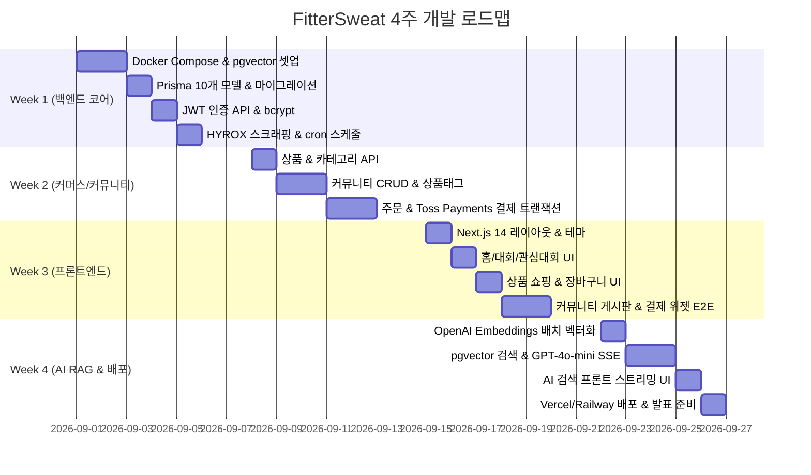

# FitterSweat - 풀스택 1인 개발자 4주 압축 구현 전략

**프로젝트명**: FitterSweat (HYROX 커뮤니티 & 커머스 플랫폼)  
**과제 구분**: 2026학년도 컴퓨터공학과 졸업작품  
**문서 기준**: `HYROX_국내_커뮤니티_커머스_프로젝트_계획서_최종.docx`  
**개발 환경**: 풀스택 1인 개발 (주당 40시간 × 4주 = 총 160시간)  

---

## 🧭 1. 풀스택 1인 개발자 시간 배분 및 전략

### 1.1 4주 압축 타임라인 원칙
- **1인 풀스택 160시간 전략**:
  - 주당 40시간(8시간 × 5일) 집중 투자.
  - **1~3주차**: 인증, DB, 스크래핑, 커뮤니티, 직매입 커머스, 결제 등 **핵심 기본 기능을 완벽히 구현하여 동작 가능한 MVP를 조기 확보**.
  - **4주차**: **풀 RAG AI 검색 엔진(pgvector + GPT-4o-mini + SSE 스트리밍)**을 집중 구현하고 프로덕션 배포 및 최종 발표 자료 준비 완료.
- **개발 복잡도 최소화**:
  - 입점몰 정산 및 다자간 승인 시스템을 전면 배제하고 '직접 매입(사입) 모델' 채택.
  - 판매자 역할 없이 `User`와 `Admin` 2단계 역할로 비즈니스 로직 단순화.

---

## 📅 2. 4주 주간 상세 실행 계획 (총 160시간)



### Week 1: 환경 구성 + 핵심 백엔드 (40시간)
- **월-화 (16시간)**:
  - GitHub 저장소 생성 및 CI/CD 워크플로우 기본 셋업
  - Fastify 4 + TypeScript 5 보일러플레이트 구축
  - Docker Compose로 PostgreSQL 14 + `pgvector` 컨테이너 구동
  - Prisma 5 설정 및 10개 핵심 테이블 모델링
- **수-목 (16시간)**:
  - 회원가입/로그인 API (JWT Access/Refresh 발급, bcryptjs 12 rounds)
  - 인증 미들웨어 및 권한 검증 (일반 사용자 / 관리자)
  - Jest 기반 인증 단위 테스트 작성
- **금 (8시간)**:
  - Cheerio 1.0 + axios 기반 HYROX 공식 레이스 찾기 스크래핑 모듈(`scraper.ts`) 구현
  - node-cron 매일 자정 스케줄러 등록 및 DB Upsert(복합 유니크 키) 검증
- **✅ Week 1 마일스톤**:
  - 인증 API 정상 동작 및 pgvector 확장 확인, 대회 정보 자동 수집 완료.

### Week 2: 커머스 + 커뮤니티 백엔드 (40시간)
- **월-화 (16시간)**:
  - 직접 매입 상품 조회 API (목록, 카테고리 필터, 상세, 검색)
  - 커뮤니티 게시글 CRUD API 및 댓글 API
  - 게시글-상품 N:M 태그 연결 (`PostProductTags`)
- **수-목 (16시간)**:
  - 주문 생성 API (단일 PostgreSQL 트랜잭션으로 재고 선검증)
  - Toss Payments 연동 및 결제 승인 API (`/api/v1/orders/:id/payment`)
  - 결제 성공 시 재고 차감 및 주문 상태 갱신, 실패 시 자동 롤백 처리
- **금 (8시간)**:
  - Toss Sandbox 환경 테스트 (테스트 카드: `4111-1111-1111-1111`) E2E 검증
  - `@fastify/swagger` + `@fastify/swagger-ui` 연동으로 Swagger 문서 자동 생성 (`/docs`)
- **✅ Week 2 마일스톤**:
  - 핵심 백엔드 REST API 완성 및 Toss Payments Sandbox 결제 승인 통과.

### Week 3: Frontend 전체 구현 (40시간)
- **월-화 (16시간)**:
  - Next.js 14 (App Router) + Tailwind CSS + shadcn/ui 초기화
  - 공통 레이아웃 (헤더, 푸터, 네비게이션) 및 반응형 레이아웃 설계
  - 홈페이지, 대회 목록 및 상세 페이지, 관심 대회 토글 기능 구현
- **수-목 (16시간)**:
  - 상품 목록 및 상품 상세 페이지 (실구매자 리뷰 컴포넌트 포함)
  - Zustand 기반 장바구니 전역 상태 관리
  - 주문서 작성 페이지 및 `@toss/payment-sdk` 결제 위젯 연동
- **금 (8시간)**:
  - 커뮤니티 게시글 목록, 상세, 작성(상품 태그 선택 모달) 구현
  - 마이페이지 (내 주문 이력, 관심 대회 목록)
  - 프론트엔드-백엔드 TanStack Query 캐싱 연동 및 결제 E2E 테스트
- **✅ Week 3 마일스톤**:
  - 전체 사용자 UI 연동 완료 및 쇼핑-결제 E2E 동작 확인.

### Week 4: 풀 RAG AI 검색 + 프로덕션 배포 + 발표 준비 (40시간)
- **월-화 (16시간)**:
  - OpenAI Embeddings API(`text-embedding-3-small`) 연동
  - 기존 상품 및 커뮤니티 게시글 텍스트 일괄 벡터화 배치 스크립트 작성 및 pgvector 저장
  - `/api/v1/ai/search` 백엔드 엔드포인트 구현:
    1. 사용자 쿼리 임베딩
    2. pgvector 코사인 유사도 검색 (상위 K개 컨텍스트 추출)
    3. GPT-4o-mini 프롬프트 생성
    4. Fastify SSE 스트리밍 응답
- **수 (10시간)**:
  - 프론트엔드 AI 검색 UI 구현:
    - 자연어 검색 인터페이스
    - SSE 토큰 실시간 스트리밍 답변 렌더링
    - 추천 상품 카드 및 출처 커뮤니티 게시글 링크 바인딩
  - 신규 상품/게시글 등록 시 자동 임베딩 파이프라인 적용
- **목 (8시간)**:
  - Vercel (Frontend) + Railway (Backend + PostgreSQL pgvector) 프로덕션 배포
  - 환경변수 주입 및 Sentry 에러 추적 연동
  - 프로덕션 환경 결제 및 AI 검색 Smoke Test
- **금 (6시간)**:
  - 최종 버그 픽스 및 성능 최적화 (Lighthouse 검사)
  - 최종 발표 슬라이드 및 시연 시나리오 준비
- **✅ Week 4 마일스톤**:
  - AI RAG 검색 스트리밍 정상 동작, 실서버 배포 완료, 졸업작품 발표 준비 완료.

---

## 🤖 3. 1인 개발자를 위한 RAG 구현 핵심 코드 가이드

### 3.1 Fastify SSE 스트리밍 엔드포인트 (`backend/src/routes/ai.ts`)
```typescript
import { FastifyInstance } from 'fastify';
import OpenAI from 'openai';
import { PrismaClient } from '@prisma/client';

const prisma = new PrismaClient();
const openai = new OpenAI({ apiKey: process.env.OPENAI_API_KEY });

export async function aiRoutes(app: FastifyInstance) {
  app.post('/api/v1/ai/search', async (request, reply) => {
    const { query } = request.body as { query: string };

    // 1. 쿼리 임베딩 생성 (1536차원)
    const embeddingResponse = await openai.embeddings.create({
      model: 'text-embedding-3-small',
      input: query,
    });
    const queryVector = embeddingResponse.data[0].embedding;

    // 2. pgvector 유사도 검색 (상위 3개 상품 + 3개 커뮤니티 후기)
    const vectorString = `[${queryVector.join(',')}]`;
    const relevantProducts: any[] = await prisma.$queryRaw`
      SELECT id, name, price, description,
             1 - (embedding <=> ${vectorString}::vector) AS similarity
      FROM products
      ORDER BY similarity DESC LIMIT 3;
    `;

    const relevantPosts: any[] = await prisma.$queryRaw`
      SELECT id, title, content,
             1 - (embedding <=> ${vectorString}::vector) AS similarity
      FROM posts
      ORDER BY similarity DESC LIMIT 3;
    `;

    // 3. 컨텍스트 구성
    const contextText = `
[추천 가능 상품 목록]
${relevantProducts.map(p => `- ${p.name} (${p.price}원): ${p.description}`).join('\n')}

[선배 참가자들의 실제 커뮤니티 후기]
${relevantPosts.map(p => `- ${p.title}: ${p.content}`).join('\n')}
    `.trim();

    // 4. SSE 헤더 설정
    reply.raw.writeHead(200, {
      'Content-Type': 'text/event-stream',
      'Cache-Control': 'no-cache',
      'Connection': 'keep-alive',
      'Access-Control-Allow-Origin': process.env.FRONTEND_URL || '*',
    });

    // 5. GPT-4o-mini 스트리밍 응답
    const stream = await openai.chat.completions.create({
      model: 'gpt-4o-mini',
      stream: true,
      messages: [
        {
          role: 'system',
          content: '당신은 HYROX 피트니스 대회 전문 어드바이저 FitterSweat AI입니다. 제공된 참가자 후기와 상품 정보를 기반으로 친절하고 실용적인 맞춤 추천을 작성하세요.'
        },
        {
          role: 'user',
          content: `질문: "${query}"\n\n참고 컨텍스트:\n${contextText}`
        }
      ],
    });

    for await (const chunk of stream) {
      const content = chunk.choices[0]?.delta?.content || '';
      if (content) {
        reply.raw.write(`data: ${JSON.stringify({ text: content })}\n\n`);
      }
    }

    // 메타데이터(추천 상품 목록) 전송 후 종료
    reply.raw.write(`data: ${JSON.stringify({ products: relevantProducts })}\n\n`);
    reply.raw.write('data: [DONE]\n\n');
    reply.raw.end();
  });
}
```

---

## 📦 4. 최종 패키지 의존성 명세 (경량화 최적화)

### Backend (`backend/package.json`)
```json
{
  "name": "fittersweat-backend",
  "version": "1.0.0",
  "dependencies": {
    "fastify": "^4.24.3",
    "@fastify/cors": "^8.4.0",
    "@fastify/jwt": "^7.0.0",
    "@fastify/rate-limit": "^9.0.1",
    "@fastify/swagger": "^8.12.0",
    "@fastify/swagger-ui": "^1.10.1",
    "@prisma/client": "^5.5.2",
    "prisma": "^5.5.2",
    "openai": "^4.20.0",
    "node-cron": "^3.0.3",
    "axios": "^1.5.1",
    "cheerio": "^1.0.0-rc.12",
    "bcryptjs": "^2.4.3",
    "zod": "^3.22.4",
    "pino": "^8.16.1",
    "pino-pretty": "^10.2.3",
    "nodemailer": "^6.9.7",
    "dotenv": "^16.3.1"
  },
  "devDependencies": {
    "@types/node": "^20.8.9",
    "@types/bcryptjs": "^2.4.6",
    "@types/node-cron": "^3.0.10",
    "@types/nodemailer": "^6.4.14",
    "typescript": "^5.2.2",
    "tsx": "^4.0.0",
    "jest": "^29.7.0",
    "ts-jest": "^29.1.1",
    "@types/jest": "^29.5.6"
  }
}
```

### Frontend (`frontend/package.json`)
```json
{
  "name": "fittersweat-frontend",
  "version": "1.0.0",
  "dependencies": {
    "next": "^14.0.0",
    "react": "^18.2.0",
    "react-dom": "^18.2.0",
    "@tanstack/react-query": "^5.0.5",
    "zustand": "^4.4.4",
    "tailwindcss": "^3.3.5",
    "shadcn/ui": "^0.8.0",
    "react-hook-form": "^7.47.0",
    "zod": "^3.22.4",
    "@toss/payment-sdk": "^0.0.1",
    "axios": "^1.5.1",
    "date-fns": "^2.30.0",
    "lucide-react": "^0.288.0"
  },
  "devDependencies": {
    "@types/react": "^18.2.31",
    "@types/node": "^20.8.9",
    "typescript": "^5.2.2",
    "eslint": "^8.52.0",
    "eslint-config-next": "^14.0.0"
  }
}
```

---

## 🎯 5. 1인 풀스택 성공 핵심 팁

1. **Prisma Raw Query 마스터**:
   - 일반 CRUD는 Prisma 타입 안전 API를 사용하고, pgvector의 코사인 유사도 검색(`<=>`)만 `prisma.$queryRaw`로 분리하여 복잡도를 낮춥니다.
2. **Mock 결제와 Toss Sandbox 분리**:
   - 결제 플로우 개발 초기에는 Mock API로 빠르게 UI를 연동하고, 2주차 후반에 Toss Sandbox 키를 적용하여 실결제 인증 플로우를 완성합니다.
3. **AI 대기시간 최소화**:
   - GPT-4o-mini 스트리밍 응답(SSE)을 필수 적용하여 사용자가 첫 토큰을 받는 데 0.5초 이상 지연되지 않도록 체감 성능을 극대화합니다.

---

**기준 원본 문서**: `HYROX_국내_커뮤니티_커머스_프로젝트_계획서_최종.docx`  
**정합성 상태**: 최종 계획서 기준 100% 동기화 완료
