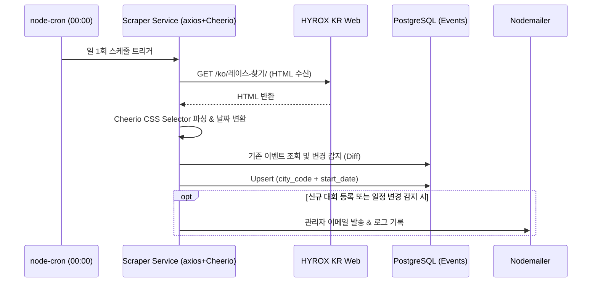

# FitterSweat 플랫폼 - 기술 분석 및 아키텍처 상세 설계서

**프로젝트명**: FitterSweat (국내 HYROX 커뮤니티 커머스 플랫폼)  
**과제 구분**: 2026학년도 컴퓨터공학과 졸업작품  
**문서 기준**: `HYROX_국내_커뮤니티_커머스_프로젝트_계획서_최종.docx` (최종 계획서 정본 100% 일치)  
**작성일**: 2026년 9월 1일 (최종 갱신)  

---

## 📋 1. Executive Summary

본 문서는 국내 HYROX 참가자를 위한 올인원 커뮤니티 커머스 플랫폼 **FitterSweat**의 전체 시스템 아키텍처, 데이터베이스 모델링, RAG 기반 AI 검색 파이프라인, 대회 스크래핑 시스템 및 4주 추진 일정을 기술합니다.

### 1.1 핵심 방향성
1. **직접 매입(사입)형 커머스 단순화**: 복잡한 다자간 입점몰/정산 시스템을 배제하고, 플랫폼 직접 매입 및 재고 관리 모델을 채택하여 개발 복잡도를 40% 이상 감축. 사용자 역할은 `User`(일반 사용자)와 `Admin`(관리자) 2단계로 단순화.
2. **대회 일정 데이터 자동 수집**: 공식 웹사이트(정적 HTML)를 대상으로 백엔드 내장 `Cheerio 1.0` + `axios 1.5` + `node-cron` 파이프라인 구축.
3. **커뮤니티 리뷰 기반 AI 검색 엔진 (풀 RAG)**: `pgvector` 기반 코사인 유사도 검색과 OpenAI `text-embedding-3-small` + `GPT-4o-mini` API 결합. Fastify SSE(Server-Sent Events) 스트리밍 추천 응답 제공.
4. **1인 풀스택 4주 완성**: 총 160시간(주당 40시간) 동안 안정적인 MVP 구축 및 배포 완료.

---

## 🏗️ 2. 전체 시스템 구조 (System Architecture)

전체 시스템은 Next.js 14 프론트엔드 웹, Fastify 4 REST API 서버, PostgreSQL 14+ (pgvector 확장), 대회 정보 자동 수집 모듈(node-cron + Cheerio), AI 검색 엔진(RAG 파이프라인)으로 구성됩니다.

```
┌─────────────────────────────────────────────────────────────────────────────┐
│                            Next.js 14 Frontend                              │
│  (App Router, React 18, Tailwind CSS, shadcn/ui, TanStack Query, Zustand)   │
└──────────────────────────────────────┬──────────────────────────────────────┘
                                       │ HTTPS / SSE (EventSource)
┌──────────────────────────────────────▼──────────────────────────────────────┐
│                             Fastify 4 Backend                               │
│      (TypeScript 5, Prisma 5, Zod, JWT Auth, Swagger OpenAPI, Pino)         │
├──────────────────────────────────────┬──────────────────────────────────────┤
│  [Core Services]                     │  [AI & Batch Engine]                 │
│  • Event Service (대회 정보/관심)    │  • RAG Search Service (OpenAI SDK)   │
│  • Commerce Service (상품/주문/결제) │  • Scraper Task (node-cron, Cheerio) │
│  • Community Service (게시글/댓글/태그)│ • Embedder Task (임베딩 벡터화)    │
│  • Notification Service (Nodemailer) │  • Admin Console Service             │
└──────────────────┬───────────────────┴───────────────────┬──────────────────┘
                   │ SQL / Raw Query (pgvector)            │ REST / SSE
┌──────────────────▼───────────────────┐  ┌────────────────▼──────────────────┐
│        PostgreSQL 14+ + pgvector     │  │          OpenAI API               │
│  (10 Tables, IVFFLAT Vector Index)   │  │  (text-embedding-3-small,        │
│  • Products/Posts embedding(1536)    │  │   GPT-4o-mini Streaming)          │
└──────────────────────────────────────┘  └───────────────────────────────────┘
```

---

## 🤖 3. AI 검색 엔진 (RAG 파이프라인 상세 설계)

커뮤니티 리뷰 기반 AI 검색 엔진은 사용자가 자연어로 질문을 입력하면, RAG(검색 증강 생성) 파이프라인이 커뮤니티 후기와 상품 데이터를 의미 기반으로 검색하여 LLM이 맞춤형 자연어 추천을 생성합니다.

### 3.1 RAG 처리 흐름 (6단계)

| 단계 | 처리 내용 | 사용 기술 |
| :--- | :--- | :--- |
| **1. 데이터 준비 (오프라인)** | 상품 등록 및 게시글 작성 시 본문/설명 텍스트를 1536차원 벡터로 변환 후 DB 저장 | OpenAI `text-embedding-3-small` + `pgvector` |
| **2. 쿼리 임베딩** | 사용자의 자연어 검색 쿼리를 동일 임베딩 모델로 벡터 변환 | OpenAI Embeddings API |
| **3. 벡터 유사도 검색** | pgvector에서 코사인 유사도 `<=>` 연산자로 상위 K개 연관 문서(후기/상품) 추출 | PostgreSQL + `pgvector` (IVFFLAT 인덱스) |
| **4. 프롬프트 조합** | 검색된 후기 컨텍스트와 상품 메타데이터를 시스템 프롬프트에 결합 | LangChain 또는 TypeScript 직접 템플릿팅 |
| **5. LLM 추천 생성** | GPT-4o-mini가 참가자 후기를 근거로 맞춤형 추천 텍스트 생성 | OpenAI Chat Completions API (`stream: true`) |
| **6. 스트리밍 출력** | Fastify SSE 플러그인을 통해 토큰 단위로 클라이언트에 실시간 전송 | Fastify SSE + React `ReadableStream` |

### 3.2 벡터 유사도 검색 쿼리 예시
```sql
-- pgvector 코사인 유사도 검색 (상위 5개 연관 상품/게시글)
SELECT id, name, price, 1 - (embedding <=> $1::vector) AS similarity
FROM products
WHERE 1 - (embedding <=> $1::vector) > 0.65
ORDER BY similarity DESC
LIMIT 5;
```

---

## 🗄️ 4. 데이터베이스 설계 (10개 핵심 테이블)

PostgreSQL 14+를 주 데이터베이스로 사용하며, `pgvector` 확장을 통해 벡터 인덱스를 관리합니다.

### 4.1 테이블 정의 요약

| 번호 | 테이블명 | 주요 컬럼 | 설명 |
| :---: | :--- | :--- | :--- |
| 1 | **`Users`** | `id, email, password_hash, name, role, created_at` | 회원 계정 정보 (`role`: `USER` / `ADMIN`) |
| 2 | **`Events`** | `id, name, city_code, start_date, end_date, event_url, status` | HYROX 대회 일정 (스크래핑 자동 수집) |
| 3 | **`InterestedEvents`** | `user_id, event_id, created_at` | 회원-대회 관심 등록 N:M 연결 |
| 4 | **`Products`** | `id, name, category_id, price, stock_quantity, embedding` | 직접 매입 상품 (`embedding: vector(1536)`) |
| 5 | **`Orders`** | `id, user_id, status, total_amount, payment_key, paid_at` | 주문 메타 (Toss 결제 키 검증 및 상태 관리) |
| 6 | **`OrderItems`** | `id, order_id, product_id, quantity, unit_price` | 주문 상세 품목 (구매 시점 가격 스냅샷) |
| 7 | **`Posts`** | `id, user_id, event_id, title, content, embedding` | 커뮤니티 게시글 (`embedding: vector(1536)`) |
| 8 | **`PostComments`** | `id, post_id, user_id, content, created_at` | 게시글 댓글 |
| 9 | **`Reviews`** | `id, product_id, user_id, rating, content, created_at` | 실구매자 상품 리뷰 (구매 확정자만 가능) |
| 10 | **`PostProductTags`** | `post_id, product_id` | 게시글-상품 N:M 태그 연결 |

### 4.2 DDL 스키마 정의 (PostgreSQL + pgvector)

```sql
-- pgvector 확장 설치
CREATE EXTENSION IF NOT EXISTS vector;

-- 1. Users
CREATE TABLE users (
    id BIGSERIAL PRIMARY KEY,
    email VARCHAR(255) UNIQUE NOT NULL,
    password_hash VARCHAR(255) NOT NULL,
    name VARCHAR(100) NOT NULL,
    role VARCHAR(20) DEFAULT 'USER' CHECK (role IN ('USER', 'ADMIN')),
    created_at TIMESTAMP WITH TIME ZONE DEFAULT CURRENT_TIMESTAMP,
    updated_at TIMESTAMP WITH TIME ZONE DEFAULT CURRENT_TIMESTAMP
);

-- 2. Events
CREATE TABLE events (
    id BIGSERIAL PRIMARY KEY,
    name VARCHAR(255) NOT NULL,
    city_code VARCHAR(10) NOT NULL,
    start_date DATE NOT NULL,
    end_date DATE NOT NULL,
    event_url VARCHAR(500),
    status VARCHAR(20) DEFAULT 'upcoming' CHECK (status IN ('upcoming', 'past', 'cancelled')),
    created_at TIMESTAMP WITH TIME ZONE DEFAULT CURRENT_TIMESTAMP,
    updated_at TIMESTAMP WITH TIME ZONE DEFAULT CURRENT_TIMESTAMP,
    CONSTRAINT uq_city_start_date UNIQUE (city_code, start_date)
);

-- 3. InterestedEvents
CREATE TABLE interested_events (
    user_id BIGINT REFERENCES users(id) ON DELETE CASCADE,
    event_id BIGINT REFERENCES events(id) ON DELETE CASCADE,
    created_at TIMESTAMP WITH TIME ZONE DEFAULT CURRENT_TIMESTAMP,
    PRIMARY KEY (user_id, event_id)
);

-- 4. Products
CREATE TABLE products (
    id BIGSERIAL PRIMARY KEY,
    name VARCHAR(255) NOT NULL,
    description TEXT,
    category_id VARCHAR(50) NOT NULL,
    price DECIMAL(12, 2) NOT NULL,
    stock_quantity INT NOT NULL DEFAULT 0,
    embedding vector(1536), -- OpenAI text-embedding-3-small
    created_at TIMESTAMP WITH TIME ZONE DEFAULT CURRENT_TIMESTAMP,
    updated_at TIMESTAMP WITH TIME ZONE DEFAULT CURRENT_TIMESTAMP
);

-- 5. Orders
CREATE TABLE orders (
    id BIGSERIAL PRIMARY KEY,
    user_id BIGINT NOT NULL REFERENCES users(id),
    status VARCHAR(20) DEFAULT 'pending' CHECK (status IN ('pending', 'paid', 'shipped', 'delivered', 'cancelled')),
    total_amount DECIMAL(12, 2) NOT NULL,
    payment_key VARCHAR(255),
    paid_at TIMESTAMP WITH TIME ZONE,
    created_at TIMESTAMP WITH TIME ZONE DEFAULT CURRENT_TIMESTAMP,
    updated_at TIMESTAMP WITH TIME ZONE DEFAULT CURRENT_TIMESTAMP
);

-- 6. OrderItems
CREATE TABLE order_items (
    id BIGSERIAL PRIMARY KEY,
    order_id BIGINT NOT NULL REFERENCES orders(id) ON DELETE CASCADE,
    product_id BIGINT NOT NULL REFERENCES products(id),
    quantity INT NOT NULL CHECK (quantity > 0),
    unit_price DECIMAL(12, 2) NOT NULL
);

-- 7. Posts
CREATE TABLE posts (
    id BIGSERIAL PRIMARY KEY,
    user_id BIGINT NOT NULL REFERENCES users(id) ON DELETE CASCADE,
    event_id BIGINT REFERENCES events(id) ON DELETE SET NULL,
    title VARCHAR(255) NOT NULL,
    content TEXT NOT NULL,
    embedding vector(1536), -- OpenAI text-embedding-3-small
    created_at TIMESTAMP WITH TIME ZONE DEFAULT CURRENT_TIMESTAMP,
    updated_at TIMESTAMP WITH TIME ZONE DEFAULT CURRENT_TIMESTAMP
);

-- 8. PostComments
CREATE TABLE post_comments (
    id BIGSERIAL PRIMARY KEY,
    post_id BIGINT NOT NULL REFERENCES posts(id) ON DELETE CASCADE,
    user_id BIGINT NOT NULL REFERENCES users(id) ON DELETE CASCADE,
    content TEXT NOT NULL,
    created_at TIMESTAMP WITH TIME ZONE DEFAULT CURRENT_TIMESTAMP
);

-- 9. Reviews
CREATE TABLE reviews (
    id BIGSERIAL PRIMARY KEY,
    product_id BIGINT NOT NULL REFERENCES products(id) ON DELETE CASCADE,
    user_id BIGINT NOT NULL REFERENCES users(id) ON DELETE CASCADE,
    rating INT NOT NULL CHECK (rating >= 1 AND rating <= 5),
    content TEXT NOT NULL,
    created_at TIMESTAMP WITH TIME ZONE DEFAULT CURRENT_TIMESTAMP
);

-- 10. PostProductTags
CREATE TABLE post_product_tags (
    post_id BIGINT REFERENCES posts(id) ON DELETE CASCADE,
    product_id BIGINT REFERENCES products(id) ON DELETE CASCADE,
    PRIMARY KEY (post_id, product_id)
);

-- IVFFLAT 인덱스 생성 (벡터 검색 가속화)
CREATE INDEX idx_products_embedding ON products USING ivfflat (embedding vector_cosine_ops) WITH (lists = 100);
CREATE INDEX idx_posts_embedding ON posts USING ivfflat (embedding vector_cosine_ops) WITH (lists = 100);
```

---

## 🌐 5. 대회 일정 데이터 수집 (Scraper & Scheduler)

### 5.1 처리 파이프라인



### 5.2 스크래핑 운영 원칙
- **사실 데이터 추출**: 저작권 이슈가 없는 사실 데이터(대회명, 도시코드, 개최일정, 상세 공식 링크)만 수집.
- **부하 최소화**: 일 1회 자정 실행으로 공식 서버 부담 전무 (`User-Agent` 명시).
- **검수 절차**: 관리자 검수 플래그를 통해 검증된 정보만 일반 사용자에게 노출.

---

## 🔌 6. 핵심 REST API 명세 (16개 엔드포인트)

모든 API는 `/api/v1` 프리픽스를 사용하며, 인증 토큰은 Bearer JWT 형식을 따릅니다.

| 도메인 | 메서드 | 엔드포인트 | 설명 | 인증 필요 |
| :--- | :--- | :--- | :--- | :---: |
| **대회** | `GET` | `/api/v1/events` | 대회 목록 조회 (연도/도시 필터, 페이징) | ❌ |
| | `GET` | `/api/v1/events/:id` | 대회 상세 조회 | ❌ |
| | `POST` | `/api/v1/events/:id/interested` | 관심 대회 등록/취소 (토글) | ✅ |
| **상품** | `GET` | `/api/v1/products` | 상품 목록 조회 (카테고리/검색어 필터) | ❌ |
| | `GET` | `/api/v1/products/:id` | 상품 상세 조회 (리뷰 및 태그된 게시글) | ❌ |
| | `POST` | `/api/v1/products/:id/reviews` | 상품 리뷰 작성 (실구매자 전용) | ✅ |
| **주문** | `POST` | `/api/v1/orders` | 주문 생성 (재고 선검증) | ✅ |
| | `POST` | `/api/v1/orders/:id/payment` | Toss 결제 승인 API 호출 및 재고 차감 | ✅ |
| | `GET` | `/api/v1/orders` | 내 주문 이력 조회 | ✅ |
| **커뮤니티** | `GET` | `/api/v1/posts` | 게시글 목록 조회 (대회 ID 필터) | ❌ |
| | `POST` | `/api/v1/posts` | 게시글 작성 (상품 태그 연결 지원) | ✅ |
| | `POST` | `/api/v1/posts/:id/comments` | 게시글 댓글 작성 | ✅ |
| **AI 검색** | `POST` | `/api/v1/ai/search` | **RAG 파이프라인 기반 SSE 스트리밍 자연어 추천** | ❌ |
| | `POST` | `/api/v1/ai/embed` | 상품/게시글 임베딩 일괄 생성 (관리자/배치) | ✅ (Admin) |
| **인증** | `POST` | `/api/v1/auth/signup` | 회원가입 (bcrypt 해싱) | ❌ |
| | `POST` | `/api/v1/auth/login` | 로그인 (JWT Access/Refresh 발급) | ❌ |
| | `POST` | `/api/v1/auth/refresh` | Access Token 갱신 | ❌ |

---

## 💳 7. 결제 및 주문 트랜잭션 (Toss Payments)

- **클라이언트**: `@toss/payment-sdk` 결제 위젯을 통한 안전한 카드/간편결제 인증.
- **백엔드 승인**: 클라이언트에서 결제 완료 후 반환된 `paymentKey`, `orderId`, `amount`를 백엔드(`/api/v1/orders/:id/payment`)로 전달.
- **원자적 트랜잭션**:
  ```typescript
  await prisma.$transaction(async (tx) => {
    // 1. 재고 차감
    for (const item of order.items) {
      await tx.products.update({
        where: { id: item.productId },
        data: { stockQuantity: { decrement: item.quantity } }
      });
    }
    // 2. Toss Payments 승인 API 호출
    const paymentResponse = await confirmTossPayment(paymentKey, orderId, amount);
    
    // 3. 주문 상태 'paid'로 변경
    await tx.orders.update({
      where: { id: orderId },
      data: { status: 'paid', paymentKey, paidAt: new Date() }
    });
  });
  ```

---

## 🚀 8. 구현 환경 및 인프라 구성

| 구성 요소 | 사용 기술 / 서비스 | 상세 사양 및 비고 |
| :--- | :--- | :--- |
| **Frontend** | **Next.js 14 + React 18** | App Router, SSR/SSG, TanStack Query v5, Zustand, Tailwind, shadcn/ui |
| **Backend** | **Fastify 4 + TypeScript 5** | Node.js 20 LTS, `@fastify/jwt`, `@fastify/swagger`, Zod, Pino |
| **ORM** | **Prisma 5** | PostgreSQL + pgvector raw 쿼리 병용 |
| **Database** | **PostgreSQL 14+ + pgvector** | Railway 호스팅, 10개 핵심 테이블, IVFFLAT 인덱스 |
| **AI / LLM** | **OpenAI API** | `text-embedding-3-small` (임베딩) + `GPT-4o-mini` (스트리밍 추천) |
| **Scheduler** | **node-cron 3 + Cheerio 1.0** | 백엔드 내장 일 1회 자동 수집 스케줄러 |
| **Payment** | **Toss Payments** | 국내 PG 결제 위젯 및 결제 승인 연동 |
| **배포 환경** | **Vercel (FE) + Railway (BE+DB)** | GitHub Actions CI/CD 자동 배포 |
| **모니터링** | **Sentry** | 런타임 예외 추적 및 API 실패 알림 |

---

## 📅 9. 4주 개발 추진 일정 및 마일스톤

- **총 개발 기간**: 4주 (1인 풀스택 기준 총 160시간, 주당 40시간 투자)
- **전략**: 1~3주차에 커뮤니티·커머스·결제 핵심 기능을 완성하여 기본 MVP를 확보하고, 4주차에 풀 RAG AI 검색 및 배포·발표 자료를 완성.

```
Week 1: 환경 구성 · 인증 · DB(pgvector) · 스크래핑 백엔드 (마일스톤: 인증 및 자동 수집 성공)
Week 2: 커머스 · 커뮤니티 · 결제 백엔드 (마일스톤: 백엔드 API 완성 & Toss Sandbox 결제 통과)
Week 3: Frontend 전체 UI 구현 (마일스톤: 전체 UI 연동 & 결제 E2E 완료)
Week 4: 풀 RAG AI 검색 엔진 + 프로덕션 배포 + 발표 준비 (마일스톤: AI 검색 스트리밍 완성 & 런칭)
```

---

**기준 원본 문서**: `HYROX_국내_커뮤니티_커머스_프로젝트_계획서_최종.docx`  
**정합성 검증**: 최종 계획서 기준 100% 동기화 완료
